# Network Storage Assignment #3 RAID Lab

> 通过RAID原理实践理解阵列相关知识

本实验通过软件RAID管理磁盘：

- 管理工具-计算机管理-存储-磁盘管理
- C盘扩展卷
- 检查其它磁盘是否联机,联机并初始化磁盘
  - 尝试创建跨区卷并存储部分数据
  - 尝试创建镜像卷并存储部分数据
  - 尝试创建RAID5卷并存储部分数据
- 通过设备管理禁用其中一块磁盘,模拟磁盘损坏.观察有什么情况发生,数据是否损坏或者丢失.

通过实验平台获取虚拟机，通过远程桌面访问获取的虚拟机的IP地址（ipv4），用户名密码通过实验平台获取

按要求完成实验，撰写实验报告（每种配置都做一遍）。本次实验密码：@buaa211

```
登录IP：10.251.253.166
登录用户名：admin
登录密码：@buaa211
```

[TOC]

## 1 初始状态

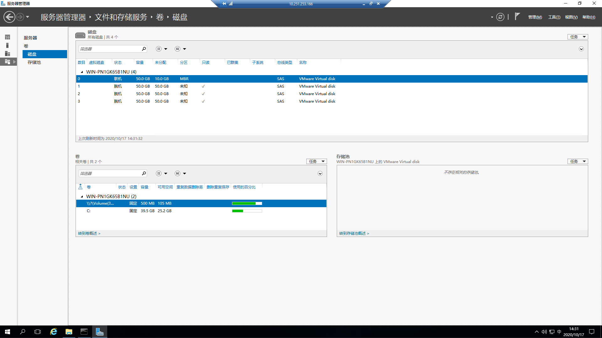

## 2 C盘扩展卷

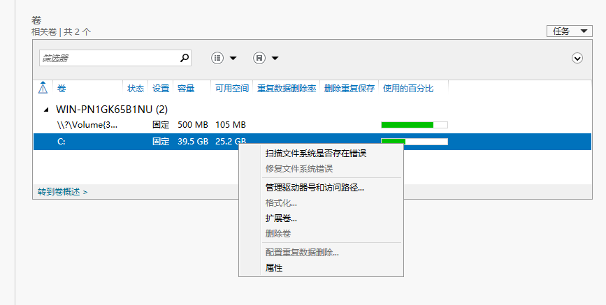

- 点击扩展卷

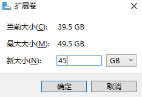

- 扩展至45G

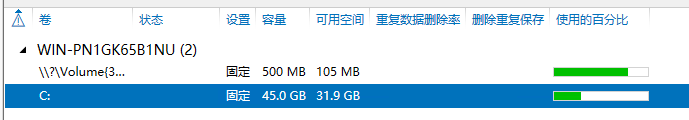

- 扩展成功

## 3 检查其它磁盘是否联机,联机并初始化磁盘

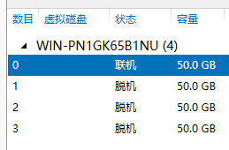

- 初始状态
  - 0号磁盘联机
  - 1、2、3号磁盘脱机

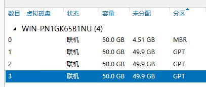

- 联机并初始化磁盘完成

### 3.1 创建跨区卷并存储部分数据

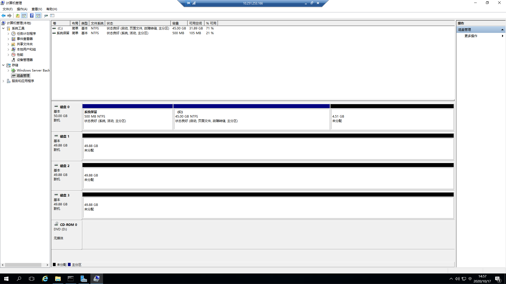

- 进入到该界面

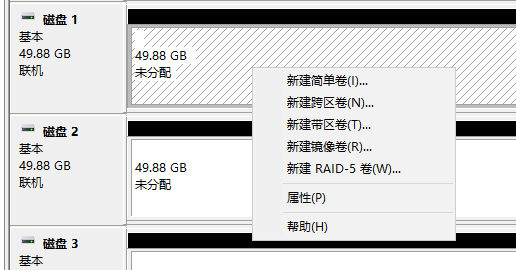

- 选择“新建跨区卷”

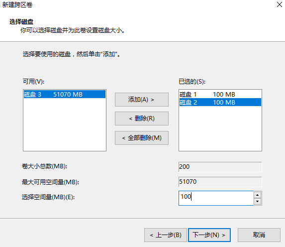

- 添加磁盘2与磁盘1跨区，并设置磁盘容量
- 以默认设置，一路下一步，根据提示，最后磁盘转为了动态磁盘

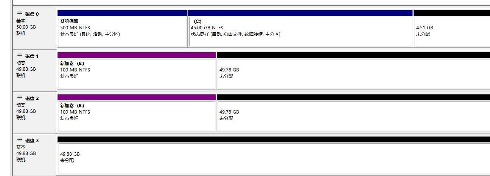

- 创建跨区卷完成(盘符为E)


- 在该磁盘中，已创建/存储部分文件

### 3.2 创建镜像卷并存储部分数据

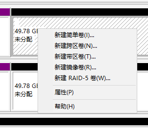

- 选择“新建镜像卷”

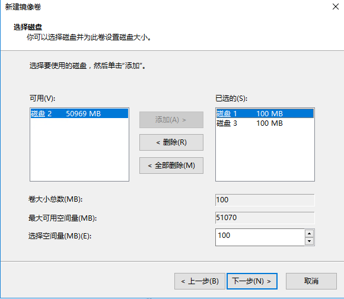

- 选择磁盘1与磁盘3镜像，大小均为100M

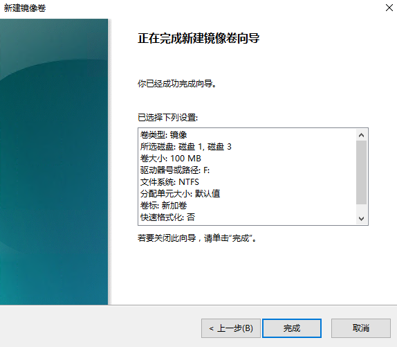

- 确认完成，自动转为动态磁盘，盘符为F

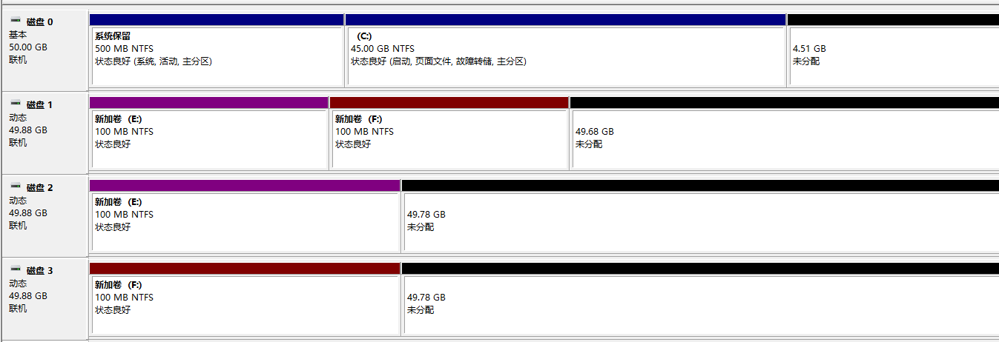

- 当前磁盘状况


- 在该镜像卷(F盘)中存储部分数据完成

### 3.3 创建RAID5卷并存储部分数据

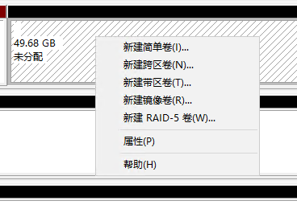

- 选择“新建RAID-5卷”

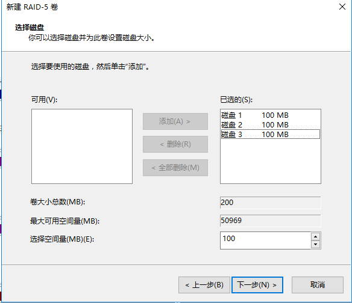

- 选择磁盘1、2、3(RAID-5至少需要3块磁盘)，大小设置为100M

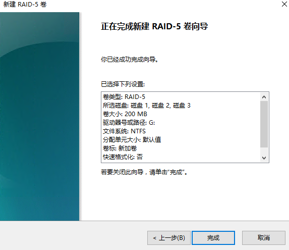

- 确认设置，盘符为G，卷大小为100M

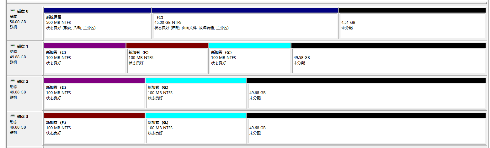

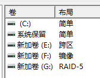

- 当前磁盘状态


- 在该镜像卷(G盘)中存储部分数据完成

## 4 通过设备管理禁用其中一块磁盘,模拟磁盘损坏

> 观察有什么情况发生,数据是否损坏或者丢失

### 4.1 镜像卷、RAID-5卷

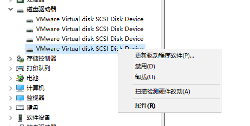

- 在设备管理器中选择“磁盘驱动器”，点击“禁用”

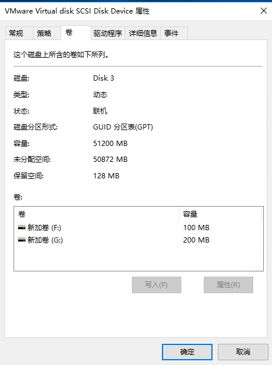

- 仅禁用磁盘3(图为磁盘3中的信息)
  - 与磁盘1镜像
  - 与磁盘1、2组RAID-5卷

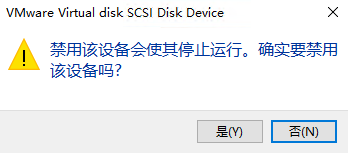

- 确定禁用，重启计算机

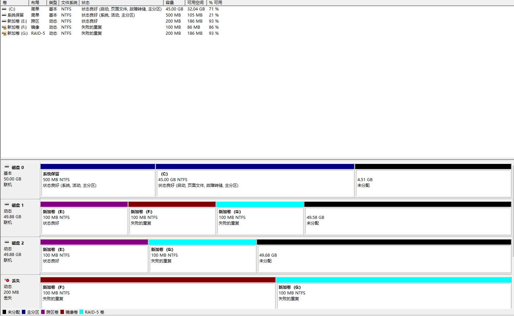

- 禁用磁盘3后的磁盘状态
  - 镜像卷失效
  - RAID-5卷失效

经过检查，新加卷E、F、G中的文件均能正常打开，没有损坏和丢失，表明先前创建镜像卷、RAID-5卷对文件进行“备份”的效果有效

### 4.2 跨区卷

- 仅禁用磁盘2
  - 其与磁盘1组成跨区卷
  - 其与磁盘1、3组RAID-5卷

- 确定禁用，重启计算机

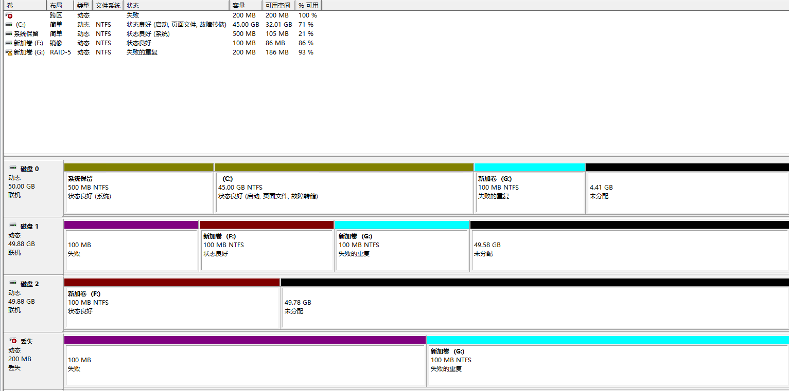

此时，新加卷E盘(跨区卷)消失，其余两卷中的文件均存在并能正常读写，表明组成跨区卷的磁盘若有其一损坏，则跨区卷损坏
