# 《网络存储》课程设计：实践型存储设计

## 实验目标

- [x] Ceph环境搭建与应用

注：参考CSDN，51CTO，搭建完成尝试验证存储节点的应用

[官网: ceph](https://ceph.io/)

[官方文档：Ceph Documentation](https://docs.ceph.com/en/latest/start/intro/)

[Github官方仓库: ceph](https://github.com/ceph/ceph)

## Ceph概述

[参考：Ceph工作原理及安装](https://www.jianshu.com/p/25163032f57f)

Ceph是一个分布式存储系统，诞生于2004年，最早致力于开发下一代高性能分布式文件系统的项目。随着云计算的发展，Ceph乘上了OpenStack的春风，进而成为了开源社区受关注较高的项目之一。

- **CRUSH算法**
  - CRUSH算法是Ceph的两大创新之一，简单来说，Ceph摒弃了传统的集中式存储元数据寻址的方案，转而使用CRUSH算法完成数据的寻址操作。CRUSH在一致性哈希基础上很好的考虑了容灾域的隔离，能够实现各类负载的副本放置规则，例如跨机房、机架感知等。CRUSH算法有相当强大的扩展性，理论上支持数千个存储节点。
- **高可用**
  - Ceph中的数据副本数量可以由管理员自行定义，并可以通过CRUSH算法指定副本的物理存储位置以分隔故障域，支持数据强一致性；Ceph可以忍受多种故障场景并自动尝试并行修复。
- **高扩展性**
  - Ceph不同于swift，客户端所有的读写操作都要经过代理节点。一旦集群并发量增大时，代理节点很容易成为单点瓶颈。Ceph本身并没有主控节点，扩展起来比较容易，并且理论上，它的性能会随着磁盘数量的增加而线性增长。
- **特性丰富**
  - Ceph支持三种调用接口：对象存储，块存储，文件系统挂载。三种方式可以一同使用。在国内一些公司的云环境中，通常会采用Ceph作为openstack的唯一后端存储来提升数据转发效率。

## 尝试在Ubuntu 16中，通过ceph-ansible配置

> ceph-ansible
> [参考：ceph-ansible Installation](https://docs.ceph.com/projects/ceph-ansible/en/latest/)

所输的具体命令见下图中的Terminal：


Fail (未定义node-1，应该和后文中的CentOS 7中的一样，配置多台主机。)

## 在Google Cloud Platform中部署Ceph

- 通过搜索Ceph API，一键部署成功(使用默认配置，设置了3个节点)


- Wait for the cluster to configure OSDs on a data node (as root)

```bash
sudo su # 进入到root
ceph status # 查看Ceph状态
```


可见Ceph正在运行中，状态HEALTH为OK，尚没有建立pool。

- Create a volume on one of the data nodes (as root)

```bash
ceph osd pool create vol_data 128; ceph osd pool create vol_metadata 128; ceph fs new vol vol_metadata vol_data; ceph fs ls
```


创建了一个osd pool

- Allow an instance to mount Ceph volumes

(Tag an instance with ceph-1-ceph-client tag or allow traffic to TCP ports 6789-7300 on data nodes using Firewall rules.)

- Mount a volume on a Ceph client

```bash
mkdir /mnt/cephfs; mount -t ceph 10.128.0.2:6789:/ /mnt/cephfs -o name=admin,secret=AQAk59Vf2YHvBRAA/kcIaBzl9oxCwNaX1oaSeA==
```


成功在Cloud Shell中，通过SSH与admin节点连接并挂接了磁盘。

### 在CentOS 7中配置Ceph，验证存储节点

[参考：Ceph-deploy快速部署Ceph分布式存储](https://www.cnblogs.com/kevingrace/p/9141432.html)

### 基本环境

- 在VMware中，安装4台装有CentOS 7的虚拟机(作为Ceph的4个节点)。
- 安装过程中，选择默认设置，注意需要创建用户/管理员，设置密码。如下图。


- 成功进入系统，并登录。


- 试图查看主机的IP地址：

```bash
ip addr
```


发现在ens33没有INET这个属性，那么就没办法通过IP远程连接。

- 设置配置文件

```bash
vi /etc/sysconfig/network-scripts/ifcfg-ens33
```


从配置文件中可以看出CentOS 7默认是不启动网卡的(ONBOOT=no)。我们把这一项修改为yes。


试图通过`ESC`进入到命令模式后，通过`:x!`保存


然而发现是可读文件，在当前权限下，无法修改。

通过以下指令修改权限：

```bash
chmod 777 /etc/sysconfig/network-scripts/ifcfg-ens33 # 777是最高权限
```


(普通用户无法设置777权限，进入到root用户后修改权限成功)

- 再次从vi进入到配置文件，此次修改配置文件成功。


- 重启网络服务：

```bash
sudo service network restart
```


- 再次查看IP地址：


可见该机的IP为：192.168.61.156

- 按以上步骤重复，最终4台主机所设置的用户(管理员)名及主机的IP地址的对应关系可得：


ceph-node1: 192.168.61.157


ceph-node2: 192.168.61.158


ceph-node3: 192.168.61.159

| IP             | Hostname   |
| -------------- | ---------- |
| 192.168.61.156 | ceph-admin |
| 192.168.61.157 | ceph-node1 |
| 192.168.61.158 | ceph-node2 |
| 192.168.61.159 | ceph-node3 |

（第二天接着做该实验变成了：）

| IP             | Hostname   |
| -------------- | ---------- |
| 192.168.61.160 | ceph-admin |
| 192.168.61.162 | ceph-node1 |
| 192.168.61.163 | ceph-node2 |
| 192.168.61.161 | ceph-node3 |

- 为每个节点修改主机名：

```bash
# 在ceph-admin主机中
hostnamectl set-hostname ceph-admin
```


```bash
# 类似地，在ceph-node1主机中：
hostnamectl set-hostname ceph-node1
# 在ceph-node2主机中：
hostnamectl set-hostname ceph-node2
# 在ceph-node3主机中：
hostnamectl set-hostname ceph-node3
```

- 为每个节点绑定主机名映射

在每一台主机中：

```bash
vi /etc/hosts
# 添加以下条目：
192.168.61.156 ceph-admin # 第二天接着做该实验变成了：192.168.61.160
192.168.61.157 ceph-node1 # 第二天接着做该实验变成了：192.168.61.162
192.168.61.158 ceph-node2 # 第二天接着做该实验变成了：192.168.61.163
192.168.61.159 ceph-node3 # 第二天接着做该实验变成了：192.168.61.161
```


- 每个节点确认连通性

```bash
ping -c 3 ceph-admin
ping -c 3 ceph-node1
ping -c 3 ceph-node2
ping -c 3 ceph-node3
```


如上图所示，在ceph-admin中连接其他node(包括自己)，全部连通。其余主机之间，亦能互相连通。

- 每个节点关闭防火墙和selinux

```bash
systemctl stop firewalld
systemctl disable firewalld
sed -i 's/SELINUX=enforcing/SELINUX=disabled/g' /etc/selinux/config
setenforce 0
```


- 每个节点安装和配置NTP（官方推荐的是集群的所有节点全部安装并配置 NTP，需要保证各节点的系统时间一致。没有自己部署ntp服务器，就在线同步NTP）

```bash
yum install ntp ntpdate ntp-doc -y
systemctl restart ntpd
systemctl status ntpd
```


- 每个节点准备yum源
- 删除默认的源（国外的比较慢）

```bash
yum clean all
mkdir /mnt/bak
mv /etc/yum.repos.d/* /mnt/bak/
```

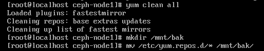

- 下载阿里云的base源和epel源

```bash
curl -o /etc/yum.repos.d/CentOS-Base.repo http://mirrors.aliyun.com/repo/Centos-7.repo
curl -o /etc/yum.repos.d/epel.repo http://mirrors.aliyun.com/repo/epel-7.repo
```

- 添加ceph源

```bash
# vi /etc/yum.repos.d/ceph.repo
[ceph]
name=ceph
baseurl=http://mirrors.aliyun.com/ceph/rpm-jewel/el7/x86_64/
gpgcheck=0
priority =1
[ceph-noarch]
name=cephnoarch
baseurl=http://mirrors.aliyun.com/ceph/rpm-jewel/el7/noarch/
gpgcheck=0
priority =1
[ceph-source]
name=Ceph source packages
baseurl=http://mirrors.aliyun.com/ceph/rpm-jewel/el7/SRPMS
gpgcheck=0
priority=1
```

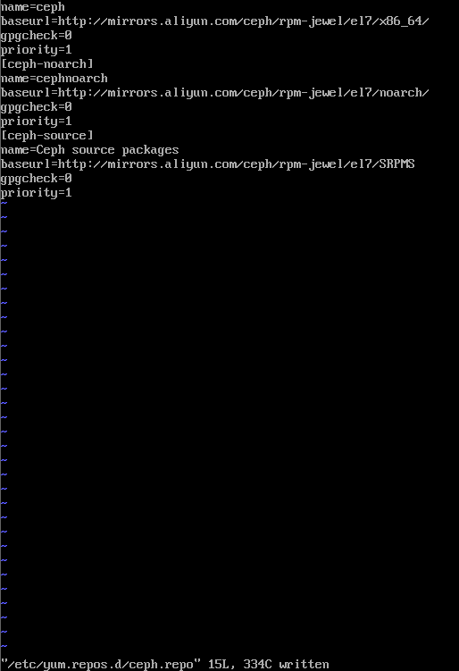

- 为每个节点创建cephuser用户，设置sudo权限

```bash
useradd -d /home/cephuser -m cephuser
echo "cephuser"|passwd --stdin cephuser # 用户名和密码都是cephuser
echo "cephuser ALL = (root) NOPASSWD:ALL" | sudo tee /etc/sudoers.d/cephuser
chmod 0440 /etc/sudoers.d/cephuser
sed -i s'/Defaults requiretty/#Defaults requiretty'/g /etc/sudoers
```

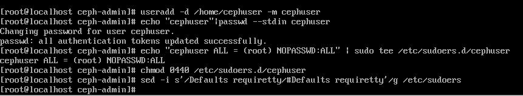

- 测试cephuser的sudo权限

```
# su - cephuser
$ sudo su -
```

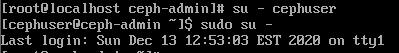

- 配置相互间的ssh信任关系
- 先在ceph-admin节点上产生公私钥文件，然后将ceph-admin节点的.ssh目录拷贝给其他节点

```
[root@ceph-admin ~]# su - cephuser
[cephuser@ceph-admin ~]$ ssh-keygen -t rsa    #一路回车
[cephuser@ceph-admin ~]$ cd .ssh/
[cephuser@ceph-admin .ssh]$ ls
id_rsa  id_rsa.pub
[cephuser@ceph-admin .ssh]$ cp id_rsa.pub authorized_keys

[cephuser@ceph-admin .ssh]$ scp -r /home/cephuser/.ssh ceph-node1:/home/cephuser/
[cephuser@ceph-admin .ssh]$ scp -r /home/cephuser/.ssh ceph-node2:/home/cephuser/
[cephuser@ceph-admin .ssh]$ scp -r /home/cephuser/.ssh ceph-node3:/home/cephuser/
```


- 然后在各节点直接验证cephuser用户下的ssh相互信任关系

```
$ ssh -p22 cephuser@ceph-admin
$ ssh -p22 cephuser@ceph-node1
$ ssh -p22 cephuser@ceph-node2
$ ssh -p22 cephuser@ceph-node3
```


### 准备磁盘

> ceph-node1、ceph-node2、ceph-node3三个节点

测试时使用的磁盘不要太小，否则后面添加磁盘时会报错，建议磁盘大小为20G及以上。

- `fdisk -l`查看当前各节点的磁盘情况（4个节点的配置一样）：


有约30G容量的一块磁盘（sda）。

- 在VMware为每个节点新建一块磁盘，容量为20G

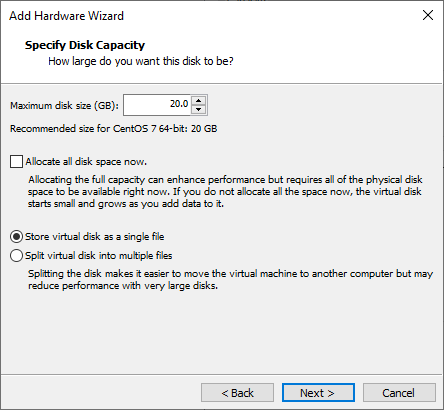

创建磁盘，选择不split成多块


ceph-node1新建磁盘后的配置详情（其余类似）


重启后，可见多出了一块大小为20G的磁盘sdb

- 为该磁盘sdb创建分区 (应该在这里也可以不做，因为后续还要继续格式化分区等。我仅在ceph-admin做了创建分区的操作)

```bash
# fdisk /dev/sdb 
# 依次输入n, p, 1, w
# 其中n分别表示创建一个新分区，p表示分区类型为主分区，1表示分区编号是1，w表示保存
```

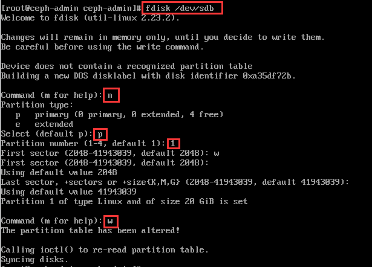

- 检查磁盘

```bash
# fdisk -l /dev/sdb
```

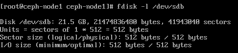

- 格式化磁盘

```bash
# parted -s /dev/sdb mklabel gpt mkpart primary xfs 0% 100%
# mkfs.xfs /dev/sdb -f
```

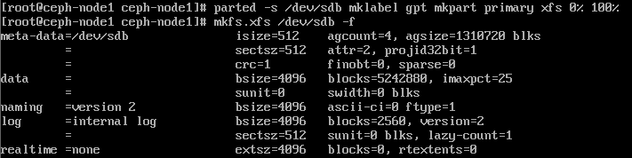

- 查看磁盘格式（xfs格式）

```bash
# blkid -o value -s TYPE /dev/sdb
```


### 部署阶段

> ceph-admin节点上使用ceph-deploy快速部署

- 进入到cephuser用户

```
[root@ceph-admin ~]# su - cephuser
```

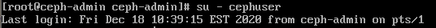

- 安装ceph-deploy

```
[cephuser@ceph-admin ~]$ sudo yum update -y && sudo yum install ceph-deploy -y
```

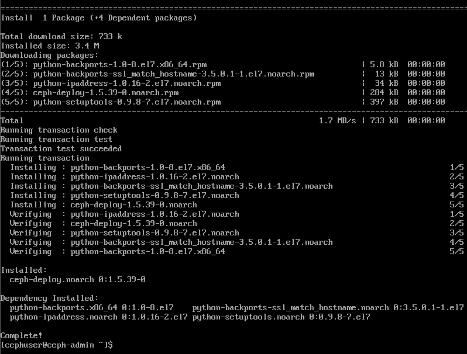

安装完成。

- 创建cluster目录

```
[cephuser@ceph-admin ~]$ mkdir cluster
[cephuser@ceph-admin ~]$ cd cluster/
```


- 创建集群（后面填写monit节点的主机名，这里monit节点和管理节点是同一台机器，即ceph-admin）

```
[cephuser@ceph-admin cluster]$ ceph-deploy new ceph-admin
```

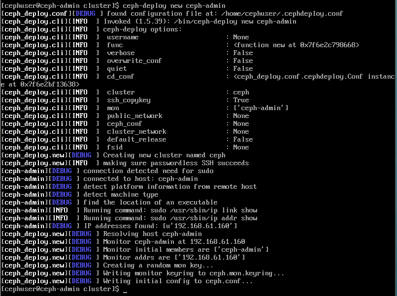

- 修改ceph.conf文件
  - （注意：mon_host必须和public network 网络是同网段内！）

```bash
[cephuser@ceph-admin cluster]$ vi ceph.conf     #添加下面两行配置内容
......
public network = 192.168.61.160/24
osd pool default size = 3
```

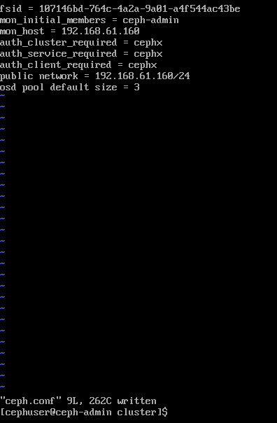

- 安装Ceph

```bash
[cephuser@ceph-admin cluster]$ ceph-deploy install ceph-admin ceph-node1 ceph-node2 ceph-node3
```

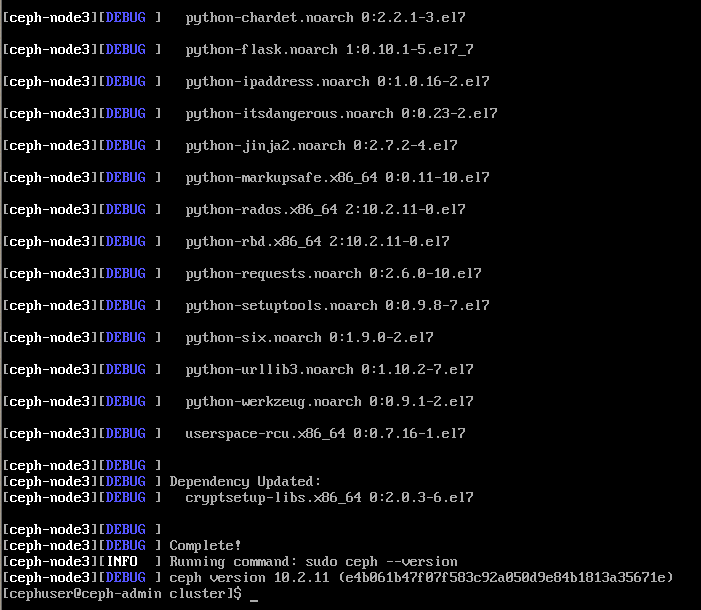

各节点上都成功装上了Ceph。

- 初始化monit监控节点

```bash
[cephuser@ceph-admin cluster]$ ceph-deploy gatherkeys ceph-admin
```


- 收集所有密钥

```bash
[cephuser@ceph-admin cluster]$ ceph-deploy gatherkeys ceph-admin
```


- 添加OSD到集群：检查OSD节点上所有可用的磁盘

```bash
[cephuser@ceph-admin cluster]$ ceph-deploy disk list ceph-node1 ceph-node2 ceph-node3
```


- 使用zap选项删除所有osd节点上的分区

```bash
[cephuser@ceph-admin cluster]$ ceph-deploy disk zap ceph-node1:/dev/sdb ceph-node2:/dev/sdb ceph-node3:/dev/sdb
```

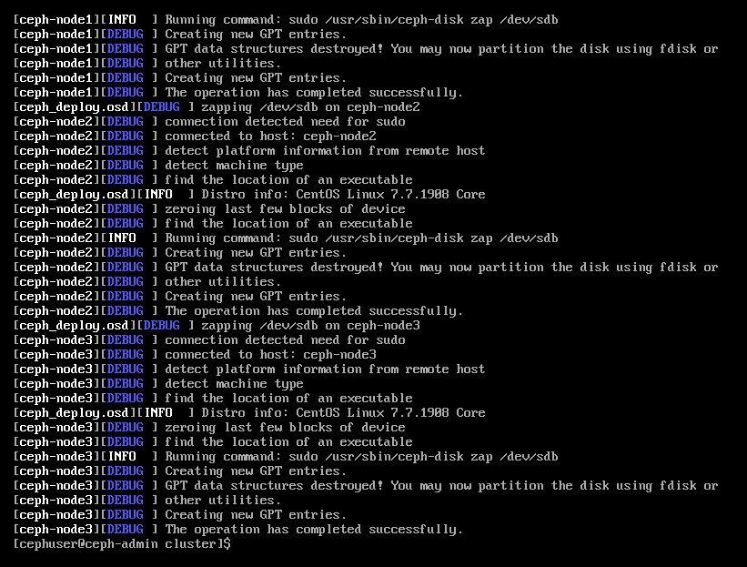

- 准备OSD（使用prepare命令）

```bash
[cephuser@ceph-admin cluster]$ ceph-deploy osd prepare ceph-node1:/dev/sdb ceph-node2:/dev/sdb ceph-node3:/dev/sdb
```


- 激活OSD（注意由于ceph对磁盘进行了分区，/dev/sdb磁盘分区为/dev/sdb1）

```bash
[cephuser@ceph-admin cluster]$ ceph-deploy osd activate ceph-node1:/dev/sdb1 ceph-node2:/dev/sdb1 ceph-node3:/dev/sdb1
```


- 在三个osd节点上通过命令已显示磁盘已成功mount：

```
[root@ceph-node1 ceph-node1]# lsblk
```


在ceph-node1节点的虚拟机中输入如上命令，可见sdb-sdb1中已有ceph-0，表明ceph挂载成功。

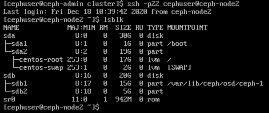

从ceph-admin通过ssh进入到ceph-node2，同样可见sdb-sdb1中已有ceph-0，表明ceph挂载成功。（ceph-node3类似）

- 查看OSD

```bash
[cephuser@ceph-admin cluster]$ ceph-deploy disk list ceph-node1 ceph-node2 ceph-node3
# cd到cluster目录下
```

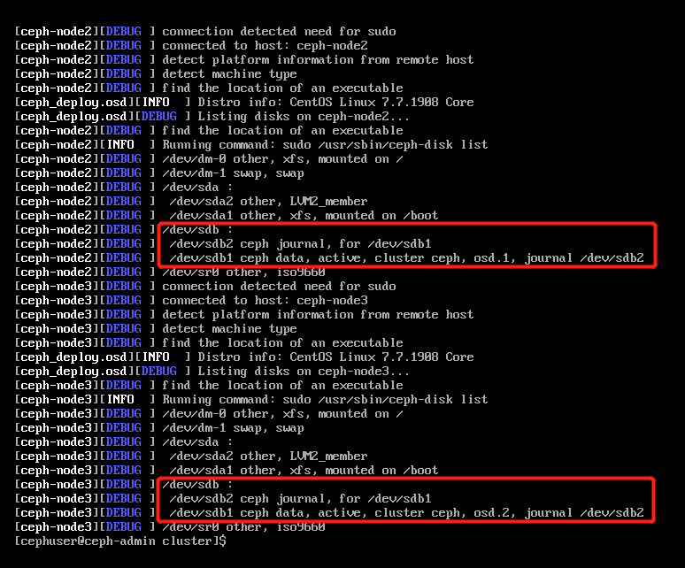

node1、node2、node3均有如上的两个分区(sdb1、sdb2)，表明成功了。

- 用ceph-deploy把配置文件和admin密钥拷贝到管理节点和Ceph节点，这样每次执行Ceph命令行时就无需指定monit节点地址和ceph.client.admin.keyring了

```bash
[cephuser@ceph-admin cluster]$ ceph-deploy admin ceph-admin ceph-node1 ceph-node2 ceph-node3
```

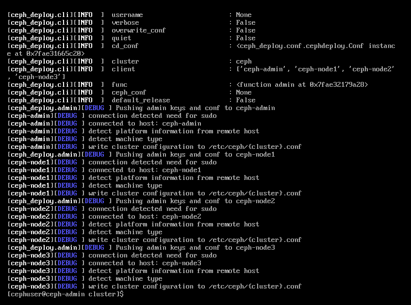

- 修改密钥权限

```bash
[cephuser@ceph-admin cluster]$ sudo chmod 644 /etc/ceph/ceph.client.admin.keyring
```

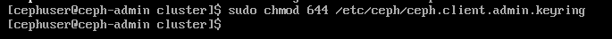

- 检查ceph状态

```bash
[cephuser@ceph-admin cluster]$ sudo ceph health
HEALTH_OK
[cephuser@ceph-admin cluster]$ sudo ceph -s
```

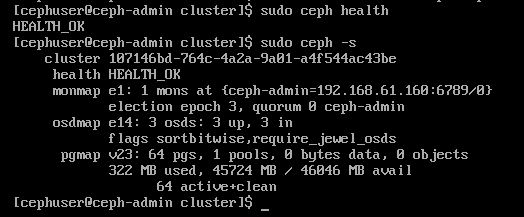

- 查看ceph osd运行状态

```bash
[cephuser@ceph-admin ~]$ ceph osd stat
```


- 查看osd的目录树

```bash
[cephuser@ceph-admin ~]$ ceph osd tree
```

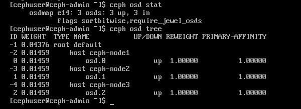

- 查看monit监控节点的服务情况

```bash
[cephuser@ceph-admin cluster]$ sudo systemctl status ceph-mon@ceph-admin
```


```bash
[cephuser@ceph-admin cluster]$ ps -ef|grep ceph|grep 'cluster'
```

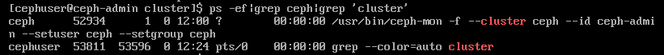

- 分别查看下ceph-node1、ceph-node2、ceph-node3三个节点的osd服务情况，发现已经在启动中。

ceph-node1:

```bash
ssh -p22 cephuser@ceph-node1 # 先进入到ceph-node1
[cephuser@ceph-node1 ~]$ sudo systemctl status ceph-osd@0.service
# 启动是start、重启是restart
[cephuser@ceph-node1 ~]$ sudo ps -ef|grep ceph|grep "cluster"
```

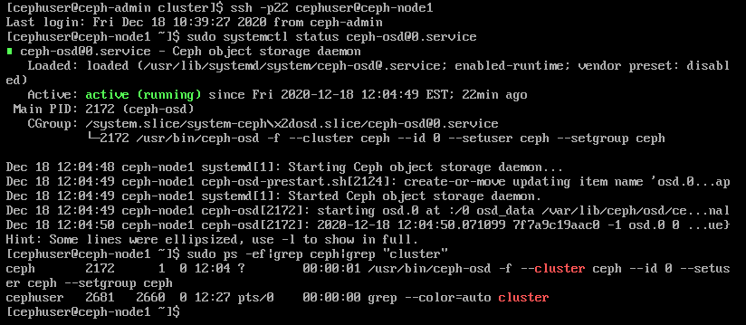

loaded，服务在启动中

ceph-node2:

```bash
ssh -p22 cephuser@ceph-node2 # 先进入到ceph-node2
[cephuser@ceph-node1 ~]$ sudo systemctl status ceph-osd@0.service
# 启动是start、重启是restart
[cephuser@ceph-node1 ~]$ sudo ps -ef|grep ceph|grep "cluster"
```


loaded，服务在启动中

ceph-node3:

```bash
ssh -p22 cephuser@ceph-node3 # 先进入到ceph-node3
[cephuser@ceph-node1 ~]$ sudo systemctl status ceph-osd@0.service
# 启动是start、重启是restart
[cephuser@ceph-node1 ~]$ sudo ps -ef|grep ceph|grep "cluster"
```


loaded，服务在启动中

### 创建文件系统

- 先查看管理节点状态，默认是没有管理节点的。

```bash
[cephuser@ceph-admin ~]$ ceph mds stat
e1:
```

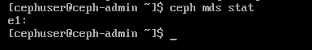

- 创建管理节点（ceph-admin作为管理节点）。

需要注意：如果不创建mds管理节点，Client客户端将不能正常挂载到Ceph集群！！

```bash
[cephuser@ceph-admin ~]$ pwd
/home/cephuser
[cephuser@ceph-admin ~]$ cd cluster/
[cephuser@ceph-admin cluster]$ ceph-deploy mds create ceph-admin
```

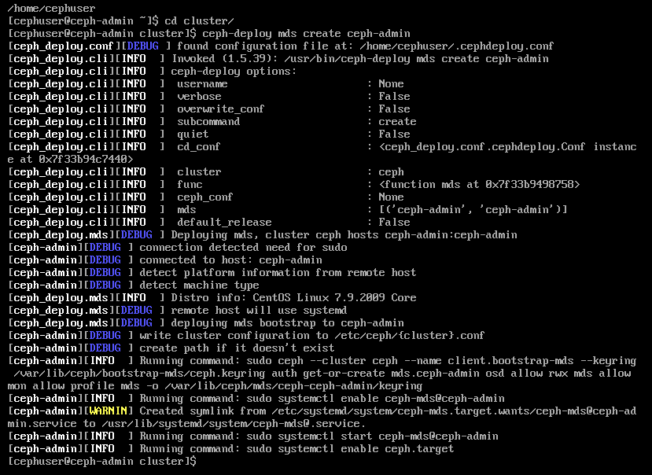

- 再次查看管理节点状态，发现已经在启动中

```bash
[cephuser@ceph-admin cluster]$ ceph mds stat
e2:, 1 up:standby
```


```bash
[cephuser@ceph-admin cluster]$ sudo systemctl status ceph-mds@ceph-admin
[cephuser@ceph-admin cluster]$ ps -ef|grep cluster|grep ceph-mds
```


- 创建pool，pool是ceph存储数据时的逻辑分区，它起到namespace的作用

```bash
[cephuser@ceph-admin cluster]$ ceph osd lspools # 先查看pool
0 rbd,
```


- 新创建的ceph集群只有rdb一个pool。这时需要创建一个新的pool

```bash
[cephuser@ceph-admin cluster]$ ceph osd pool create cephfs_data 10
# 后面的数字是PG的数量
pool 'cephfs_data' created
```


```bash
[cephuser@ceph-admin cluster]$ ceph osd pool create cephfs_metadata 10
# 创建pool的元数据
pool 'cephfs_metadata' created
```

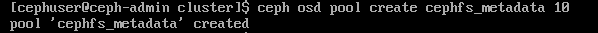

```bash
[cephuser@ceph-admin cluster]$ ceph fs new myceph cephfs_metadata cephfs_data
new fs with metadata pool 2 and data pool 1
```

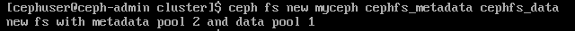

- 再次查看pool状态

```bash
[cephuser@ceph-admin cluster]$ ceph osd lspools
0 rbd,1 cephfs_data,2 cephfs_metadata,
```

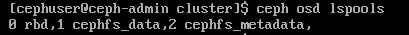

- 检查mds管理节点状态

```bash
[cephuser@ceph-admin cluster]$ ceph mds stat
e5: 1/1/1 up {0=ceph-admin=up:active}
```
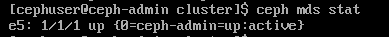

- 查看ceph集群状态

```bash
[cephuser@ceph-admin cluster]$ sudo ceph -s
```

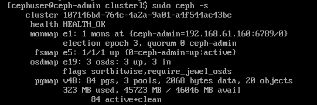

3 osds: 3 up, 3 in。均正常运行中。

- 查看ceph集群端口

```bash
# 在root状态下安装lsof(用于查看文件的打开情况，用于调试程序，查看系统情况)
# yum -y install lsof
[root@ceph-admin cluster]# sudo lsof -i:6789
```

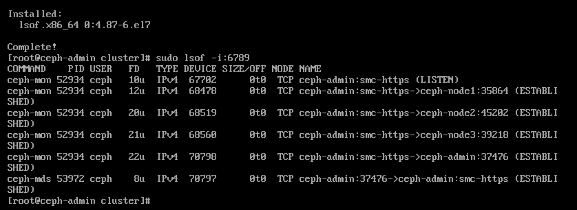

端口全部established/listen

### Client端挂载Ceph存储（采用fuse方式）

- 创建ceph-client虚拟机（CentOS 7系统），继续实验

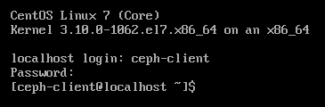

- 按先前方法配置网络（启动网卡）

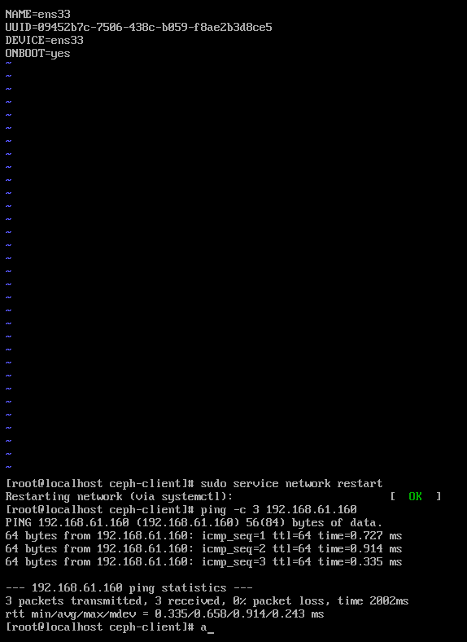

可以ping通先前创的各个ceph节点了。

- 安装ceph-fuse

```bash
rpm -Uvh https://dl.fedoraproject.org/pub/epel/epel-release-latest-7.noarch.rpm
# EPEL（Extra Packages for Enterprise Linux） 是由 Fedora 社区打造，为 RHEL 及衍生发行版如 CentOS等提供高质量软件包的项目。装上了EPEL，就像在 Fedora 上一样，可以通过 yum install 软件包名，即可安装很多以前需要编译安装的软件、常用的软件或一些比较流行的软件，比如现在流行的nginx, openvpn等等，都可以使用EPEL很方便的安装更新。
yum install -y ceph-fuse
```

- 如果安装失败，先执行以下命令，再执行上述安装ceph-fuse的命令

```bash
yum -y install epel-release
rpm -Uhv http://download.ceph.com/rpm-jewel/el7/noarch/ceph-release-1-1.el7.noarch.rpm
```

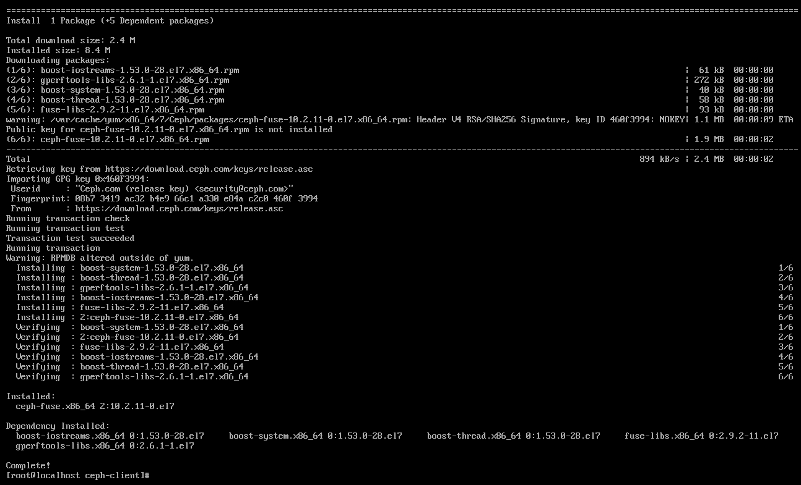

安装成功。

- 创建挂载目录

```
# mkdir /cephfs
```

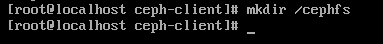

- 安装rsync（给ceph-admin节点也要装）

```bash
yum -y install rsync  
#启动rsync服务
systemctl start rsyncd.service
systemctl enable rsyncd.service
```

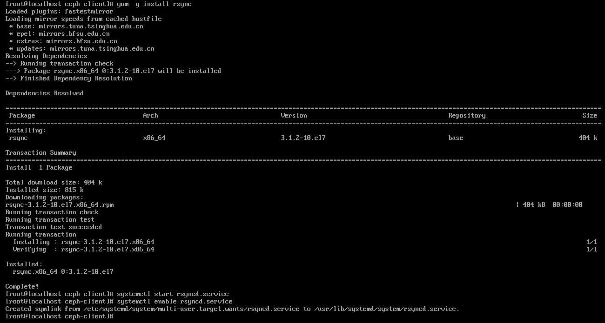

```bash
# 检查是否已经成功启动
# yum -y install net-tools (可以生成ifconfig命令, netstat命令)
netstat -lnp|grep 873
```

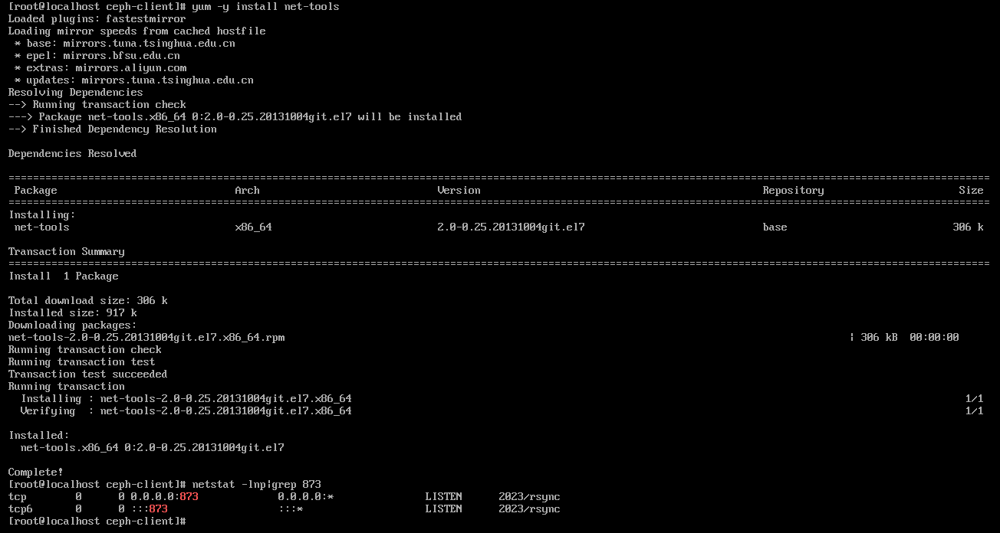

服务已启动。

- 复制配置文件

将ceph配置文件ceph.conf从管理节点copy到client节点（192.168.10.220为管理节点）

```bash
[root@localhost ceph-client]# rsync -e "ssh -p22" -avpgolr root@192.168.61.160:/etc/ceph/ceph.conf /etc/ceph/
```

或者（两个路径下的文件内容一样）

```bash
# rsync -e "ssh -p22" -avpgolr root@192.168.61.160:/home/cephuser/cluster/ceph.conf /etc/ceph/
```

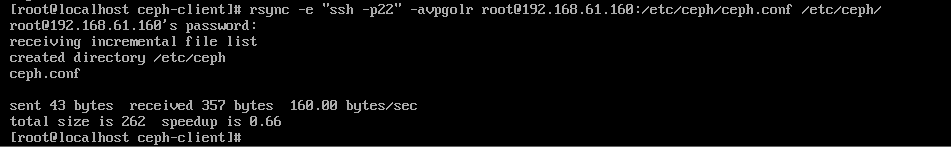

成功复制。

- 复制密钥

将ceph的ceph.client.admin.keyring从管理节点copy到client节点

```bash
[root@localhost ceph-client]# rsync -e "ssh -p22" -avpgolr root@192.168.61.160:/etc/ceph/ceph.client.admin.keyring /etc/ceph/
```

或者

```bash
[root@localhost ceph-client]# rsync -e "ssh -p22" -avpgolr root@192.168.61.160:/home/cephuser/cluster/ceph.client.admin.keyring /etc/ceph/
```


成功复制。

- 从admin节点，查看ceph授权

```bash
[root@ceph-admin cluster]# ceph auth list
```

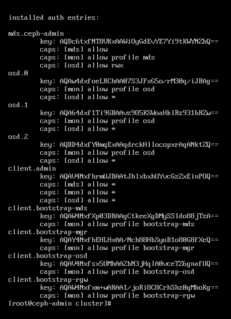

- 将ceph集群存储挂载到客户机的/cephfs目录下

```bash
[root@localhost ceph-client]# ceph-fuse -m 192.168.61.160:6789 /cephfs
```

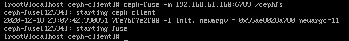

- 查看挂载情况

```bash
[root@localhost ceph-client]# df -h
Filesystem            Size  Used Avail Use% Mounted on
/dev/mapper/centos-root
                       17G  1.4G   16G   8% /
tmpfs                 487M     0  487M   0% /dev/shm
...
ceph-fuse              45G  324M   45G   1% /cephfs
```


由上可知，已经成功挂载了ceph存储。其中三个osd节点，每个节点各15G。

（在节点上通过`lsblk`命令可以查看ceph data分区大小）如：

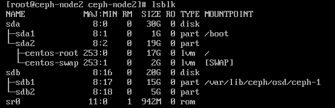

- 取消ceph存储的挂载

[root@localhost ceph-client]# umount /cephfs

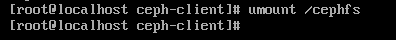

Note:

- 当有一半以上的OSD节点挂掉后，远程客户端挂载的Ceph存储就会使用异常了，即暂停使用。比如本实验中有3个OSD节点，当其中一个OSD节点挂掉后（比如宕机），客户端挂载的Ceph存储使用正常；但当有2个OSD节点挂掉后，客户端挂载的Ceph存储就不能正常使用了（表现为Ceph存储目录下的数据读写操作一直卡着状态），当OSD节点恢复后，Ceph存储也会恢复正常使用。OSD节点宕机重新启动后，osd程序会自动起来（通过监控节点自动起来）

