# 《网络存储》课程设计：实践型存储设计

## 实验目标

- [ ] Ceph环境搭建与应用

注：参考CSDN，51CTO，搭建完成尝试验证存储节点的应用

[官网: ceph](https://ceph.io/)

[官方文档：Ceph Documentation](https://docs.ceph.com/en/latest/start/intro/)

[Github Repo: ceph](https://github.com/ceph/ceph)

## Ceph概述

[参考：Ceph工作原理及安装](https://www.jianshu.com/p/25163032f57f)

Ceph是一个分布式存储系统，诞生于2004年，最早致力于开发下一代高性能分布式文件系统的项目。随着云计算的发展，Ceph乘上了OpenStack的春风，进而成为了开源社区受关注较高的项目之一。

### CRUSH算法

CRUSH算法是Ceph的两大创新之一，简单来说，Ceph摒弃了传统的集中式存储元数据寻址的方案，转而使用CRUSH算法完成数据的寻址操作。CRUSH在一致性哈希基础上很好的考虑了容灾域的隔离，能够实现各类负载的副本放置规则，例如跨机房、机架感知等。CRUSH算法有相当强大的扩展性，理论上支持数千个存储节点。

### 高可用

Ceph中的数据副本数量可以由管理员自行定义，并可以通过CRUSH算法指定副本的物理存储位置以分隔故障域，支持数据强一致性；Ceph可以忍受多种故障场景并自动尝试并行修复。

### 高扩展性

Ceph不同于swift，客户端所有的读写操作都要经过代理节点。一旦集群并发量增大时，代理节点很容易成为单点瓶颈。Ceph本身并没有主控节点，扩展起来比较容易，并且理论上，它的性能会随着磁盘数量的增加而线性增长。

### 特性丰富

Ceph支持三种调用接口：对象存储，块存储，文件系统挂载。三种方式可以一同使用。在国内一些公司的云环境中，通常会采用Ceph作为openstack的唯一后端存储来提升数据转发效率。

## 环境搭建

### 尝试在Ubuntu 16中，通过ceph-ansible安装

> ceph-ansible
> [参考：ceph-ansible Installation](https://docs.ceph.com/projects/ceph-ansible/en/latest/)

所输的具体命令见下图中的Terminal：


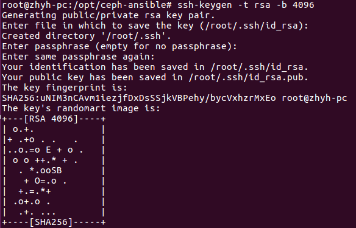

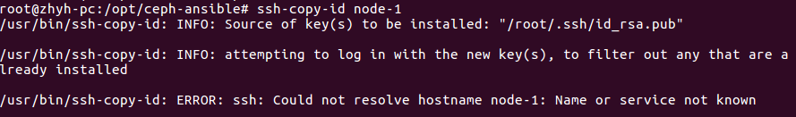

Fail (未定义node-1)

### 尝试在CentOS 7中安装

#### 基本环境

- 在VMware中，安装4台装有CentOS 7的虚拟机(作为Ceph的4个节点)。
- 安装过程中，选择默认设置，注意需要创建用户/管理员，设置密码。如下图。


- 成功进入系统，并登录。


- 试图查看主机的IP地址：

```bash
ip addr
```


发现在ens33没有INET这个属性，那么就没办法通过IP远程连接。

- 设置配置文件

```bash
vi /etc/sysconfig/network-scripts/ifcfg-ens33
```

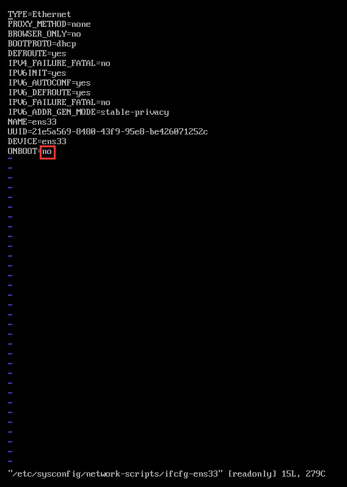

从配置文件中可以看出CentOS 7默认是不启动网卡的(ONBOOT=no)。我们把这一项修改为yes。


试图通过`ESC`进入到命令模式后，通过`:x!`保存

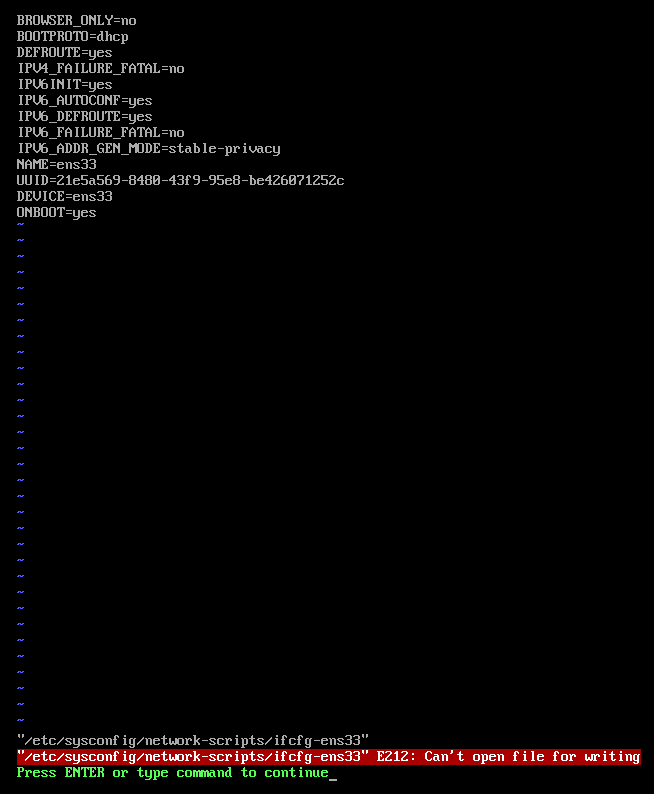

然而发现是可读文件，在当前权限下，无法修改。

通过以下指令修改权限：

```bash
chmod 777 /etc/sysconfig/network-scripts/ifcfg-ens33 # 777是最高权限
```

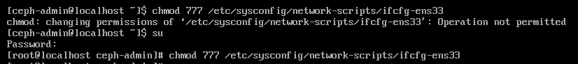

(普通用户无法设置777权限，进入到root用户后修改权限成功)

- 再次从vi进入到配置文件，此次修改配置文件成功。

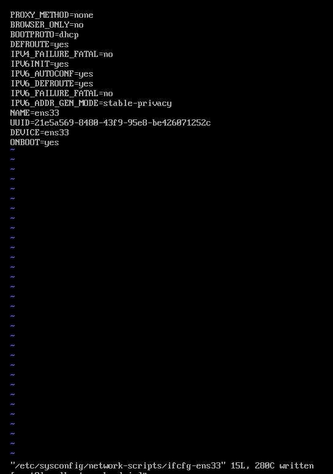

- 重启网络服务：

```bash
sudo service network restart
```

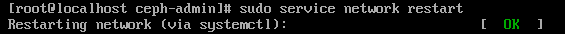

- 再次查看IP地址：

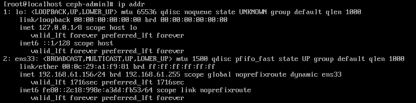

可见该机的IP为：192.168.61.156

- 按以上步骤重复，最终4台主机所设置的用户(管理员)名及主机的IP地址的对应关系可得：

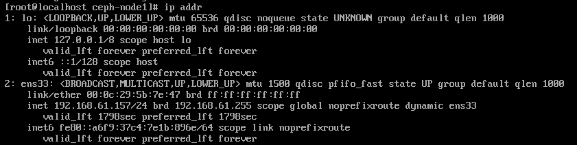

ceph-node1: 192.168.61.157


ceph-node2: 192.168.61.158


ceph-node3: 192.168.61.159

| IP             | Hostname   |
| -------------- | ---------- |
| 192.168.61.156 | ceph-admin |
| 192.168.61.157 | ceph-node1 |
| 192.168.61.158 | ceph-node2 |
| 192.168.61.159 | ceph-node3 |

- 为每个节点修改主机名：

```bash
# 在ceph-admin主机中
hostnamectl set-hostname ceph-admin
```

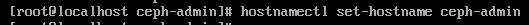

```bash
# 类似地，在ceph-node1主机中：
hostnamectl set-hostname ceph-node1
# 在ceph-node2主机中：
hostnamectl set-hostname ceph-node2
# 在ceph-node3主机中：
hostnamectl set-hostname ceph-node3
```

- 为每个节点绑定主机名映射

在每一台主机中：

```bash
vi /etc/hosts
# 添加以下条目：
192.168.61.156 ceph-admin
192.168.61.157 ceph-node1
192.168.61.158 ceph-node2
192.168.61.159 ceph-node3
```

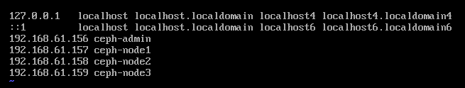

- 每个节点确认连通性

```bash
ping -c 3 ceph-admin
ping -c 3 ceph-node1
ping -c 3 ceph-node2
ping -c 3 ceph-node3
```


如上图所示，在ceph-admin中连接其他node(包括自己)，全部连通。其余主机之间，亦能互相连通。
### 在Google Cloud Platform中部署Ceph

- 通过搜索Ceph API，一键部署成功(使用默认配置，设置了3个节点)


- Wait for the cluster to configure OSDs on a data node (as root)

```bash
sudo su # 进入到root
ceph status # 查看Ceph状态
```


- Create a volume on one of the data nodes (as root)

```bash
ceph osd pool create vol_data 128; ceph osd pool create vol_metadata 128; ceph fs new vol vol_metadata vol_data; ceph fs ls
```

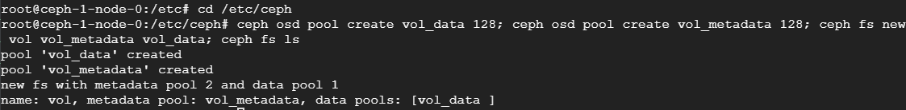

- Allow an instance to mount Ceph volumes

(Tag an instance with ceph-1-ceph-client tag or allow traffic to TCP ports 6789-7300 on data nodes using Firewall rules.)

- Mount a volume on a Ceph client

```bash
mkdir /mnt/cephfs; mount -t ceph 10.128.0.2:6789:/ /mnt/cephfs -o name=admin,secret=AQAk59Vf2YHvBRAA/kcIaBzl9oxCwNaX1oaSeA==
```

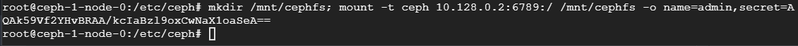

## 存储节点的应用
