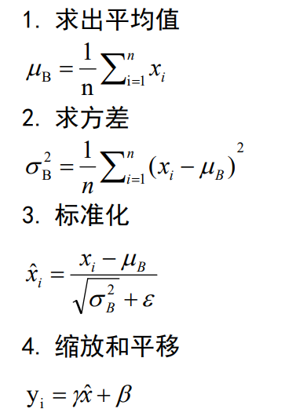
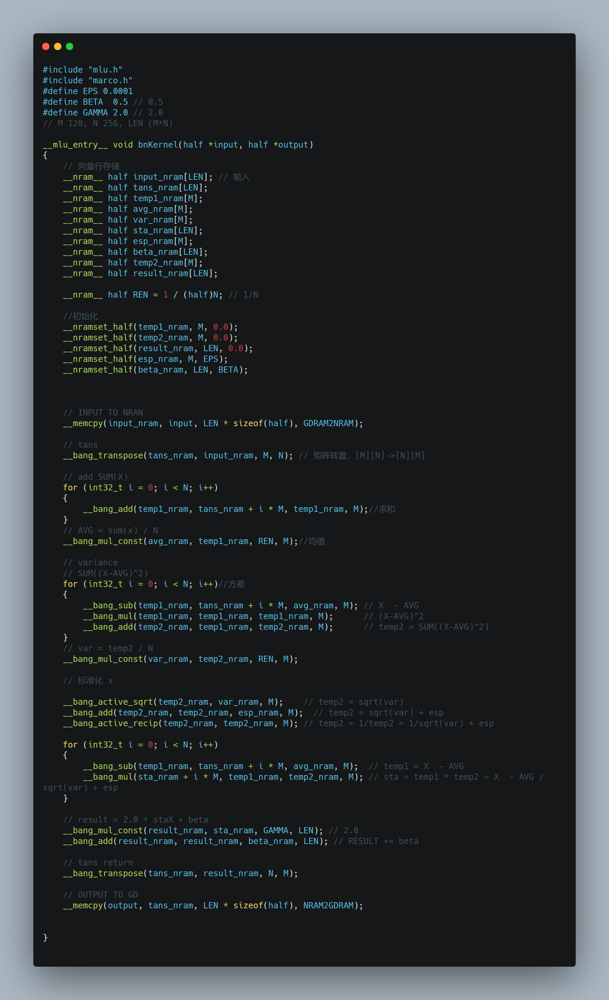
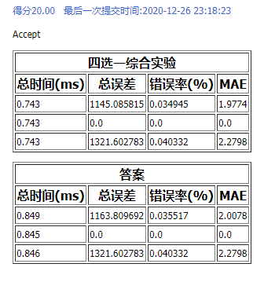

# 实验报告——实验一选做

> 姓名：朱英豪
> 学号：18373722
> 班级：182111

[TOC]

## 1. 实验内容

> （介绍你所实现的算子）

**Batch Normalization**

神经网络在训练过程中，前一层权重参数的改变会造成每层输入样本分布的改变，这造成了训练过程的困难。为了解决这个问题，通常会使用小的学习率和参数初始化技巧，就导致了训练速度变慢，尤其是训练具有饱和非线性的模型时。我们将这一现象定义为internal covariate shift，并提出通过规范化输入来解决。给定输入$m \times n (128 \times 256)$规模的矩阵B，逐行求BN，输出$m \times n$标准化后的矩阵。

## 2. 试验步骤

### 2.1. 算子实现

#### 2.1.1. 解决思路

根据题目中所给的参考步骤，一步步计算：

由于BangC语言中的库函数的输入都是行向量，因此首先要将矩阵进行转置，变成$m \times n$的矩阵`trans_nram`。

之后按行遍历，根据上述步骤，依次求平均值，方差，标准化，缩放平移。

具体来说：

- 首先通过求和，乘以$\frac{1}{N}$得到平均值`avg_nram`；
- 与`tans_nram`相减，再自乘，累加，乘以$\frac{1}{N}$，得到方差；
- 利用BangC自带的开根号，以及求倒数运算，分别计算`tans_nram`-`avg_nram`，1/sqrt(`var`+`epsilon`)，相乘得到标准化矩阵`sta_nram`；
- 将矩阵乘以`gamma`，加上`beta_nram`，得到缩放、平移后的矩阵`result_nram`，再转置回到$n \times m$，即为所求。

#### 2.1.2. 补全代码截图

#### 2.1.3. 测试结果截图

## 3. 实验总结分析

本次实验中，我认识到通过使用BangC所支持的矩阵运算，可以有效降低了代码的嵌套层数，让代码结构更加简洁，思路更加清晰。

同时，在指数运算、乘法运算上，函数也表现出较高的精度和速度。

综合来看，BangC更加有利于以矩阵运算为支撑的机器学习应用场景。