# 实验报告——实验一

> 姓名：朱英豪
> 学号：18373722
> 班级：182111

[TOC]

## 1. 试验目的

通过使用智能编程语言（BANGC）进行算子开发，对高性能库（CNML）算子进行扩展，并最终集成到编程框架（TensorFlow）中，掌握对高性能库及编程框架进行扩展的能力，使读者可以在 DLP 硬件上自由设计并优化满足特定应用场景的新算子，满足日新月异智能算法的实际需求。

## 2. 试验内容

1. 算子实现：采用智能编程语言 BCL 实现 PowerDifference 算子;
2. 算子测试：对 PowerDifference 算子本身进行测试，保证其功能正确;
3. 框架集成：通过高性能库 PluginOp 的接口对 PowerDifference 算子进行封装,使其调用方式和高性能库原有算子一致，将封装后的算子集成到 TensorFlow 编程框架中;
4. 框架算子测试：使用框架 API 测试上一步集成在 TensorFlow 中的算子，保证其功能正确。

## 3. 试验步骤

### 3.1. BANGC 算子实现

#### 3.1.1. 解决思路

实验中要计算PowerDiffernce的算子，也就是要计算得到$(X-Y)^Z$的结果。可以通过普通的迭代累乘，还有快速幂方法来算这个幂次。

在这里，我思考可以通过多核拆分方法，更多地利用CPU资源来加速。我将向量切成64份，以便后续实验中的多核并行计算。

其中，每次计算都有拷入拷出的操作。在TODO代码的提示下，依次在测试程序中进行拷入输入、传参、执行、拷出输出的操作。

#### 3.1.2. 补全代码截图

- `plugin_power_difference_kernel.h`

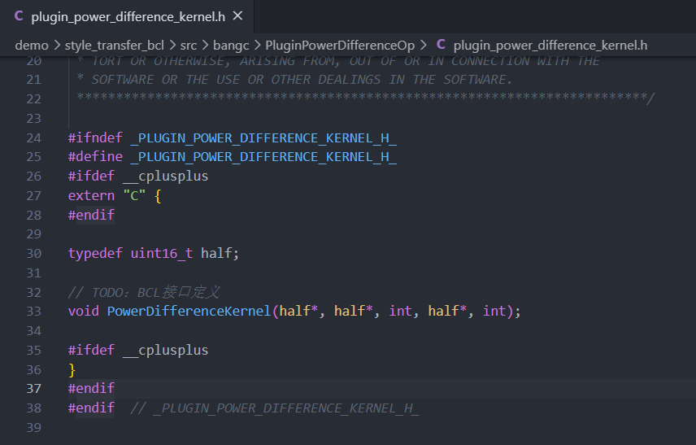

- `plugin_power_difference_kernel.mlu`

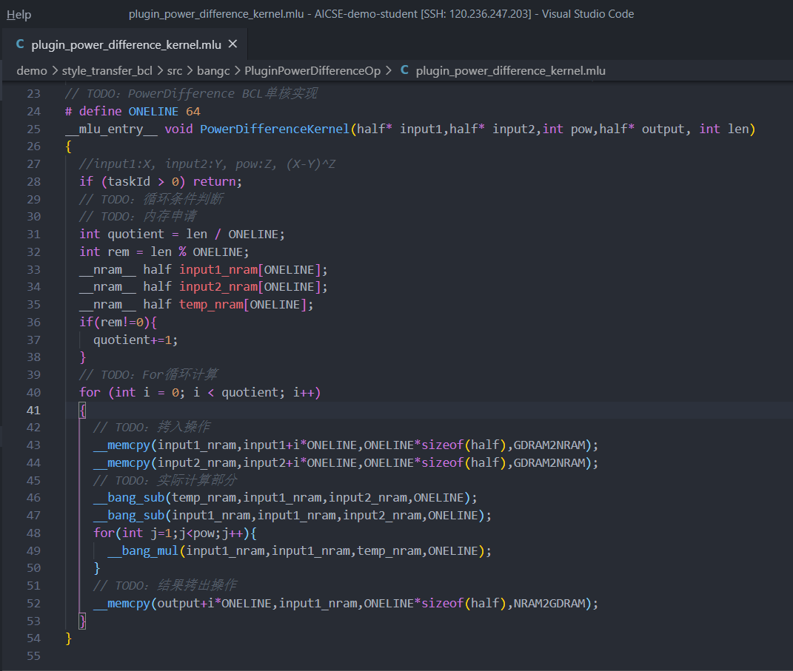

- `powerDiff.cpp`

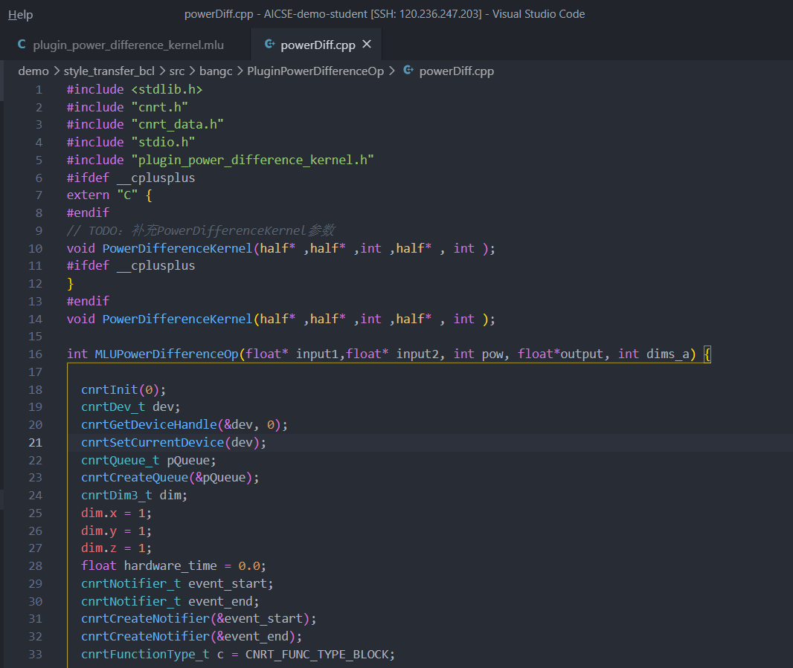
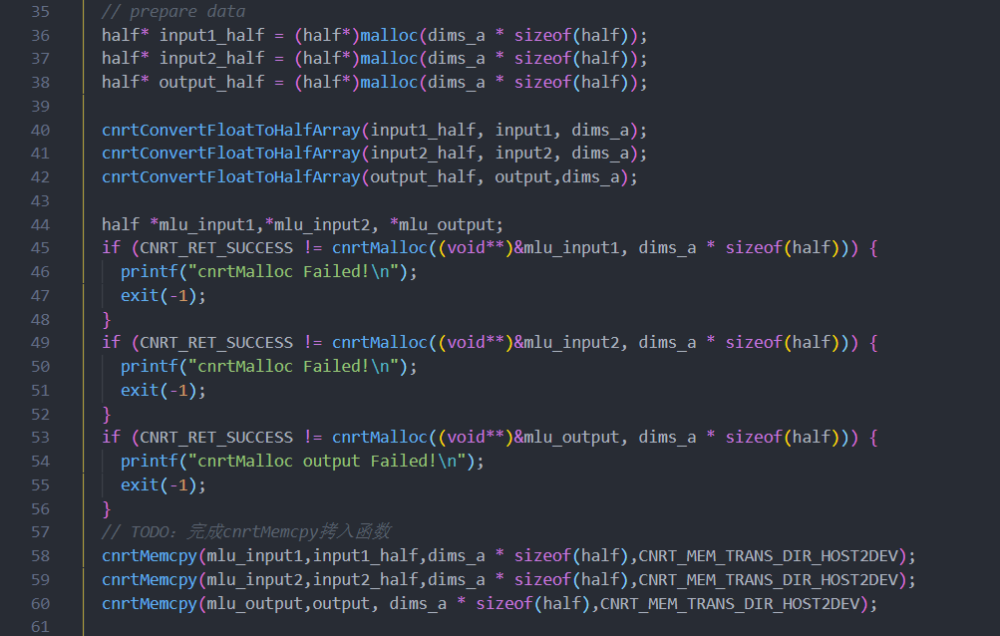
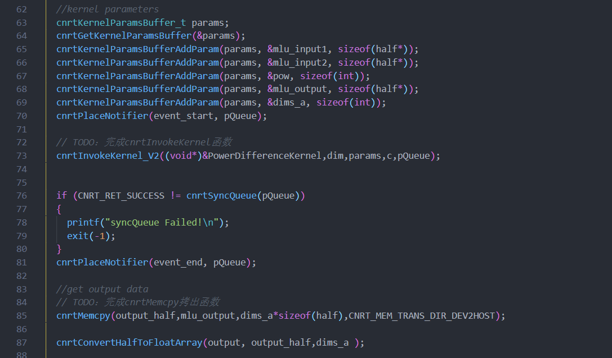
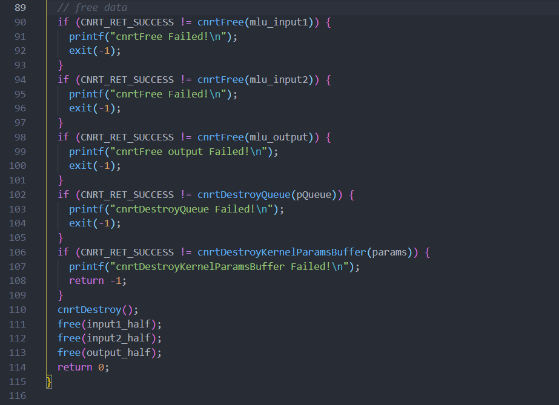

#### 3.1.3. 测试结果截图

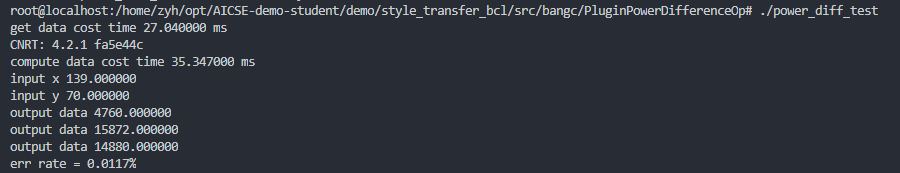

### 3.2. TensorFlow 集成

#### 3.2.1. 解决思路

根据PowerDifference的参数配置相应的变量。在Python文件中，根据创建的输入向量配置相相对应的参数类型。Tensorflow 从第二次开始的推理时间显著缩短，接近硬件时间，与 BangC 单算子时间基本一致，在代码中添加循环，该结论得到了验证。

#### 3.2.2. 补全代码截图

- `plugin_power_difference_op.cc`

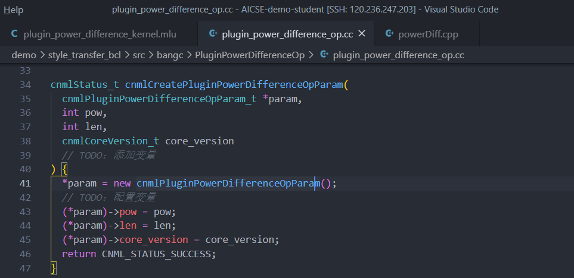
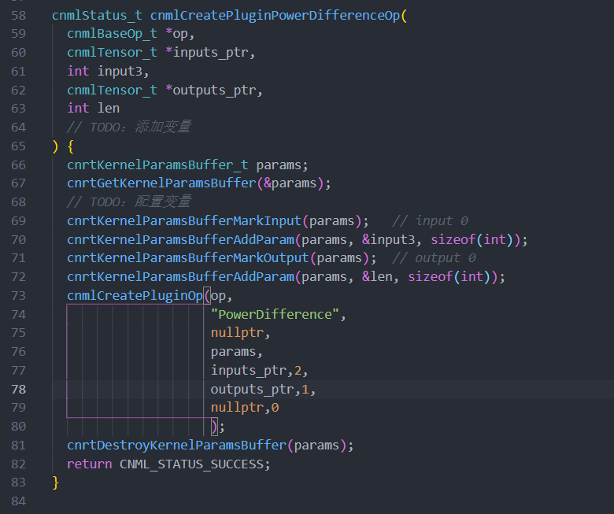
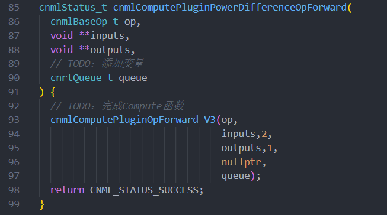

- `cnplugin.h`

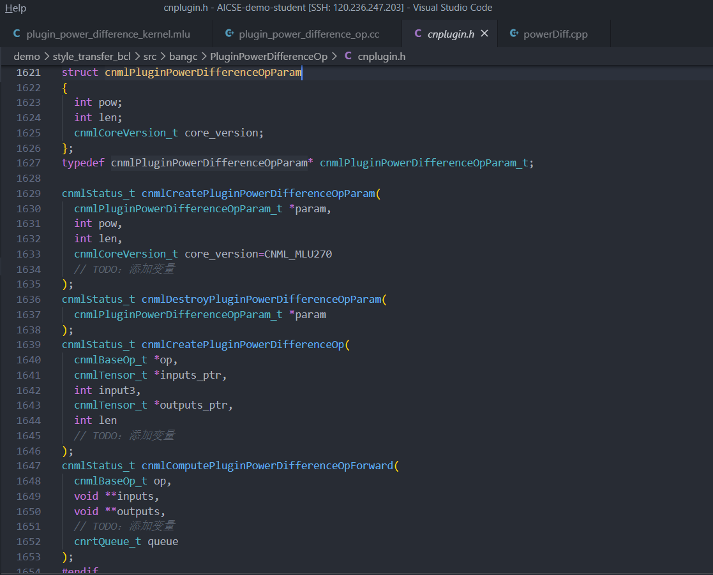

- `.../src/online_mlu/power_difference_test_bcl.py`

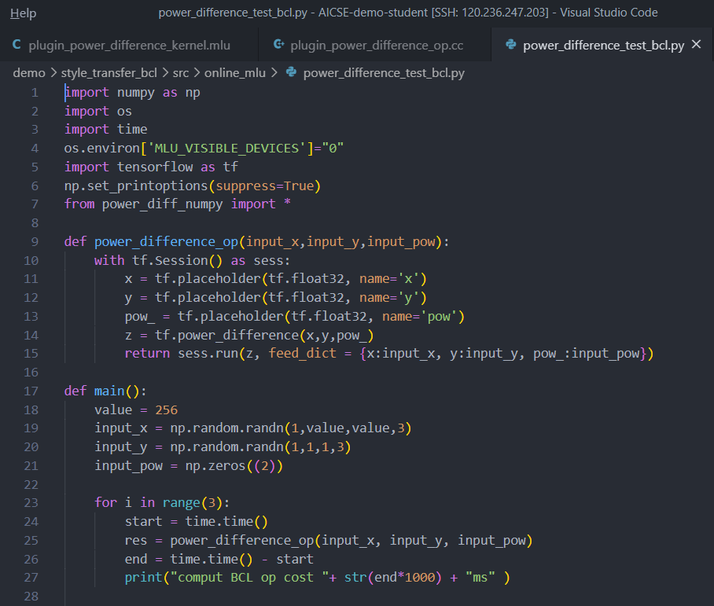
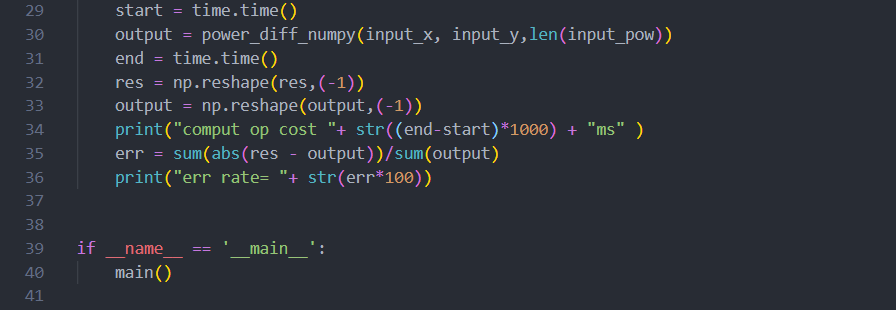

- `.../src/online_cpu/power_difference_test_cpu.py`

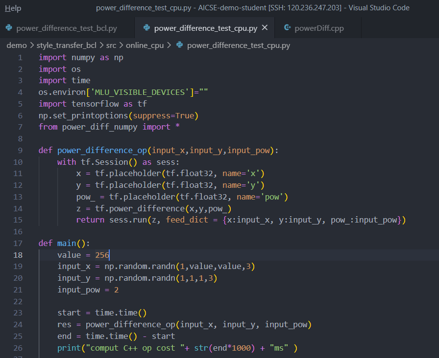
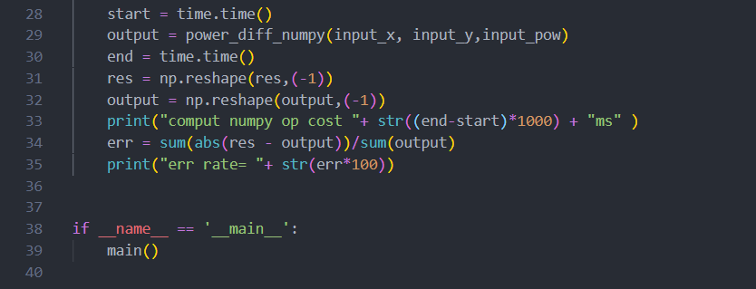

#### 3.2.3. 测试结果截图

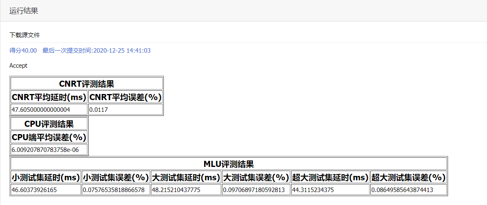

## 4. 实验总结分析

通过本次实验，我对 BangC 的用法有了大致的了解。通过实践认识到完成一次训练的大致编写流程和提速方法——申请内存，拷贝输入输出、多核拆分计算等。在该实验中，我对算子计算原理也有了更进一步的理解。此外，通过对测试文件的编写了解了 cnrt 框架以及用法。同时，我通过对算子的封装了解了 PluginOP 的部分接口，也提升了看文档、分析代码、Debug 的能力。这也是我初次使用 TensorFlow 编程框架，对其有了一定的认识。总的来说，该实验我收获颇丰。
