# 实验报告——实验二

> 姓名：朱英豪
> 学号：18373722
> 班级：182111

[TOC]

## 1. 试验内容

- 模型量化：将单精度模型量化为INT8模型。
- 在线推理，完成MLU推理代码的移植工作，分别比较三种不同模型（原始模型、PowerDifference算子模型，Numpy算子模型）在CPU和MLU上的性能和精度。
- 离线推理，完成MLU CNRT离线推理代码，并完成部署测试。

## 2. 试验步骤

### 2.1. 模型量化

#### 2.1.1. 请阐述一下你对于模型量化的理解

- **模型量化的背景需求**

Resnet-152神经网络的提出证明了越宽越深越大的模型往往比越窄越浅越小的模型精度要高，但是越宽越深越大的模型对计算资源要求更高，而现在模型应用越来越倾向于从云端部署到边缘侧，受限于边缘侧设备的计算资源，我们不得不考虑设备存储空间（storage）、设备内存大小（memory）、设备运行功耗（power）及时延性（latency）等等问题，特别是在移动终端和嵌入式设备等资源受限的边缘侧应用场景中更加需要我们进行优化。因此，为了解决此类问题模型量化应运而生。

- **什么是模型量化**

模型量化即以较低的推理精度损失将连续取值（或者大量可能的离散取值）的浮点型模型权重或流经模型的张量数据定点近似（通常为int8）为有限多个（或较少的）离散值的过程，它是以更少位数的数据类型用于近似表示32位有限范围浮点型数据的过程，而模型的输入输出依然是浮点型，从而达到减少模型尺寸大小、减少模型内存消耗及加快模型推理速度等目标。

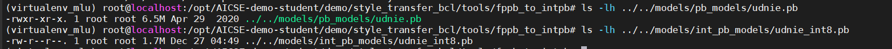

由上图可见，量化后，模型的大小有了显著减小，大小只占了约四分之一。

### 2.2. 在线推理

#### 2.2.1. 补全代码截图

- `transform_cpu.py`

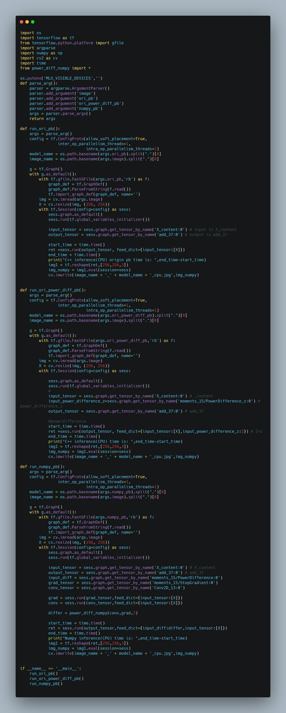

- `transform_mlu.py`

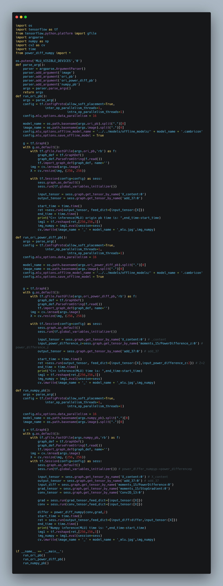

#### 2.2.2. 测试结果截图

> 包括执行结果与生成的图片

- 完成模型量化

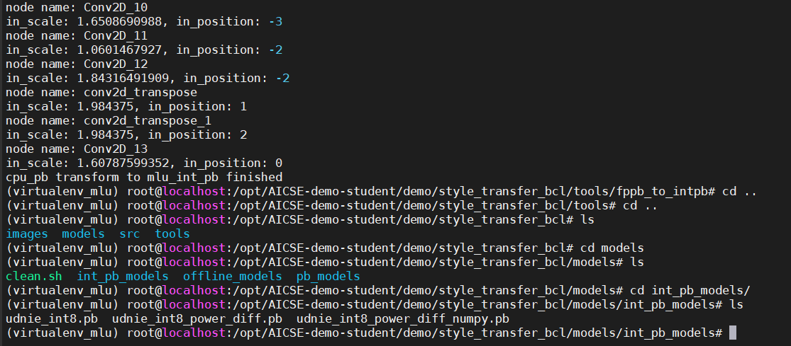

- 测试图片：

- MLU推理结果

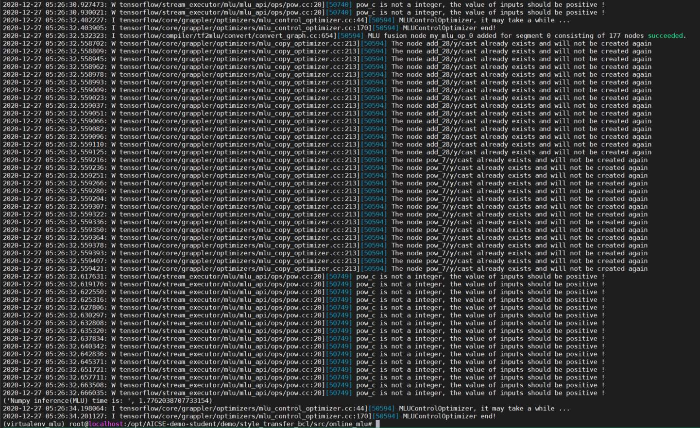

cube_udnie_int8_mlu.jpg

cube_udnie_int8_power_diff_mlu.jpg

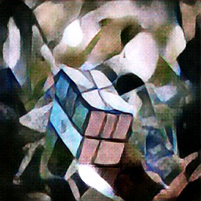

cube_udnie_int8_power_diff_numpy_mlu.jpg

- CPU推理结果

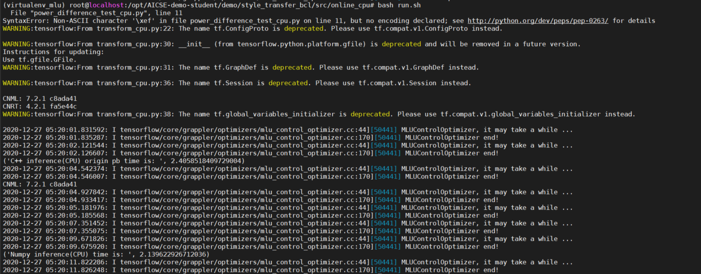

cube_udnie_cpu.jpg

cube_udnie_power_diff_cpu.jpg

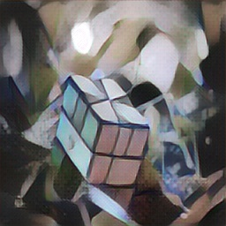

cube_udnie_power_diff_numpy_cpu.jpg

可见，利用三种不同模型生成的图片差异并不大。

### 2.3. 离线推理

#### 2.3.1. 补全代码截图

- `inference.cpp`

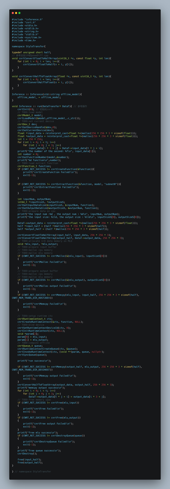

#### 2.3.2. 测试结果截图

> 包括执行结果与生成的图片

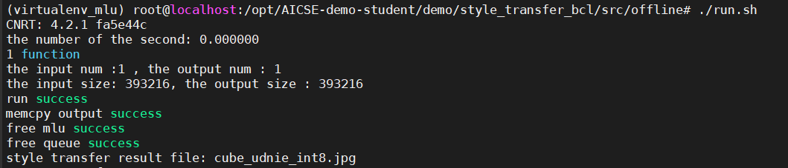

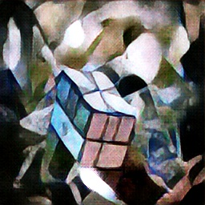

cube_udnie_int8.jpg

cube_udnie_int8_power_diff.jpg

同样，这两种推理方式几乎无差别。

## 3. 实验总结分析

实验过程中程序运行速度非常快，很快便训练完毕并生成所需的迁移风格后的图片，服务器的计算资源没有占用很多。

通过产生的图片可以看出：使用不同模型和是否进行量化对训练后生成的图片效果差异不大。这表明，模型量化后可以在保证运算精度损失不大的前提下，有效降低了模型复杂度，减小了资源消耗。以后在训练模型时都可以考虑先对模型进行量化。
