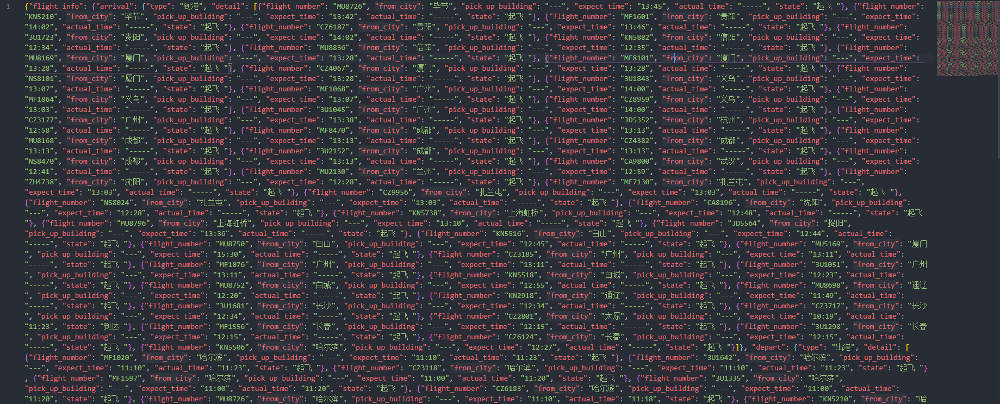
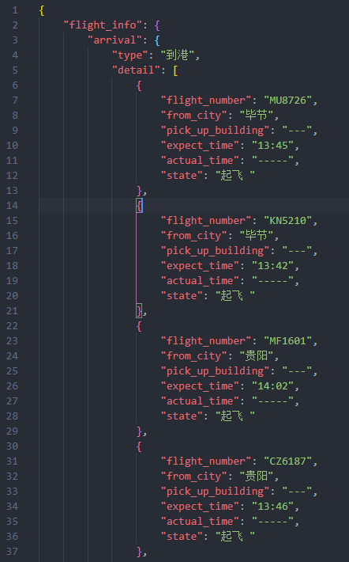
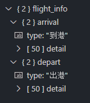
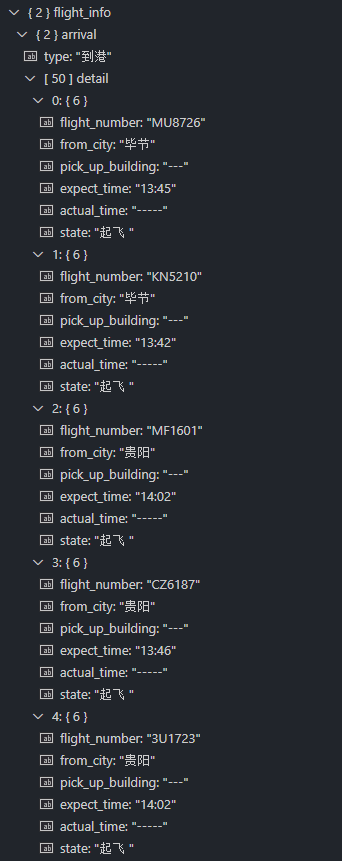

# scrapy-demo

> PKX Airport Flight Info (Computer Networks Course Assignment)
> 
> [北京大兴机场](http://data.carnoc.com/corp/airport/pkx__airportflight.html)

## 安装环境

- 安装Scrapy

```bash
pip install Scrapy
```

## 初始化项目

```bash
scrapy startproject flight
cd flight # into directory: pkx_flight/pkx_flight
scrapy genspider pkx "http://data.carnoc.com/corp/airport/pkx__airportflight.html"
```

**Note:**

- 在最外层的flight目录下开发（如VS Code中，打开该目录），防止import module error

## 如何运行

在外层flight目录下，`main.py`为定时（每2小时）爬取的脚本，亦可单次运行

```bash
scrapy crawl pkx # 单次爬取，pkx为在PkxSpider Class中定义的name
python main.py # 开始定时爬取
```

## 爬取结果

- 原网站内容


- 所爬原始结果



- 格式化JSON

在VS Code中Format Document



- 数据的层次结构

在VS Code中安装json插件


打开json文件，如本次的北京大兴机场进出港情况xxx.json，点击左侧工具栏的Json图标



可展开查看detail信息

