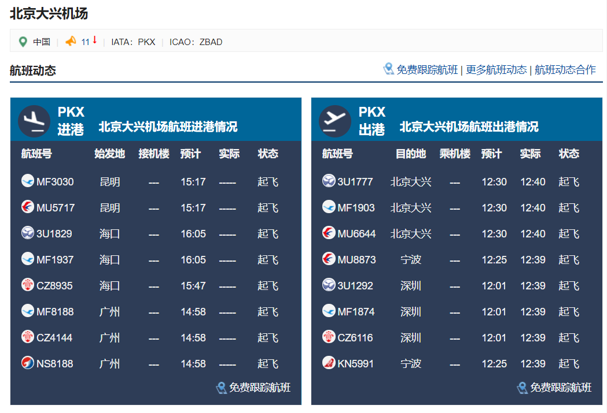
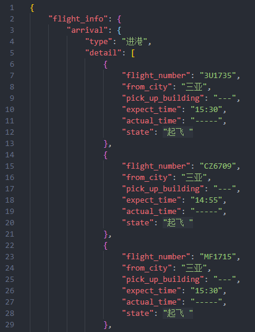
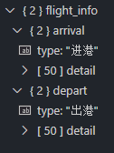

# scrapy-demo

> PKX Airport Flight Info (Computer Networks Course Assignment)
> 
> [北京大兴机场](http://data.carnoc.com/corp/airport/pkx__airportflight.html)

## 安装环境

- 安装Scrapy

```bash
pip install Scrapy
```

## 初始化项目

```bash
scrapy startproject flight
cd flight # into directory: pkx_flight/pkx_flight
scrapy genspider pkx "http://data.carnoc.com/corp/airport/pkx__airportflight.html"
```

**Note:**

- 在最外层的flight目录下开发（如VS Code中，打开该目录），防止import module error

## 如何运行

在外层flight目录下，`main.py`为定时（每2小时）爬取的脚本，亦可单次运行

```bash
scrapy crawl pkx # 单次爬取，pkx为在PkxSpider Class中定义的name
python main.py # 开始定时爬取
```

## 数据介绍

### 数据来源

数据来自于[民航资源网](http://www.carnoc.com/)，从中选取北京大兴机场作为分析目标

- [北京大兴机场](http://data.carnoc.com/corp/airport/pkx__airportflight.html)网站内容



该网站对进港/出港情况、分时统计等数据动态滚动更新，具有一定的爬取难度。

我从中选择爬取北京大兴机场航班进港与出港情况的数据

### 数据字段说明

| 字段名            | 说明                |
| ----------------- | ------------------- |
| flight_info       | 总进出港数据        |
| arrival           | 其下的均为进港数据  |
| depart            | 其下的出港数据      |
| type              | 表明类型：进港/出港 |
| flight_number     | 航班号              |
| from_city         | 始发地              |
| to_city           | 目的地              |
| pick_up_building  | 接机楼              |
| check_in_building | 乘机楼              |
| expect_time       | 预计到达时间        |
| actual_time       | 实际到达时间        |
| state             | 状态                |

## 爬取结果

- 所爬原始结果


- 格式化JSON

在VS Code中Format Document



- 数据的层次结构

在VS Code中安装json插件


打开json文件，如本次的北京大兴机场进出港情况xxx.json，点击左侧工具栏的Json图标



可展开查看详细信息(所含数量，具体字段内容)

