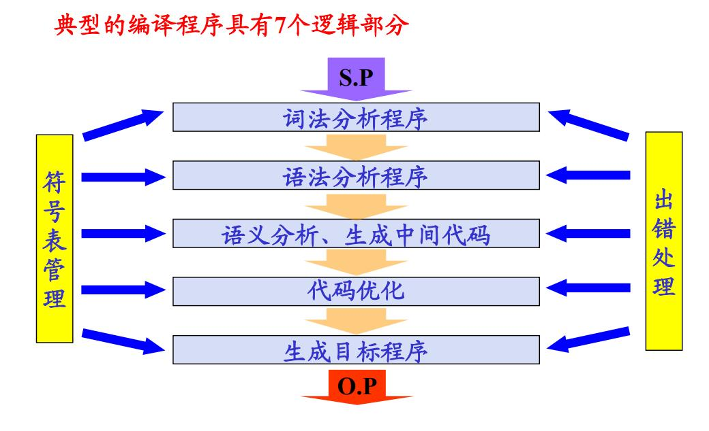

# Chapter01: 概论

> 介绍名词术语、了解编译系统的结构和编译过程

## 基本概念

- 低级语言（Low level language)
  - 字位码、机器语言、汇编语言
  - 特点：与特定的机器有关，功效高，但使用复杂、繁琐、费时、易出错。
- 高级语言
  - Fortran、Pascal、C语言等
  - 特点：不依赖具体机器，移植性好，对用户要求低，易使用，易维护等。
- 源程序
  - 用汇编语言或高级语言编写的程序称为源程序。
- 目标程序
  - 用目标语言所表示的程序。
  - 目标语言：可以是介于源语言和机器语言之间的“中间语言”，可以是某种机器的机器语言，也可以是某种机器的汇编语言。
- 翻译程序
  - 将源程序转换为目标程序的程序称为翻译程序。它是指各种语言的翻译器，**包括汇编程序和编译程序**，是汇编程序、编译程序以及各种变换程序的总称。

源程序是翻译程序的输入，目标程序是翻译程序的输出。

- 汇编程序
  - 若源程序用汇编语言书写，经过翻译程序得到用机器语言表示的程序，这时的翻译程序就称之为汇编程序。这种翻译过程称为“汇编”(Assemble)。
- 编译程序
  - 若源程序是用高级语言书写，经加工后得到目标程序，上述翻译过程称“编译” (Compile)。
- 解释程序（Interpreter）
  - 对源程序进行解释执行的程序。

## 编译过程

所谓编译过程是指将高级语言程序翻译为等价的目标程序的过程。

习惯上是将编译过程划分为5个基本阶段：

- 词法分析
- 语法分析
- 语义分析、生成中间代码
- 代码优化
- 生成目标程序

### 词法分析

任务：分析和识别单词。

单词：是语言的基本语法单位，一般语言有四大类单词：

- 语言定义的关键字或保留字（如BEGIN、END、IF）
- 标识符
- 常数
- 分界符（运算符）

### 语法分析

根据语法规则（即语言的文法），分析并识别出各种语法成分，如表达式、各种说明、各种语句、过程、函数、程序等，并进行语法正确性检查。

### 语义分析、生成中间代码

任务：对识别出的各种语法成分进行语义分析，并产生相应的中间代码。

- 中间代码：一种介于源语言和目标语言之间的中间语言形式。
- 生成中间代码的目的：
  - 便于做优化处理；
  - 便于编译程序的移植（中间代码不依赖于目标计
算机）。
- 中间代码的形式：编译程序设计者可以自己设计，常用的有**四元式、三元式、逆波兰表示**等。

### 代码优化

任务：目的是为了得到高质量的目标程序。

### 生成目标程序

由中间代码很容易生成目标程序（地址指令序列）。这
部分工作与机器关系密切，所以要根据具体机器进行。在做这部分工作时（要注意充分利用累加器），也可以进行优化处理。

注意：在翻译成目标程序的过程中，要切记保持语义
的等价性。

## 编译程序构造

### 编译程序的逻辑结构

按逻辑功能不同，可将编译过程划分为五个基本阶段。与此相对应，我们将实现整个编译过程的编译程序划分为五个逻辑阶段（即五个逻辑子过程）。

- 词法分析
- 语法分析
- 语义分析、生成中间代码
- 代码优化
- 生成目标程序

在上列五个阶段中都要做两件事：

- 建表和查表
- 出错处理

所以编译程序中都要包括表格管理和出错处理两部分。

- 表格管理（符号表组织）

在整个编译过程中始终都要贯穿着建表（填表）和查表的工作。即要及时地把源程序中的信息和编译过程中所产生的信息登记在表格中，而在随后的编译过程中同时又要不断地查找这些表格中的信息。

- 出错处理

规模较大的源程序难免有多种错误。编译程序必须要有出错处理的功能，即能诊察出错误，并向用户报告错误性质和位置，以便用户修改源程序。出错处理能力的优劣是衡量编译程序质量好坏的一个重要指标。

### 遍（PASS）

遍：对源程序（包括源程序中间形式）从头到尾扫描一次，并做有关的加工处理，生成新的源程序中间形式或目标程序，通常称之为一遍。

一遍扫描即可完成整个编译工作的称为一遍扫描编译程序。

### 前端和后端

根据编译程序各部分功能，将编译程序分成前端和后端。

- 前端：通常将与源程序有关的编译部分称为前端。
  - 词法分析、语法分析、语义分析、中间代码生成、代码优化（分析部分）
  - 特点：与源语言有关
- 后端：与目标机有关的部分称为后端。
  - 目标程序生成（与目标机有关的优化）（综合部分）
  - 特点：与目标机有关

## 编译程序的前后处理器

- 源程序：多文件、宏定义和宏调用，包含文件
- 目标程序：一般为汇编程序或可重定位的机器代码

## 编译技术的应用

- 语法制导的结构化编译器
- 程序格式化工具
- 软件测试工具
- 程序理解工具
- 高级语言的翻译工具etc
