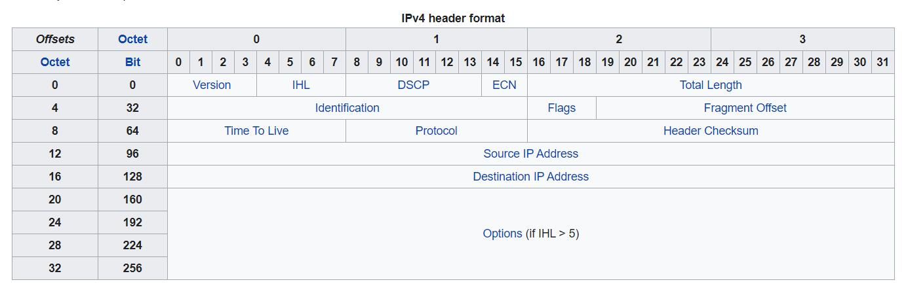

# Chapter04: The Network Layer

> 30%

## Key Points

- IP数据报的格式和**分片**
  - 需要知道每个分量代表的意思
- IP地址的**表示**和分类分配、**子网掩码**、**地址有效性**、广播地址
- **子网划分**
- **CIDR路由聚合**
- ARP协议和ICMP协议
  - 知道作用、报文有哪几种
- **路由表**、**路由器**的工作原理
- **RIP协议**和OSPF协议
  - RIP知道算法和流程
  - OSPF了解流程
- 网络层的**综合设计和应用**

## 虚电路服务&数据报服务

> page 113

对比（是否建立连接；分组顺序...）page 115

TCP/IP体系的网络层提供的是数据报服务。

## 网际协议IP

### IP地址及其表示方法

> page 118

IP地址的编址方法共经过了三个历史阶段：

- 分类的IP地址
- 子网的划分
- 构成超网

IP地址::={<网络号>,<主机号>}

[Reference: IP地址的分配原理](https://blog.csdn.net/qzcsu/article/details/72859431)

(可指派的网络数与书本有出入)

#### 网络号指派范围

- A类地址网络号占用一个字节，但是由于有一位是类别位，只有7位可供使用，但是由于规定，网络字段全0是个保留字段表示本网络，而127（01111111）是另外一个保留字段，作为本地软件的环回测试。我们常见的127.0.0.1表示本机，原因也是出自这里。所以A类地址可以指派的网络号个数为（2^7-2）。
- B类网络地址网络号有两个字节，前两位为10已经固定，只剩下14位可用，由于这14位无论怎么取值都不会使得网络号为全0或者全1，所以B类地址可以指派的网络号个数为（2^14）。
- C类地址有3个字节的网络字段号，前三位固定110，只有剩下21位可用，C类地址可指派的网络号个数为（2^21）。

#### 主机号指派范围

- 由于主机号有规定，全0的主机号代表IP地址是“本主机”所连接到的单个网络地址（例：一主机地址为5.6.7.8，则该主机所在的网络地址为5.0.0.0），而全1则表示“所有的”，即表示该网络上的所有主机。
- A类地址的主机号是由三个字节，24位组成，所以每一个A类网络中可分配的主机个数为（2^24-2）
- B类地址的主机号是由两个字节，16位组成，所以每一个B类网络中可分配的主机个数为（2^16-2）
- C类地址的主机号是由一个字节，8位组成，所以每一个C类网络中可分配的主机个数为（2^8-2）

[Reference: Reserved IP addresses](https://en.wikipedia.org/wiki/Reserved_IP_addresses)

### IP数据报的格式

> page 128

[Reference: IPv4](https://en.wikipedia.org/wiki/IPv4)

- 版本
- 首部长度
- 区分服务
- 总长度
- 标识
- 标志
  - MF(More Fragment)：1代表还有分片，0表明已是若干数据报片中的最后一个
  - DF(Don't Fragment)：不能分片。DF=0时才允许分片
- 片偏移
- 生存时间TTL
- 协议
- 首部检验和
- 源地址32位
- 目的地址32位

### 转发的流程

> page 132

默认路由：如不出现在路由表中，被记为0.0.0.0

分组转发算法 page 134

### 地址解析协议ARP

> page 124

已知一个机器的IP地址，需要找出其相应的硬件地址。ARP便解决这个问题。

方法：在主机ARP高速缓存中存放一个从IP地址到硬件地址的映射表，并且这个映射表还经常动态更新。

工作原理：page 126

## 划分子网&构造超网

### 划分子网

> page 135

- 从两级IP地址到三级IP地址
  - IP地址::={<网络号>,<子网号>,<主机号>}
  - 子网掩码(默认子网掩码)
- 使用子网时分组的转发 page 140
  - 路由表中含：目的网络地址、子网掩码、下一跳地址

### CIDR(构造超网)

> page 142

特点：

- 无分类（取消A/B/C类和划分子网的概念）
- IP地址::={<网络前缀>,<主机号>}
- CIDR记法
- 地址掩码

由于一个CIDR地址块中有很多地址，所以在路由表中就利用CIDR地址块来查找目的网络。这种地址的聚合即**路由聚合(构成超网)**，使得路由表中的一个项目可以表示原来传统分类地址的很多个(上千)路由。

## 网际控制报文协议ICMP

> page 147

为了更有效地转发IP数据报和提高交付成功的机会，在网际层使用了ICMP。

ICMP报文**装在IP数据报**中，作为其中的数据部分。

### 分类

> page 148

- ICMP差错报告报文
  - 终点不可达
  - 时间超过
  - 参数问题
  - 改变路由
- ICMP询问报文
  - 回送请求或回答
  - 时间戳请求或回答

### 应用

> page 149

- `ping`
- `tracert`(`traceroute`)

## 路由选择协议

> page 152

分层次的路由选择协议：

- 内部网关协议IGP
  - RIP
  - OSPF
- 外部网关协议EGP
  - BGP

### RIP协议

> page 153

采用分布式的基于距离向量的路由选择协议

特点：

- 仅和相邻路由器交换信息
- 交换的信息是当前本路由器所知道的全部信息，即自己现在的路由表
- 按固定的时间间隔交换路由信息

示例：page 156

报文格式：page 157

使用用户数据报UDP进行传送

存在的问题：好消息传播得快，而坏消息传播得慢

### OSPF协议

> page 159

开放最短路径优先OSPF

采用分布式的链路状态协议

特点：

- 向本自治系统中所有路由器发送信息
  - 采用洪泛法
- 发送的信息是与本路由器相邻的所有路由器的链路状态
  - 可有度量的概念（费用、距离、时延、带宽etc）
- 只有当链路状态发生变化时，才向所有路由器用洪泛法发送信息
- 更新过程收敛得快

直接采用IP数据报传送——减少路由信息的通信量；不必将长的数据报分片传送。

### BGP协议

> page 163

不同自治系统的路由器之间交换路由信息的协议，采用了路径向量路由选择协议

特点：

- 在自治系统之间交换“可达性”信息
- 自治系统之间的路由选择必须考虑有关策略
- BGP只能是力求寻找一条能够到达目的网络且**比较好**的路由，并非最佳

### 路由器

> page 167

- 路由器的结构
  - 路由选择部分（控制部分）
  - 分组转发部分
- 交换结构
  - 通过存储器
  - 通过总线
  - 通过互连网络
