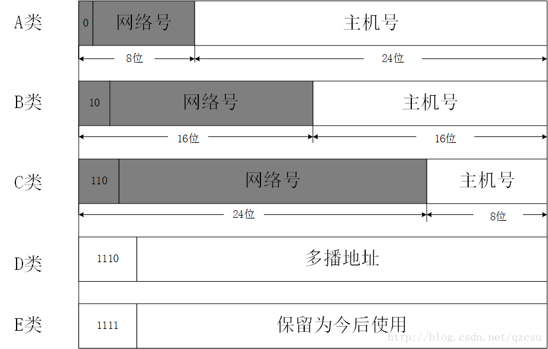

# Chapter04: The Network Layer

> 30%

## Key Points

- IP数据报的格式和**分片**
  - 需要知道每个分量代表的意思
- IP地址的**表示**和分类分配、**子网掩码**、**地址有效性**、广播地址
- **子网划分**
- **CIDR路由聚合**
- ARP协议和ICMP协议
  - 知道作用、报文有哪几种
- **路由表**、**路由器**的工作原理
- **RIP协议**和OSPF协议
  - RIP知道算法和流程
  - OSPF了解流程
- 网络层的**综合设计和应用**

## 虚电路服务&数据报服务

> page 113

对比（是否建立连接；分组顺序...）page 115

TCP/IP体系的网络层提供的是数据报服务。

## 网际协议IP

### IP地址及其表示方法

> page 118

IP地址的编址方法共经过了三个历史阶段：

- 分类的IP地址
- 子网的划分
- 构成超网

IP地址::={<网络号>,<主机号>}

[Reference: IP地址的分配原理](https://blog.csdn.net/qzcsu/article/details/72859431)

(可指派的网络数与书本有出入)

#### 网络号指派范围

- A类地址网络号占用一个字节，但是由于有一位是类别位，只有7位可供使用，但是由于规定，网络字段全0是个保留字段表示本网络，而127（01111111）是另外一个保留字段，作为本地软件的环回测试。我们常见的127.0.0.1表示本机，原因也是出自这里。所以A类地址可以指派的网络号个数为（2^7-2）。
- B类网络地址网络号有两个字节，前两位为10已经固定，只剩下14位可用，由于这14位无论怎么取值都不会使得网络号为全0或者全1，所以B类地址可以指派的网络号个数为（2^14）。
- C类地址有3个字节的网络字段号，前三位固定110，只有剩下21位可用，C类地址可指派的网络号个数为（2^21）。

#### 主机号指派范围

- 由于主机号有规定，全0的主机号代表IP地址是“本主机”所连接到的单个网络地址（例：一主机地址为5.6.7.8，则该主机所在的网络地址为5.0.0.0），而全1则表示“所有的”，即表示该网络上的所有主机。
- A类地址的主机号是由三个字节，24位组成，所以每一个A类网络中可分配的主机个数为（2^24-2）
- B类地址的主机号是由两个字节，16位组成，所以每一个B类网络中可分配的主机个数为（2^16-2）
- C类地址的主机号是由一个字节，8位组成，所以每一个C类网络中可分配的主机个数为（2^8-2）

// TODO

### IP数据报的格式

### 地址解析协议ARP

## 划分子网&构造超网

### 划分子网

### CIDR(构造超网)

## 网际控制报文协议ICMP

## 路由选择协议

### RIP协议

### OSPF协议

### BGP协议

### 路由器

