# 数据挖掘实验报告——熟悉SmartMining云平台

[TOC]

## 实验目的

本次实验主要自行探索并熟悉SmartMining云平台“工具商城”模块-“敏捷挖掘”功能中的相关节点和操作，最终应该达到如下目标：

1. 对“敏捷挖掘”部分的结构和功能有大概的了解，能够建立、保存、修改、执行一个完整的工作流。
2. 对“节点库”中的各个节点功能、配置方法以及节点涉及到的模型或算法有基本的理解和认知。

## 实验内容

- 熟悉各个节点功能和使用方法，以及参数的设置，分别对应数据挖掘过程中的哪一个部分。选取至少三个节点（最好是对应数据挖掘过程的不同阶段），在实验报告中写明对该节点的理解以及使用过程说明。
- 学会建立工作流并完成保存、导入、导出等操作。
- 自行尝试建立完整的工作流，并执行工作流，报告中给出完整工作流的截图（执行成功的工作流）、对该工作流的说明（建立思路、设计过程等）以及过程中遇到的问题和解决方法。
- 写出自己对此次实验的感想和收获。

## 实验步骤

### 准备工作

#### 创建工作流

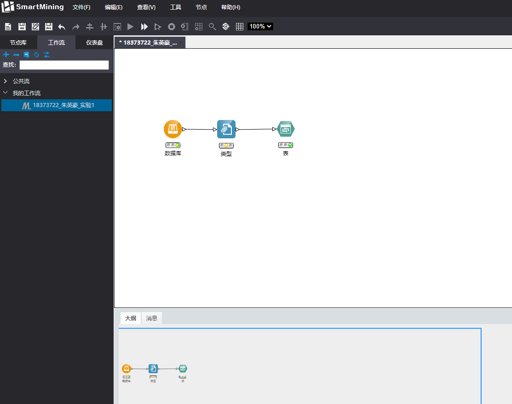

点击“文件-新建工作流”创建一个新工作流：18373722_朱英豪_实验1，选择保存至“我的工作流中”。如图已创建完成。

#### 配置数据库

在左侧栏中选择“数据源-数据库”，拖拽至主工作区，便建立了数据库节点。其余对各项节点的添加操作均与之类似：从左侧节点库中拖拽至主工作台，以下不再重复说明。

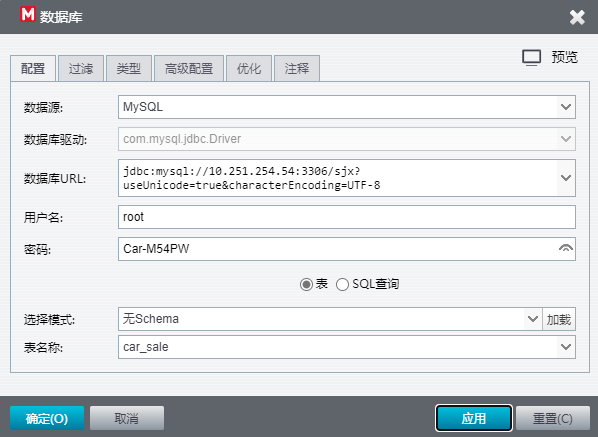

双击“数据库”，如图，根据PPT中的提示配置数据库相关参数。在本实验中，我选择了car_sale表作为数据源进行实验。

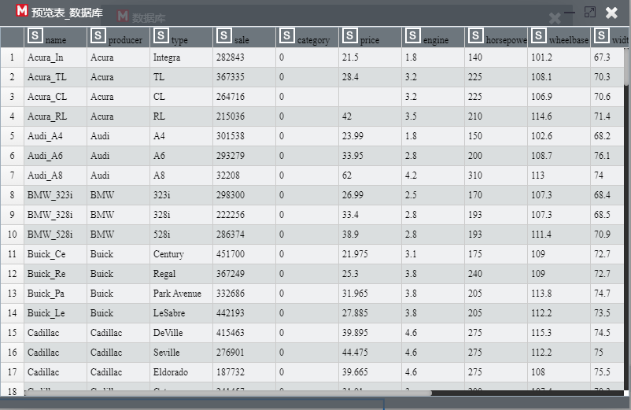

预览表，可看到有如上若干参数：

| name | producer | type | sale | category | price | engine | horsepower | wheel | base | ...  |
| ---- | -------- | ---- | ---- | -------- | ----- | ------ | ---------- | ----- | ---- | ---- |
|      |          |      |      |          |       |        |            |       |      |      |

可以看到该数据源是对购买汽车的记录，包括了汽车名称、销量等各种参数。

#### 实验设计

根据数据源的相关信息，我设想做根据汽车的属性来做对汽车若干属性预处理、相关分析等操作来熟悉SmartMining实验平台，完成本次实验的实验目标。

我对节点的设计如下图：

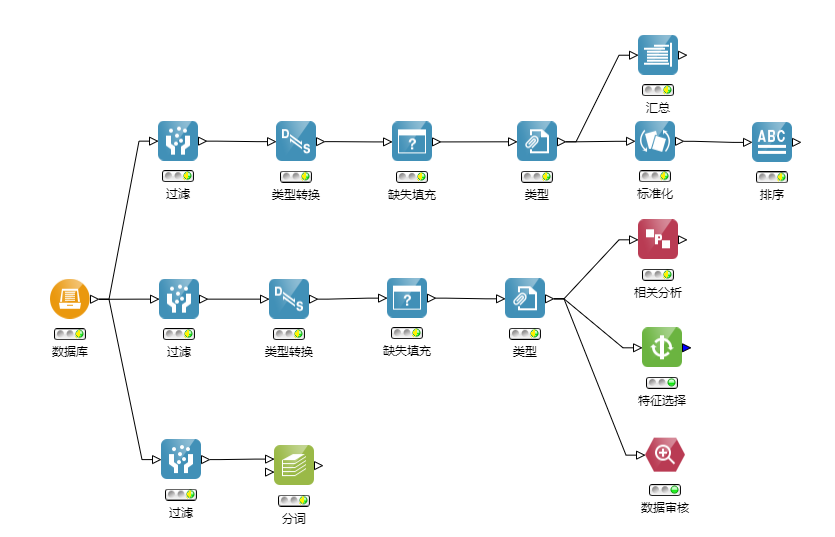

具体对各个节点的操作处理实验操作部分说明。

### 实验操作

对于该数据源，我从数据库节点外引出了三个分支，分别对应了我所设计的三个实验部分：

- Part 1: 对某属性的排序操作
- Part 2: 对其中若干属性的相关度分析、特征选择、数据审核
- Part 3: 对name字段的分词

在三个部分我分别进行了过滤字段操作(选择我所需要的字段来研究，不需要将所有字段放入模型中来分析)

#### Part 1: 数据预处理

以Part 1为例，演示我是如何进行数据预处理的。

- 过滤字段

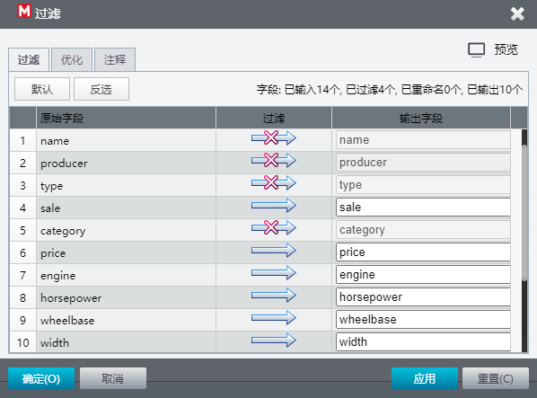

- 类型转换

根据数据特点，将数值数据(默认为string)全部转换为double型

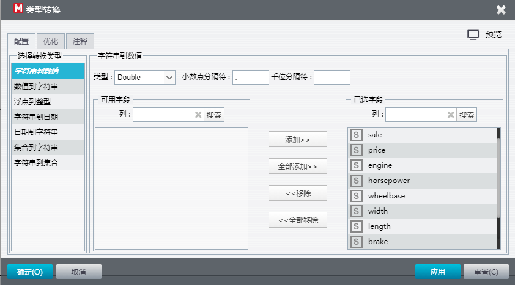

- 缺失填充：对所有字段均设置为平均值填充

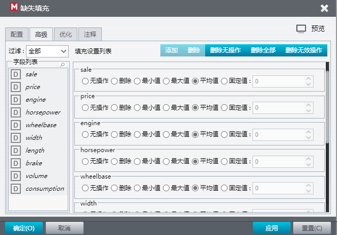

- 类型说明：指明各字段在模型中的角色

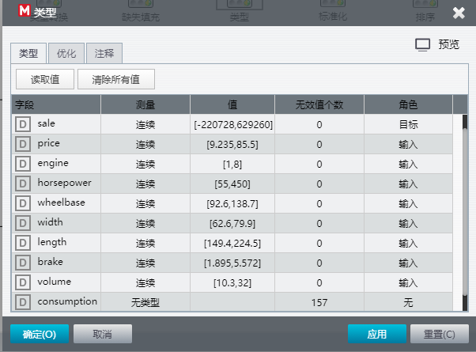

- 数据标准化处理

此处，我将除price字段外的所有数据，全部使用z-Score标准化处理。

> 标准分数（Standard Score，又称z-score，中文称为Z-分数或标准化值）在统计学中是一种无因次值，就是一种纯数字标记，是借由从单一（原始）分数中减去母体的平均值，再依照母体（母集合）的标准差分割成不同的差距，按照z值公式，各个样本在经过转换后，通常在正、负五到六之间不等。(来源：Wikipedia)

- 排序：将部分字段设置主要、次要关键字，并指定排序方式。

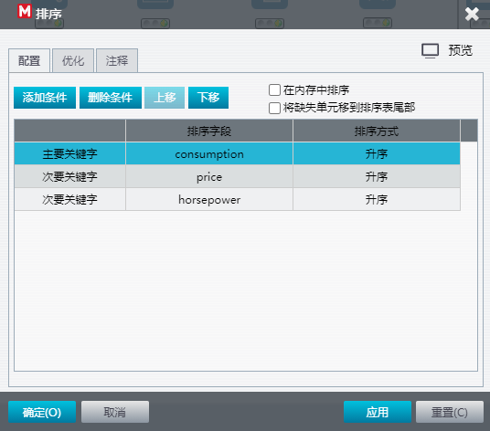

- 可视化：预览表

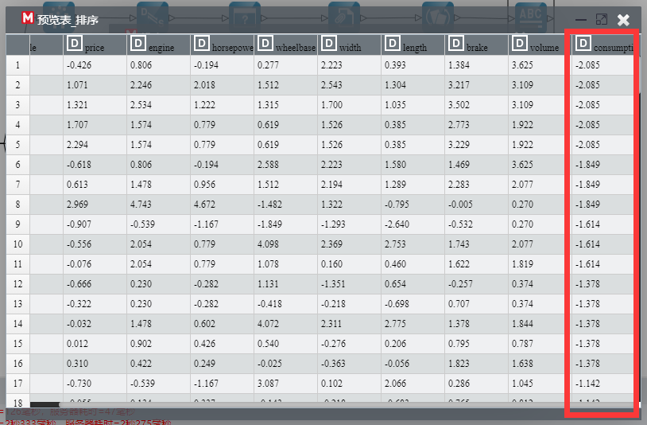

可见，以上几个节点已经跑通，consumption按升序排。

#### Part 2: 相关分析、特征选择、数据审核

在该部分中，我选择3个属性：sale、price、consumption来分析。

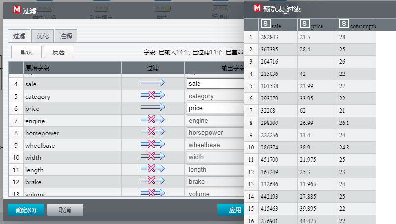

如图为过滤的字段。

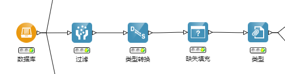

其余对数据的预处理部分与Part 1类似。

- 相关度分析：分析某几个属性的相关程度

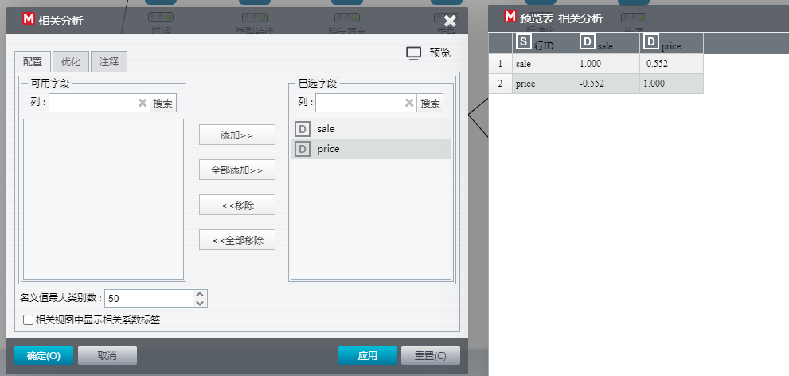

此处，我选择分析sale(销量)、price(价格)两个字段的相关度分析。如图为结果。

有趣而显然的发现：**属性自己与自己的相关程度是1。**

- 特征选择：设置属性的重要性分段，特征质量等参数的设定。

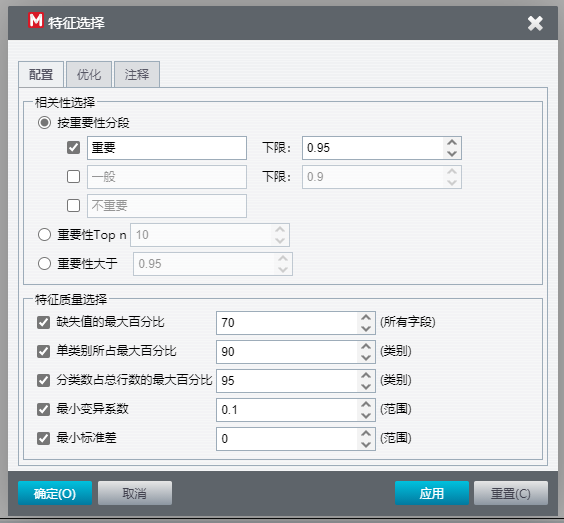

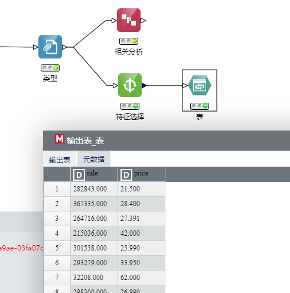

如上为可视化表的结果。

- 数据审核：查看相关数据

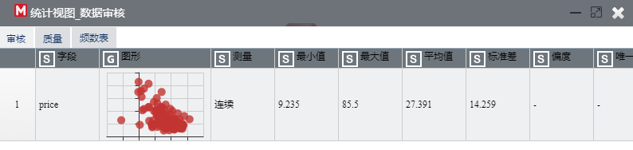

如图，可见price字段的审核结果。

#### Part 3: 对name字段的分词

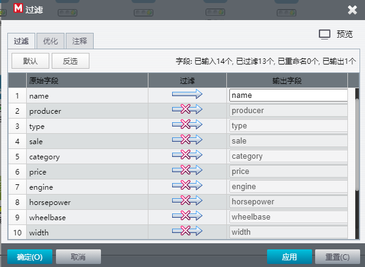

过滤仅保留name

- 分词：文本挖掘中的一部分，其自带的模型可直观地分析出中/英文词语的相关性质

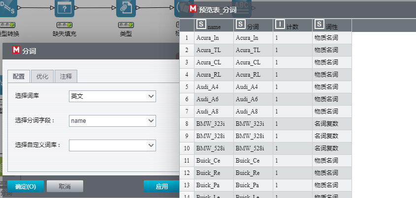

由于name字段的均为英文的，我选择词库为英文。如图为分词结果，可见该模型并不是很准确，应当多为专有名词。

## 实验中遇到的问题及解决方法

- 没处理缺失值

一开始，由于对数据部分的相关节点不熟悉，我对数据的理解和处理仅限于过滤选择自己需要的属性，类型转换。但继续想做后续的数据分析操作时，发现节点几乎都跑不通。通过对数据表的预览，发现有许多的缺失值。

解决方法：添加缺失填充节点，我选择用平均值来填充。

- 需要选择数据的类型(是输入/输出...)

在做数据挖掘时，要对数据本身有很明确的认识：它是用户输入的？是待预测的值？是离散变量？是连续变量？其数据类型是什么？在这个实验中，我对这些步骤有了更深的认识。

解决方法：通过节点的添加，进行细致的指明。如在“类型”节点里，说明sale是连续字段，角色是目标。

- 机器学习模块

我试图对已数据预处理后的数据进行如线性回归、随机森林等分类预测。但并没有跑通。提示错误有“未查找到可以执行的节点，执行终止。”、“未指明元数据”等。待解决。

## 实验感想和收获

在大数据与人工智能的时代，数据是重要的——我们用海量的数据来训练模型。人脸识别模型需要数以亿计的人脸数据来进行预训练，自动驾驶模型需要提前对所有的路况进行训练模拟……在做这一切的第一步是什么？是拿到数据。听闻许多实验室的同学干着“AI搬砖”的活，爬取数据，标注数据……如著名的ImageNet数据集便离不开许许多多的人工标注。可见，拿到一份可靠的数据就很不容易。在这个实验中，我们已有数据库里现成的数据，我们不用再自己去繁复地找，但我依然要提这一“数据获取”的过程。

当拿到一个数据后，也并非简简单单地就可以拿来套很多高大上的机器学习模型的。我们要花很多功夫在数据的获取、预处理上。很如何获得一份有用的数据，选取所需的数据，更重要的是，如何理解你拿到的数据。在课上的例子中，我们有学习到过一个经典的反例：在不理解数据的情况下，随随便便拿标识号当输入，最终训练出了可笑的结果。在这次实验中，我的收获多不在于很多操作的使用方法，而在于对数据的理解，理解深刻后，才能知道什么数据是你所需的；什么数据要转成什么类型；要如何处理缺省值等等。只是这一部分的“简单”工作，亦让我更加明白——理解你手中的数据的重要性，它是一切后续具体分析工作的前提。

数据挖掘的另外一个阶段当是对数据进行训练/可视化等操作，可惜由于SmartMining平台的故障，在本次实验中并未较多地涉及。数据审核、可视化表是我这次实验里所做的可视化部分。对于这一阶段，当是离走向应用最近的一个阶段。对于数据，我们要拿来做什么，处理成什么样子，希望得到什么样的结果或是突然发现了什么样的结果，均在这一过程中体现。
