# 数据挖掘实验报告——医疗诊病数据预处理

[TOC]

## 实验目的

本次实验主要利用给出的医疗诊病数据集，对数据挖掘中的预处理过程进行理解和学习，最终应该达到如下目标：

1. 进一步熟悉SmartMining平台上数据预处理相关的节点和功能。
2. 对数据预处理的思想和方法有所了解，建立一个完整的预处理相关的工作流。

## 实验内容

- 熟悉SmartMining平台上数据预处理相关的节点。
- 根据实验课上的讲解以及实验PPT，自行思考给出的医疗诊病数据中，针对不同问题可能需要哪些预处理步骤。建立预处理工作流，并执行工作流，报告中给出完整工作流的截图（执行成功的工作流）、对该工作流的说明（建立思路、设计过程等）以及过程中遇到的问题和解决方法。
- 写出自己对此次实验的感想和收获。

## 实验步骤

### 实验设计

实验中需要处理两张关于药物的表，这两张表的字段均相同(仅中英之差)，故最终需要合并。

在实验前，先大致观察这两张表(通过数据审核)：

- 表1中含缺失数据

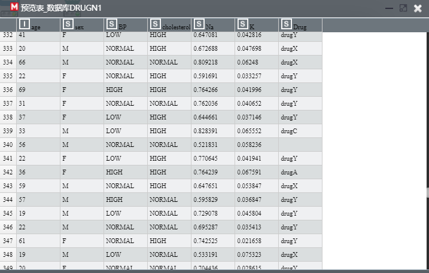

- 表2中存在大量脏数据
  - 如NORMAL拼错成NORMALL
  - Na、K存在离群值(不在正常范围内)

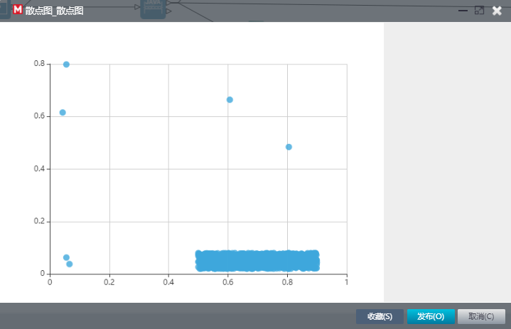

因此对于这两张表，需要进行的操作有：

- 类型转换
  - 将字符型转为double(钠钾含量)/int(年龄)
- 缺失填充
  - 我在此使用删除的方式
- 选择
  - 将拼错的数据删去
  - 将离群值删去
- ...

设计节点图总览

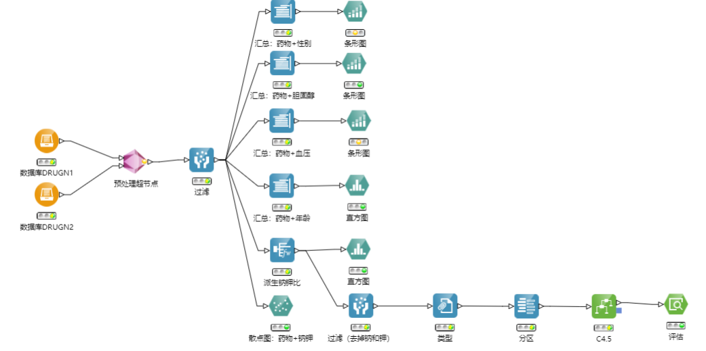

数据预处理部分超节点总览

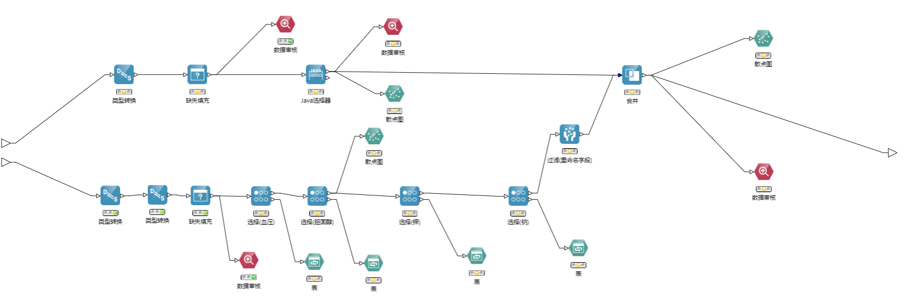

### 关键节点的配置和结果

#### 数据预处理部分

- 类型转换：string->double

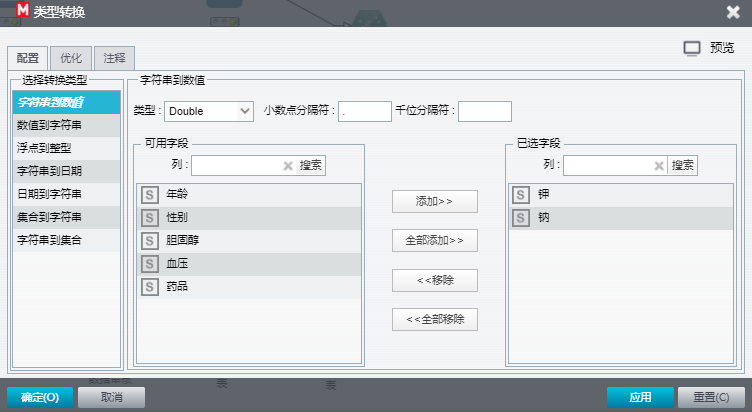

- 类型转换：string->int

- 缺失填充

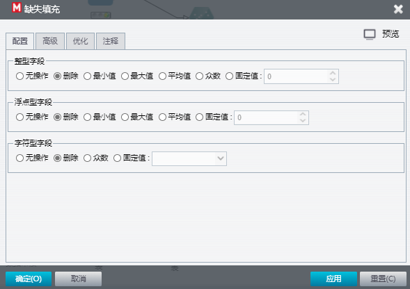

- 删去只含`\n`的空数据

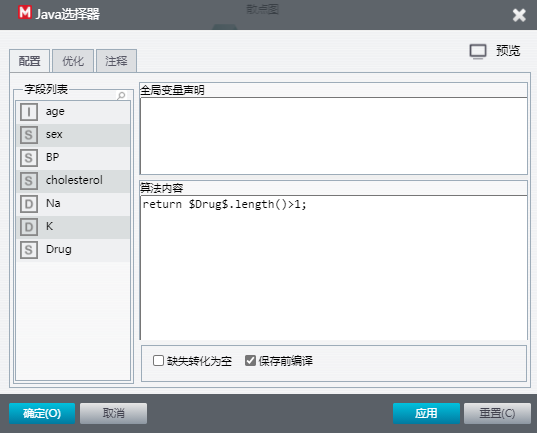

- 模式匹配选择(血压、胆固醇)

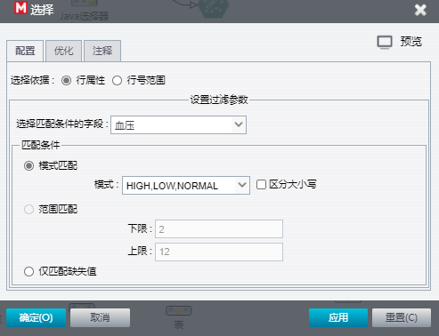

- 范围匹配选择(钠、钾)

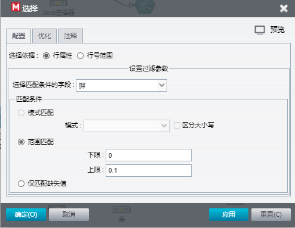

进行数据预处理后，通过散点图，可见前后的对比：

- 处理钠钾的离群值前

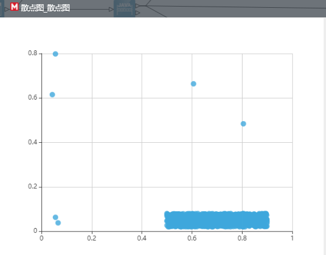

- 处理钠钾的离群值后(已经过了表1和表2的合并)

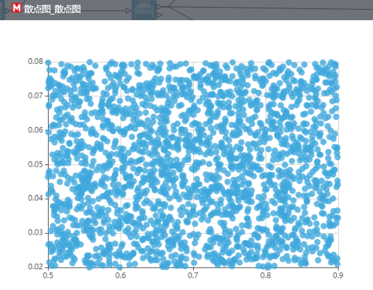

可见已清理掉了离散值，表明数据预处理之有效。

- 两表合并后数据审核

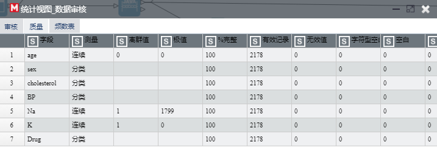

可见没有无效值，离散值、极值已几乎清理完全。

#### 分析部分

- 汇总：药物+性别

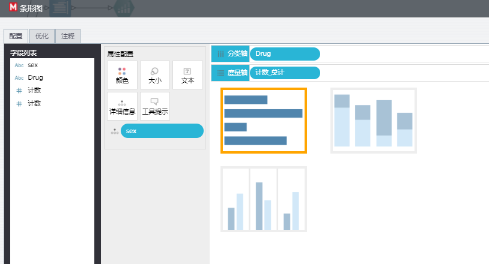

汇总节点中选取药物和性别，条形图的节点配置如上。

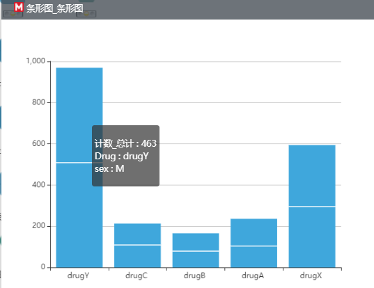

上为结果。(汇总：药物+胆固醇&汇总：药物+血压类似)

- 汇总：药物+性别

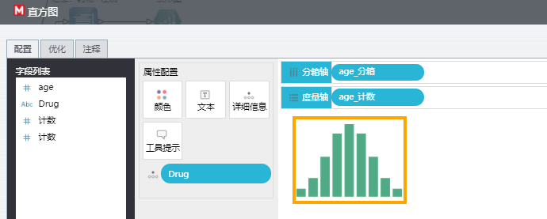

汇总节点中选取药物和年龄，条形图的节点配置如上。

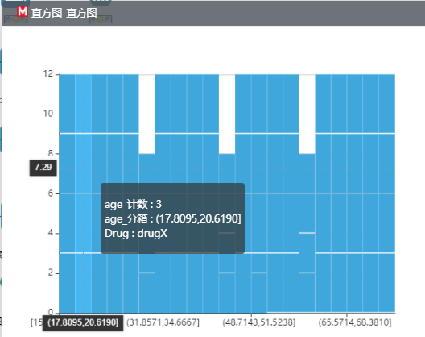

上为结果。

- 派生钠钾比，将Na/K的值作为一个分析参数

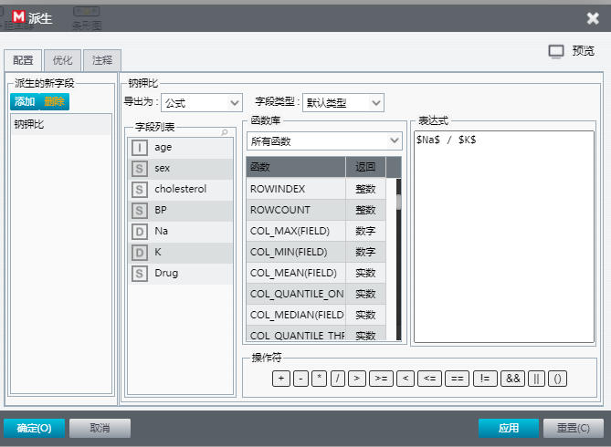

派生Na/K节点的配置

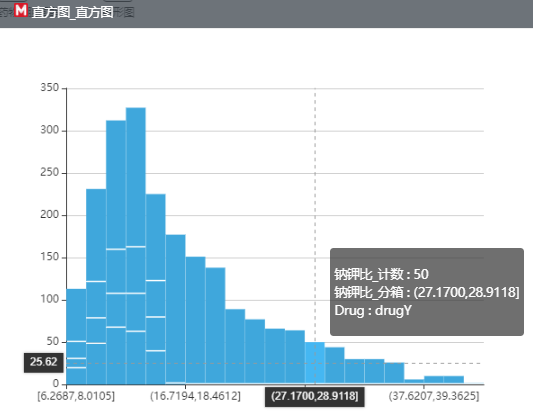

可分析出：Na/K值较高的，多为drugY

- C4.5分析

> 产生决策树的算法

经过类型声明，测试集与训练集的分区后，可得分析结果：

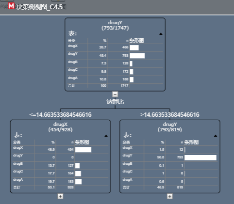

训练结果的评估如下：

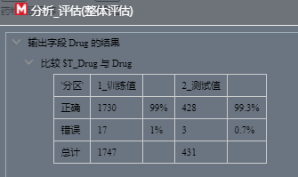

在测试集中的正确率为99.3%，可见训练效果非常好。(数据预处理部分有很大的功劳)

## 实验中遇到的问题及解决方法

- 对机器学习部分节点(如C4.5)的不熟悉

通过与同学之间的交流以及反复改变参数设置的尝试，逐渐熟悉。

- 数据预处理部分的设计比较复杂，一时没有处理完全

通过反复使用数据审核、观察散点图等方式，对处理结果进行可视化的分析。借助这些节点，我找到了尚未处理好的数据，如异常值、缺失值等。

- 表1中缺失填充处理失败

在与同学的讨论之间发现了这个问题。一开始，因为缺失填充一直失败，我们认为是网站的BUG。后来想到可能数据并不是真的空，我们将数据通过DataGrip软件打开，发现所有数据末尾都有换行，而DataMining不将其视为是空数据，发现了问题所在。

解决方法：通过Java选择器，编写代码，筛选出string length>1的数据，过滤掉仅含换行的“空”数据。

## 实验感想和收获

本次实验主要是数据预处理——不断地清理脏数据、异常数据。

实验过程中，我学到了大量数据预处理相关的方法。在助教的提示下，我学会了使用数据审核、散点图等可视化方法来观察数据，也对数据中可能存在的如拼错、某两个字段输入反了、异常值处理等可能出错的地方有了一个直观的认识。

便是在通过实践，观察到了在数据处理前后，两张散点图里效果好坏之对比以及在C4.5训练结束后的评估中超过99%的正确率，我深刻感受并意识到了数据预处理是如此的重要。没有数据预处理，没有对数据很好的理解，不能进行此后的机器学习、统计学习方向的分析。