# 数据挖掘实验报告——关联规则挖掘

[TOC]

## 实验目的

本次实验主要利用给出的BASKETS1n数据集（推荐）或BASKETS2n数据集，对关联规则挖掘算法进行理解和学习，最终应该达到如下目标：

1. 基于实践，对完整的数据挖掘过程有进一步的认识。
2. 对关联规则挖掘相关的算法进行学习。
3. 对数据价值进行思考探索，提出自己的建议。

## 实验内容

- 熟悉SmartMining平台上关联规则挖掘相关的节点。
- 根据实验课上的讲解以及实验PPT，建立关联规则挖掘的工作流，并执行工作流，报告中给出完整工作流的截图（执行成功的工作流）、对该工作流的说明（建立思路、设计过程等）以及过程中遇到的问题和解决方法。
- 写出自己对此次实验的感想和收获，以及对最终关联挖掘结果的思考和分析。

## 实验步骤

### 完整工作流

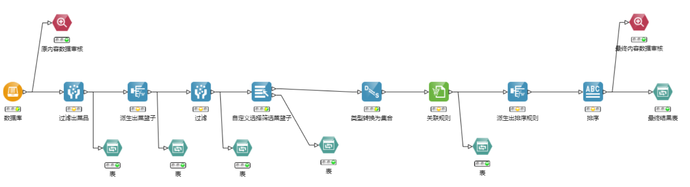

### 建立思路与设计过程

递归下降式地分析：

- 观察数据库中的内容，明确要做什么？

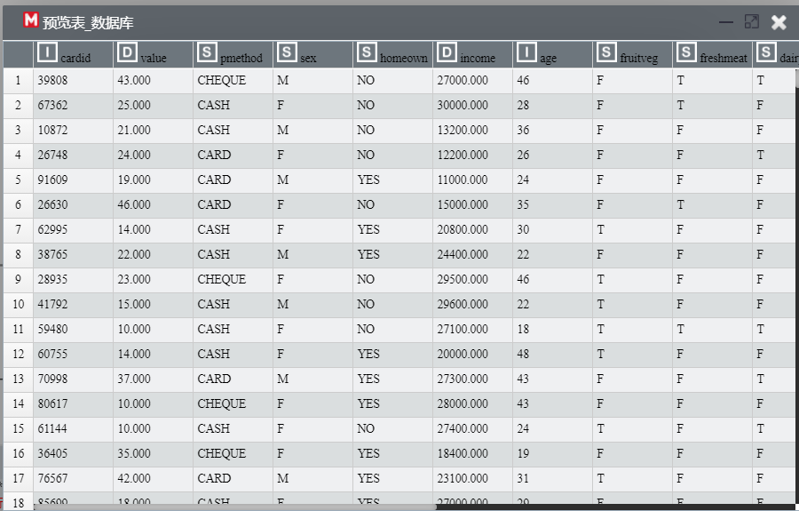

1. 我们要做一个关联规则的挖掘：每个客户所买的东西都和什么东西有关联。因此，明确了调查目标（表中有用的项，要做列选择）：具体买了什么菜。
2. 对于我们所要的具体菜品，数据值为T/F，这不利于我们的数据转化，因此我们要进行转化——将各个客户买的菜整合为一个集合，制成菜篮子，才能进行关联规则的挖掘。

- 要怎么整合成集合？

类型转换中可以将字符串转换为集合，其中可以设定规则，如将以空格分隔的字符串进行split，再append进list中。

- 要怎么将组合成菜品之间以空格分隔的字符串？

通过自定义规则派生，可以用Java语言写函数拼接字符串。

- 该字符串亦是一个派生出来的量——菜篮子（组合了同一个客户所购的菜品）

### 各节点信息

- 数据审核

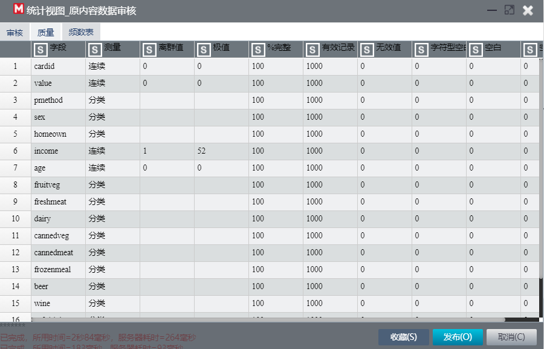

可见没有缺失值，不需要缺失填充

- 过滤出菜品

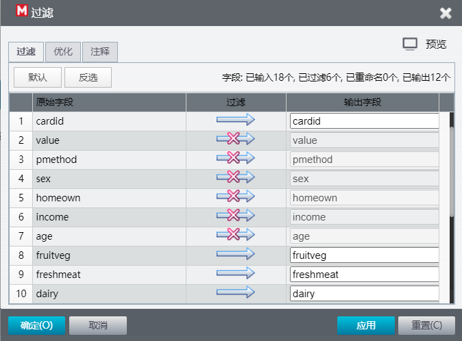

我们只需要顾客所买的菜，其余信息过滤掉

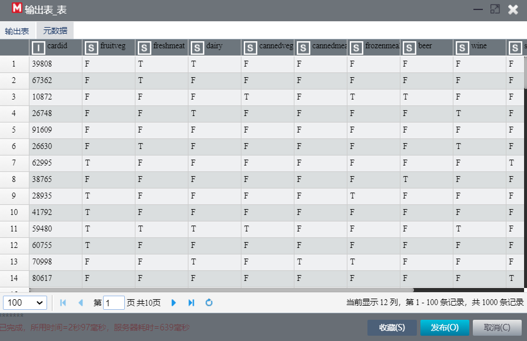

- 派生出菜篮子

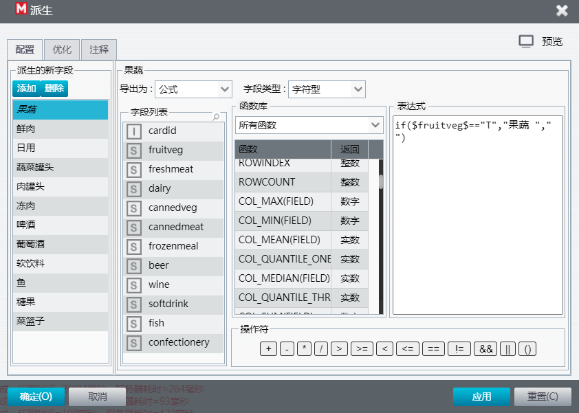

由于买了没买的数据值是T/F，在此进行判断、字符串处理——只要T（买了），如果买了，字符串处理为后加一个名称+空格（便于拼接）

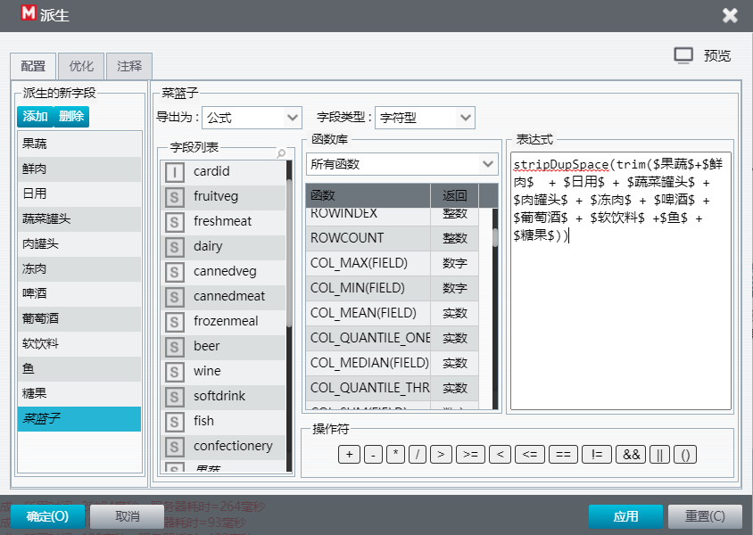

将菜品拼接成菜篮子

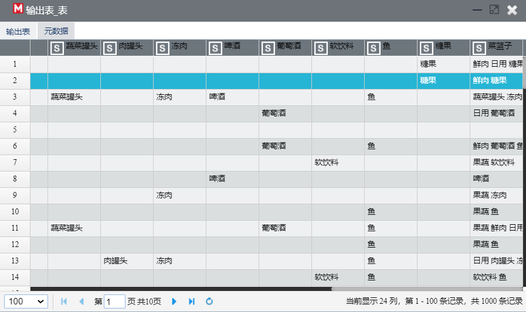

- 过滤只要菜篮子（保留cardid）

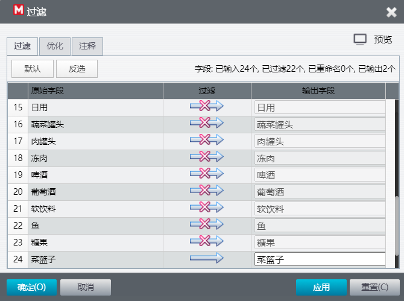

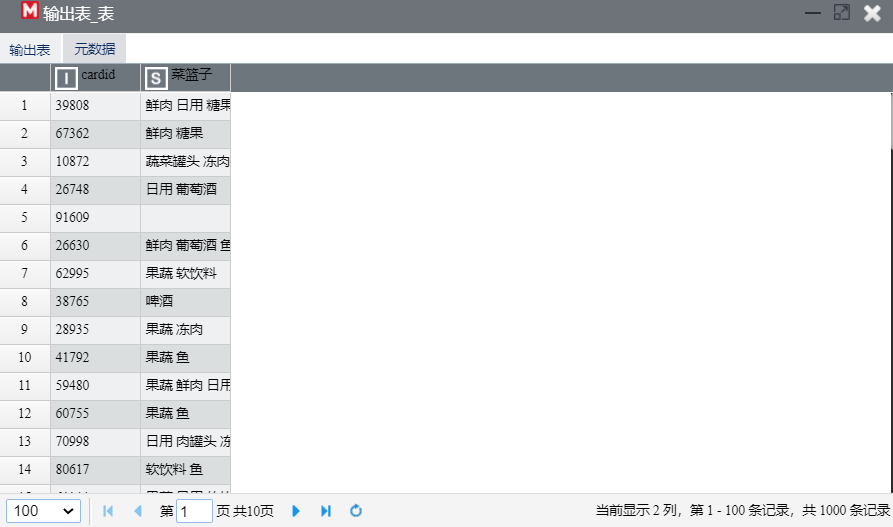

可见表中含缺失值、只有一个菜的菜篮子，在下一步中我们要对此进行筛选。

- 自定义选择筛选菜篮子

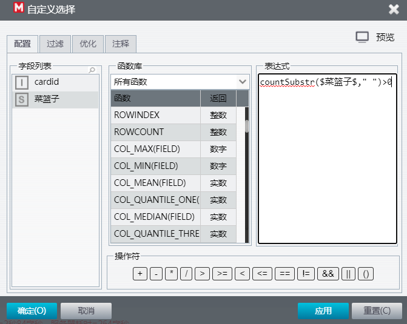

考虑到要做关联规则挖掘，菜篮子中的菜至少要有2个——此处通过`countSubstr`函数，对该规则进行筛选。

（`countSubstr`数其中空格的个数。由于先前的菜篮子字符串中菜之间由空格相分隔，因此仅当空格数>0的菜篮子才有效）

- 类型转换为集合

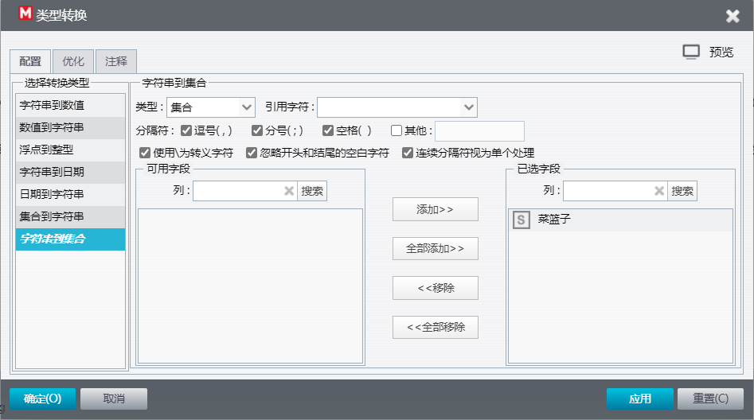

将字符串类型的菜篮子转换为集合类型，便于后续的关联分析

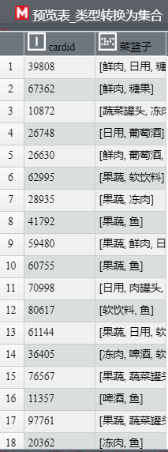

- 关联规则

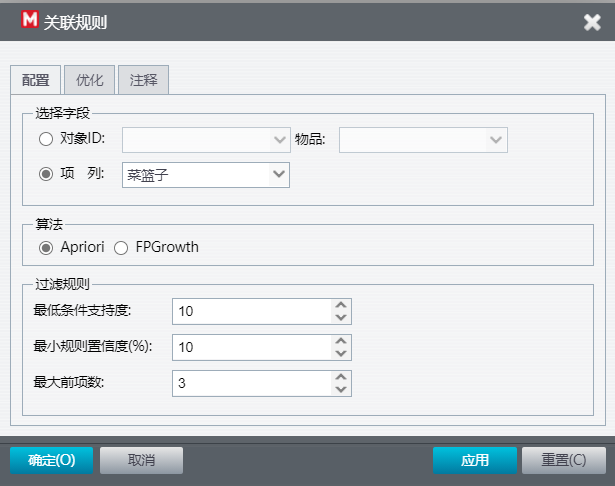

使用Apriori算法定义关联规则。在默认的过滤规则设置中，我将最小规则置信度修改为了10%，提升可信度。

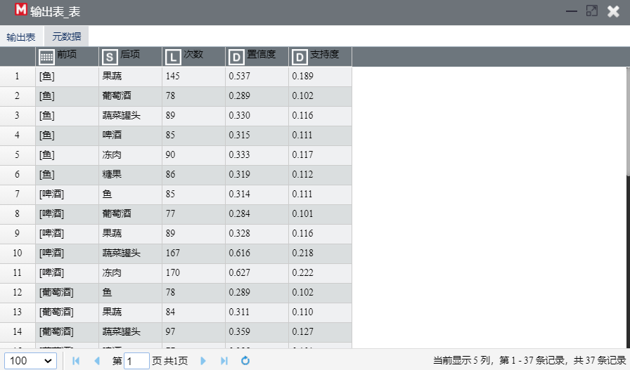

- 派生出排序规则

为了后续排序，定义相关性=置信度*支持度

- 排序

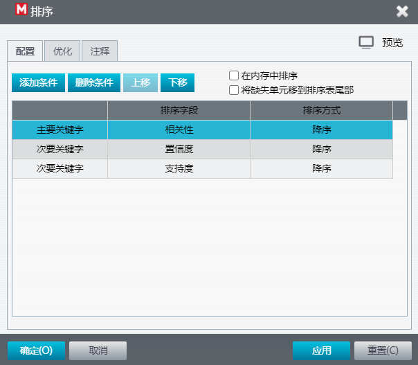

根据先前定义的排序规则排序

- 最终内容数据审核

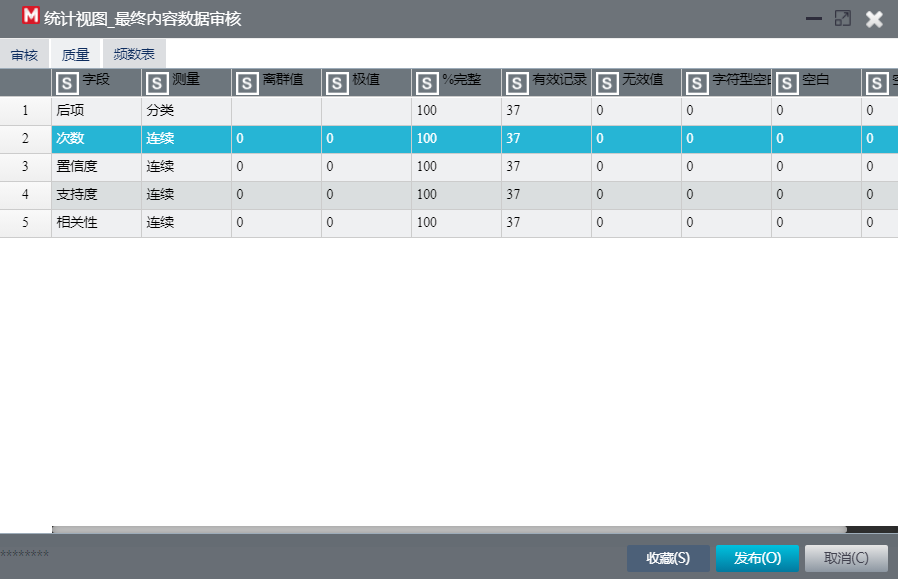

最终表中含以上字段，完整度100%，数据全部有效

- 最终结果表

最终得到了37个结果，排在首位的是[啤酒, 蔬菜罐头]->冻肉

### 结果与分析

- 业务层面的价值和研究的意义

本次实验是一次典型的利用Apriori算法进行关联规则挖掘的例子。通过顾客购买的菜品进行分析，最终得到菜品之间的关联。对于超市而言，若将相关度高的菜品放在一起，省去顾客走远路去找的时间，则顾客进行捆绑购买的可能性便会更高，购物体验会更好，这能有效地提高超市收益，具有很高的商业价值。

- 为什么会出现这个情况

再次考察排在首位的[啤酒, 蔬菜罐头]->冻肉。他们相关度最高我认为没有太多意外。喜欢吃罐头、喝啤酒的男性，给我们的主观印象里，常常也爱吃肉。而排在前9项的结果，也恰恰是[冻肉，蔬菜罐头，啤酒]的组合。

- 提出有效的建议

建议超市将啤酒、冻肉、蔬菜罐头、鱼等放在一块。

## 实验中遇到的问题及解决方法

实验的主要困难主要还是数据处理部分——如何将菜品转化为需要分析的菜篮子集合。

解决方法是通过写类Java函数，进行字符串的拼接和再处理。解决思路已在建立思路与设计过程中详细写出。

另外一个问题是排序规则的制定：此处我选择的相关性=置信度*支持度参考了助教的实现。

## 实验感想和收获

在经过关联规则的理论部分学习后，本次实验中我亲身实践了Apriori算法，将若干的菜品做关联规则挖掘。实验的工作流虽不多，但完整地经历数据处理、数据分析……令我在数据挖掘的学习中更加熟练与了解。实验最终也得到了非常有意思的结论[冻肉，蔬菜罐头，啤酒]的相关性非常高，可以给我们启示，利用类似的关联规则挖掘，可以将相关度高的商品放在一起，或能提高超市的收益。可以猜想到，Apriori算法有很高的商业价值和潜力。
