# 数据挖掘实验报告——分类

[TOC]

## 实验目的

本次实验主要利用给出的heart数据集或者自己的数据集，对逻辑回归算法进行理解和学习，最终应该达到如下目标：

1. 能了解相关的算法（体现在参数设置）
2. 能对数据挖掘过程的思路更深入的理解并进行总结
3. 能对最终的模型结果进行分析

## 实验内容

- 发现问题本质、探索数据以及数据预处理
- 训练模型并对模型结果进行分析评估
- 写出实验中遇到的问题和收获感想

## 实验步骤

### 完整工作流

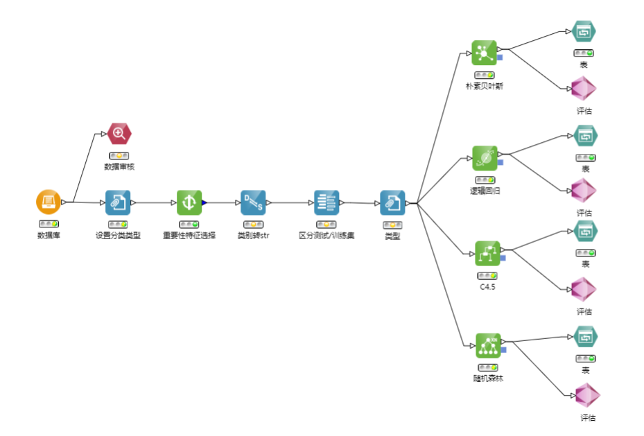

“评估”项为超节点，4个“评估”超节点中的内容类似，下仅以逻辑回归的为例：

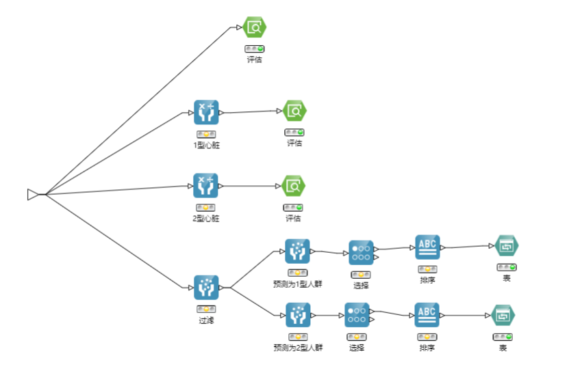

### 建立思路与设计过程

- 首先观察数据，明确要选什么字段来分类：

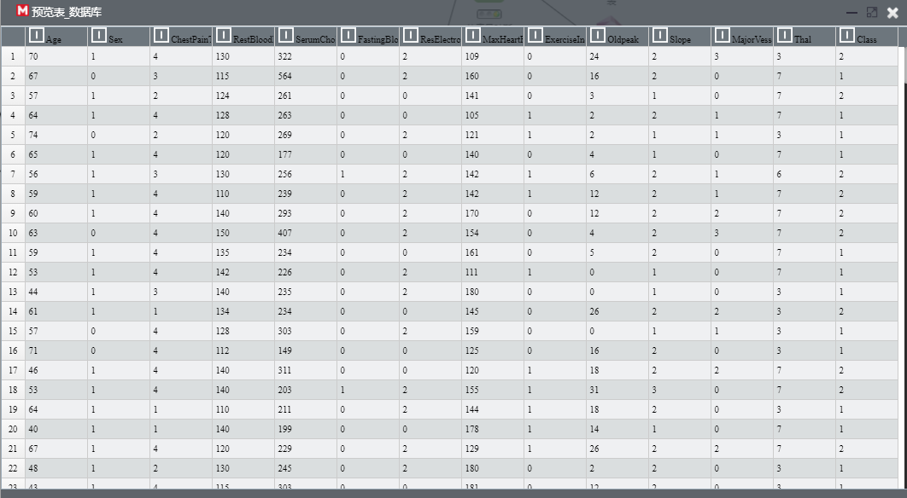

从助教所给的PPT中亦可得知各字段的含义：

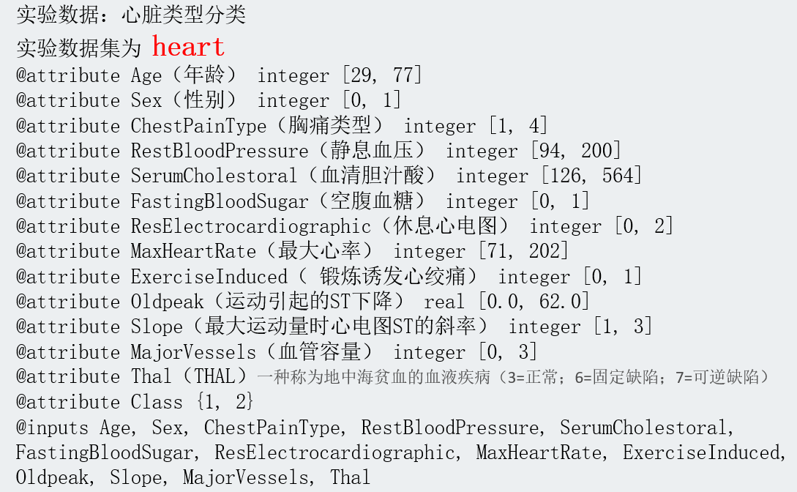

字段中“Class”为需要分类的目标，有1型、2型两种，因此是一个二分类问题。其余字段均可作为需要训练的参数。Class与Thal应当作为名义值，而其余值均为连续的字段。

- 对于机器学习问题，需要设定测试集、训练集；设定分类目标(Class)；筛选重要特征……

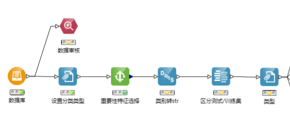

以上节点便显示了数据预处理的过程，做完预处理后，才可进行训练(使用不同的模型)并评估模型效果。

- 对于评估而言，需要观察在训练集与测试集中的训练效果。我在本次实验还对2种类别的训练效果单独进行了分析。(见超节点的设置)

### 各节点信息

- 数据库：连接heart

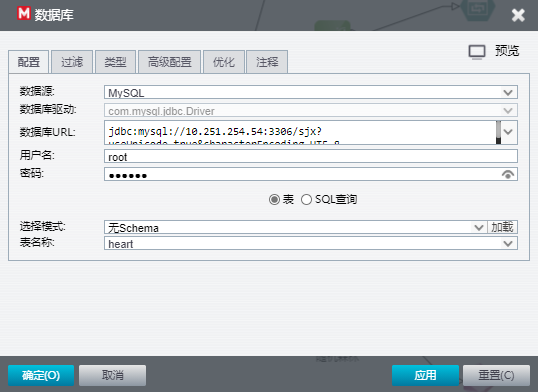

- 数据审核：观察到没有缺失值，Thal与Class的“测量”有误，在后续需要修正

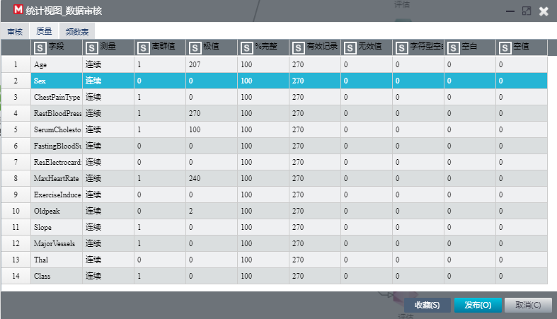

- 设置分类类型：Thal、Class为名义值，Class设为“目标”

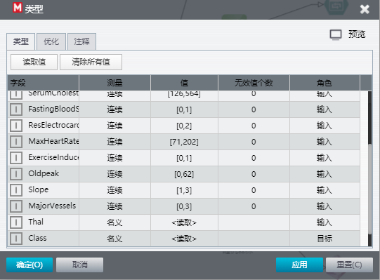

- 特征选择：筛选重要特征，我在此重要性设置为大于0.9

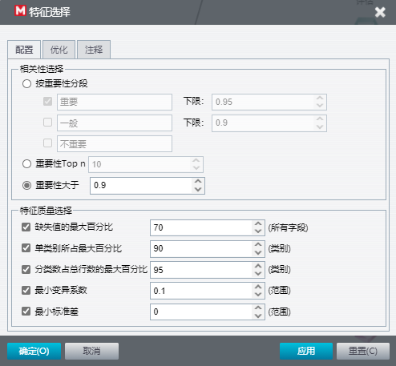

- 类型转换：将Class类别转为字符串类型

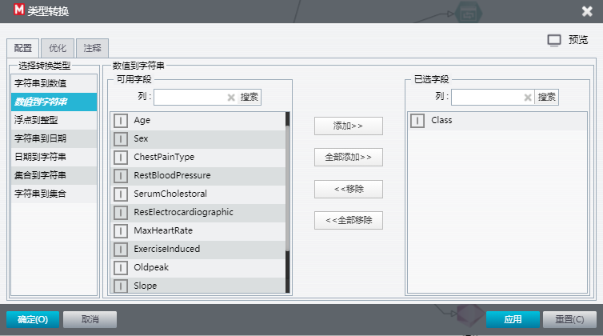

- 区分测试/训练集：训练集30%:测试集70%

- 进一步区分类型：分区项的角色为“分区”

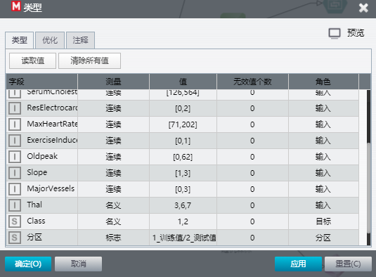

至此，数据预处理的部分完成。以下我采用了4种机器学习模型(朴素贝叶斯、逻辑回归、C4.5、随机森林)分别训练与评估，最终旨在选出效果最好的一个模型。

- 以朴素贝叶斯模型的评估为例，观察训练完后的表的情况：

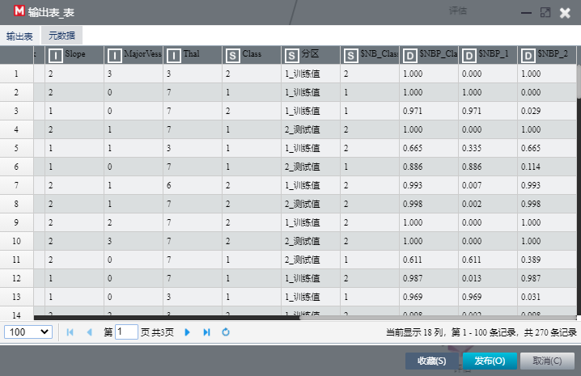

- 表中多出了四个字段，已训练完成，得到了分类结果。

| 字段名    | 字段含义                         |
| --------- | -------------------------------- |
| NB_Class  | 预测的分类(1/2型)                |
| NBP_Class | 分类置信度                       |
| NBP_1     | 预测为1型的置信度                |
| NBP_2     | 预测为2型的置信度(NBP_1+NBP_2=1) |

以下我将对训练结果进行分析，区分出测试集准确率、训练集准确率、预测为1型的准确率、预测为2型的准确率。

- 进入到朴素贝叶斯模型对应的超节点

- 最上面的评估结果：

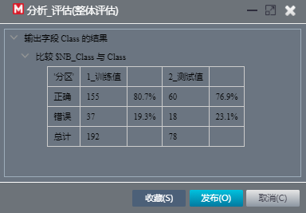

- 筛选出Class=1的样本

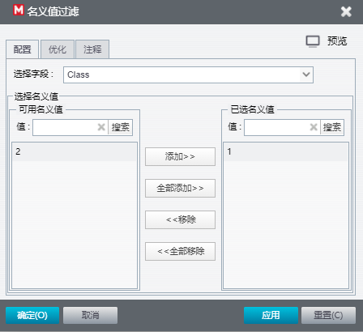

- 查看Class=1的评估结果：

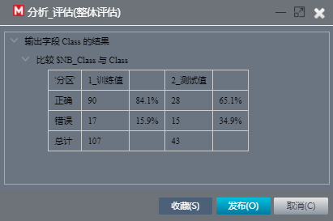

- 同理查看Class=2的评估结果：

以下我将对预测出Class=1/2，即NBP_Class=1/2的条目作出分析(先前为原为Class=1/2)。

- 过滤不必要字段，仅保留与Class有关的

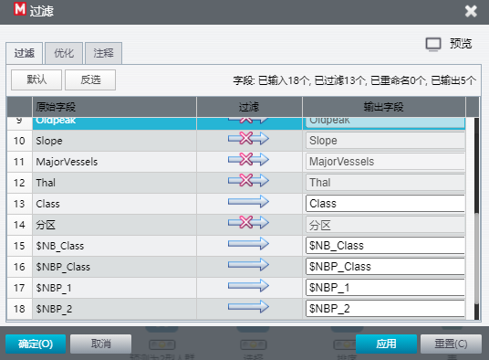

- 对于预测为1型人群，筛选去除NBP_2的字段

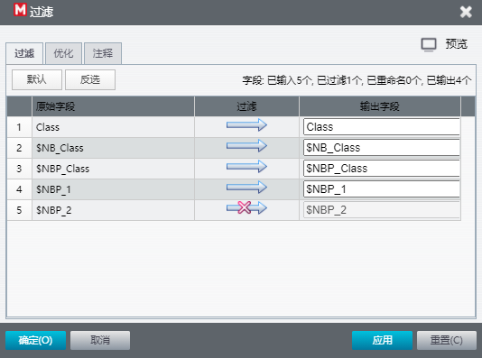

- 余下NBP_1中，筛选出置信度>0.9的项

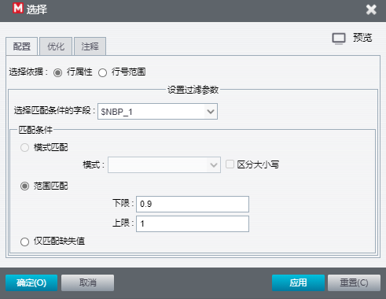

- 根据关键词NBP_1降序排序

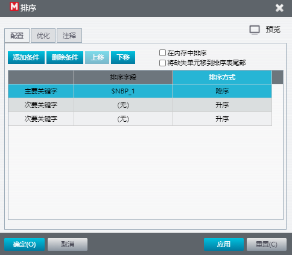

- 可观察如下表(有正确预测，有错误预测)：

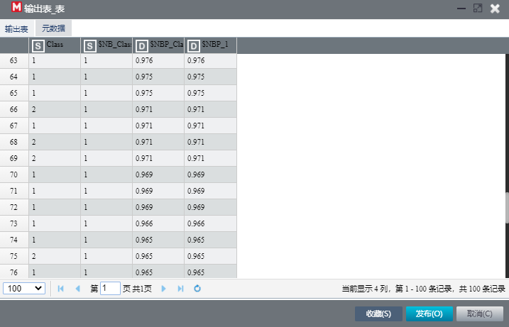

### 结果与分析

| 模型       | 训练集准确率(%) | 测试集准确率(%) | 在测试集中，Class=1的准确率(%) | 在测试集中，Class=2的准确率(%) |
| ---------- | --------------- | --------------- | ------------------------------ | ------------------------------ |
| 朴素贝叶斯 | 80.7            | 76.9            | 65.1                           | 91.4                           |
| 逻辑回归   | 83.9            | 85.9            | 86                             | 85.7                           |
| C4.5       | 93.8            | 76.9            | 86                             | 65.7                           |
| 随机森林   | 89.1            | 84.6            | 81.4                           | 88.6                           |

逻辑回归、随机森林模型在本次heart数据集上的训练效果较好，在测试集中均达到了约85%的正确率。

值得注意的是：朴素贝叶斯虽然在Class=2的分类中有超过90%的正确率，但Class=1的正确率却很低，仅有65.1%；而C4.5模型虽在训练集中有93.8%的正确率，但最终测试集中的准确率的效果却一般，为76.9%。

我认为造成训练集、测试集的训练准确率的偏差较大的原因在于还是数据集太小了，总计只有约200余条。数据集非常小时，模型的训练结果与训练集的相关度非常大，最终的准确率不大能说明问题，需要扩充数据集才能使模型具有更大的实际意义。

## 实验中遇到的问题及解决方法

本次实验由于实验目标相对明确：作一个分类回归的问题，总的来说没有遇到特别大的问题，相对还是比较顺利的。主要的问题出现在数据处理中，一开始对数据字段的含义不是很明确，将Thal的测量属性搞错了，后来再回顾助教的PPT才修正为“名义”。另外，对于训练目标字段的选择需要一开始就设定(Class为目标字段)，否则很多的节点跑不通。

## 实验感想和收获

本次实验是根据heart数据集，作分类1型/2型心脏的问题。实验中经过数据预处理，成功训练出了朴素贝叶斯、逻辑回归、C4.5、随机森林模型四个模型，非常有成就感。我亦在过程中，学会了如何使用特征选择筛选出重要的特征提高训练效果、区分训练集与测试集、配置不同的模型。在实践中，最终对分类问题有了更深的认识。

另外，我的一大收获是了解到了**Logistic回归的结果并非数学定义中的概率值**，更像是置信度。这是我在此之前对Logistic回归的误区，感谢助教的科普！