# 数据挖掘实验报告——分类(附加)

> 学号：18373722
> 姓名：朱英豪
> 班级：182111

[TOC]

## 实验目的

本次实验主要利用给出的electronicsData数据集或自己的数据集，任选一个分类算法进行理解和学习，最终应该达到如下目标：

1. 能了解相关的算法（体现在参数设置）
2. 能对数据挖掘过程的思路更深入的理解并进行总结
3. 能对最终的模型结果进行分析
4. 能对文本处理有初步的了解

## 实验内容

- 发现问题本质、探索数据以及数据预处理
- 训练模型并对模型结果进行分析评估
- 写出实验中遇到的问题和收获感想

## 实验步骤

### 完整工作流

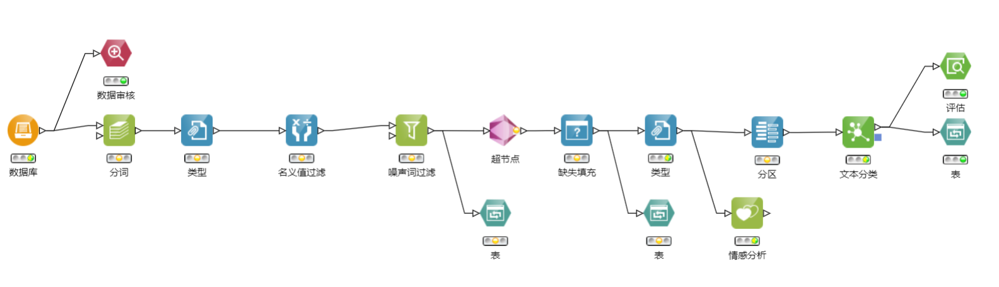

超节点中的工作流：

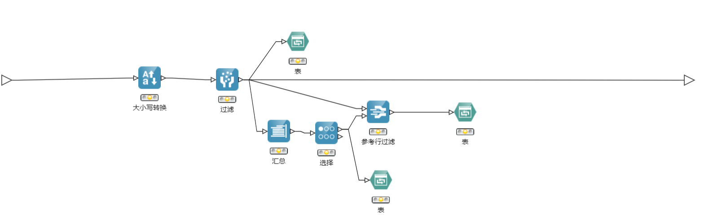

### 建立思路与设计过程

- 首先观察数据（eleNegData），明确要选什么字段来分类：

思考各字段的含义：

ID为记录ID；Catalog是最终文本分类的目标；Review是所需要去训练的文本

- 工作流的建立和设计过程参考了助教所给的文本分析样例，结合本数据作出了一定的修改（额外去除了停顿词（文本中一些高频的代词、连词、介词等对文本分类无意义的词））。

### 各节点信息

- 数据库：连接eleNegData数据库

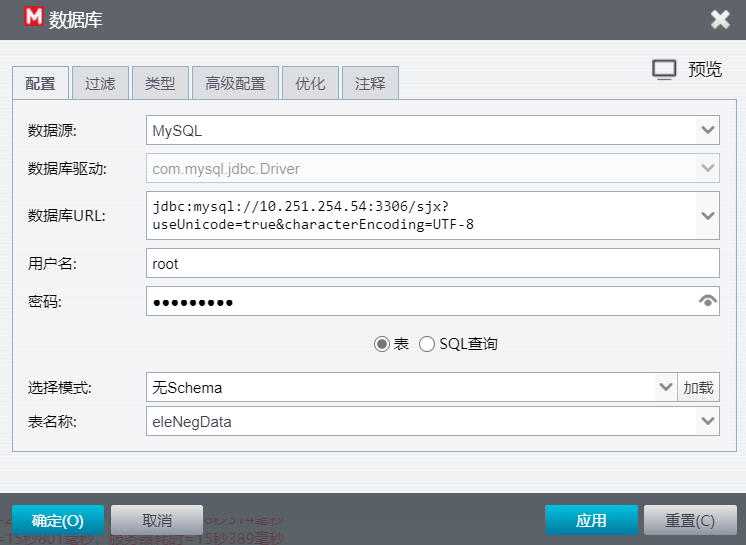

- 数据审核

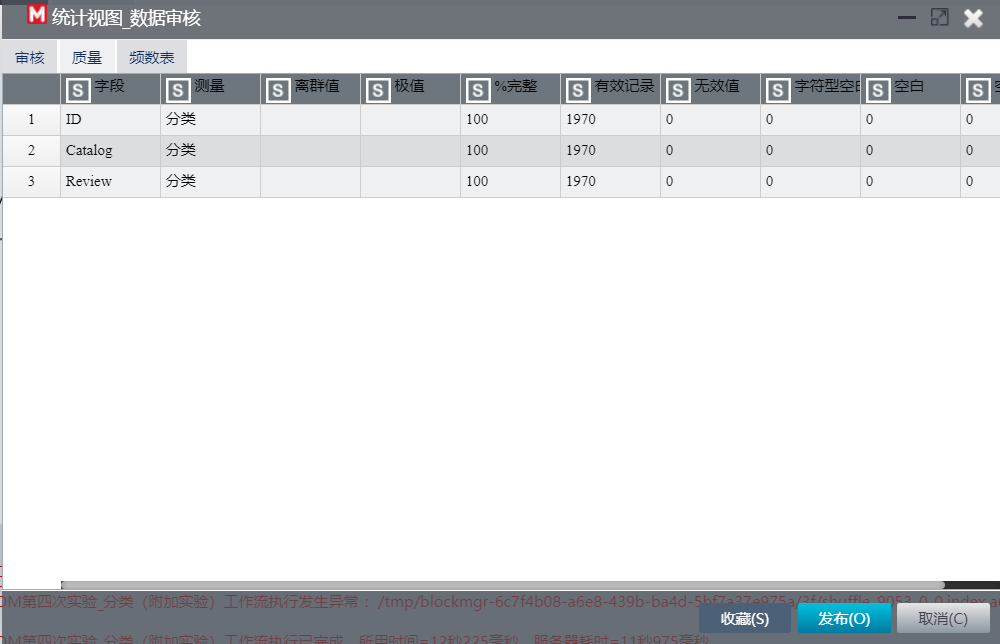

观察发现，没有缺失值

- 分词：词库为英文，字段选择Review

- 类型：ID为记录ID，Catalog是目标

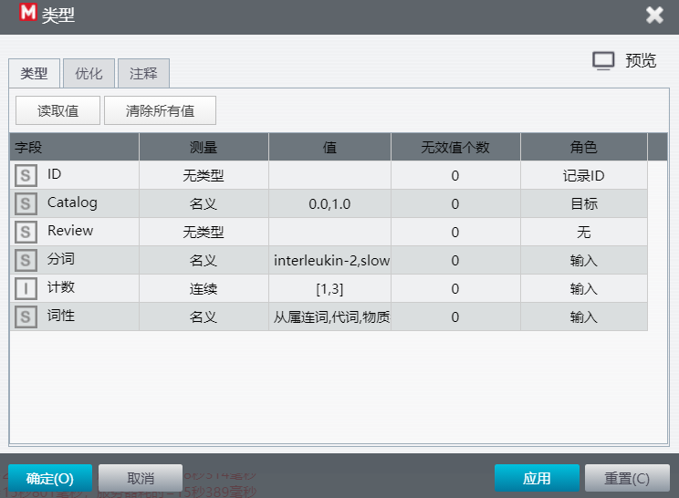

- 名义值过滤：对分词后的“词性”名义值进行过滤

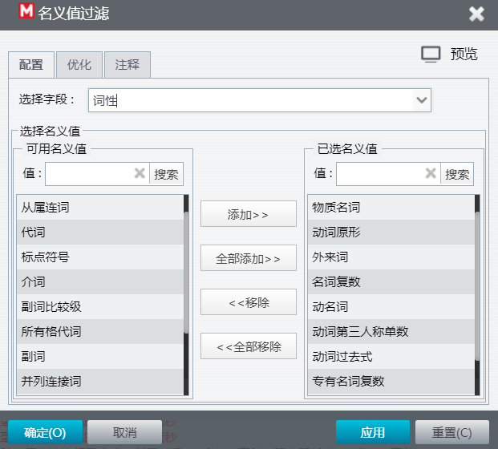

根据助教提示，保留了我认为有用的词性：包括了物质名词、动词原形、外来词、名词复数、动名词、动词第三人称单数、动词过去式、专有名词复数

去除了代词、介词、连词等。

如图所示，过滤有效。

- 噪声词过滤：使用内建的噪声词库（英文），并过滤掉了数字、标点符号等

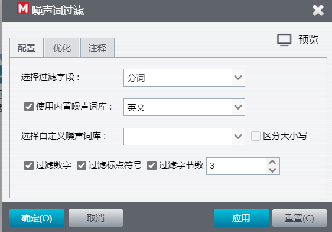

- （进入超节点）
- 大小写转换：将分词后的结果全部转为小写

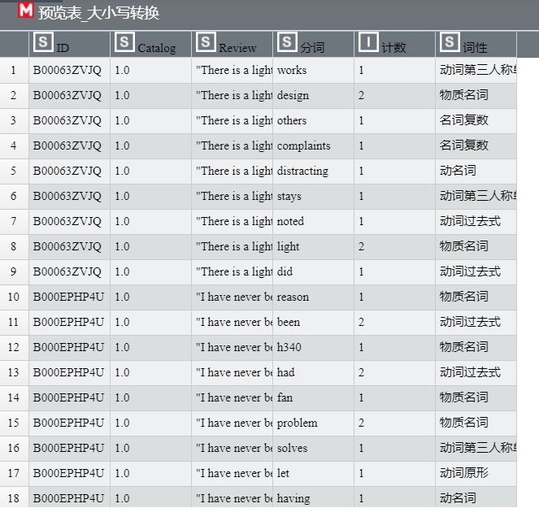

可见，已全部转换为了小写单词。

- 汇总：对同一个记录ID下的分词结果进行汇总

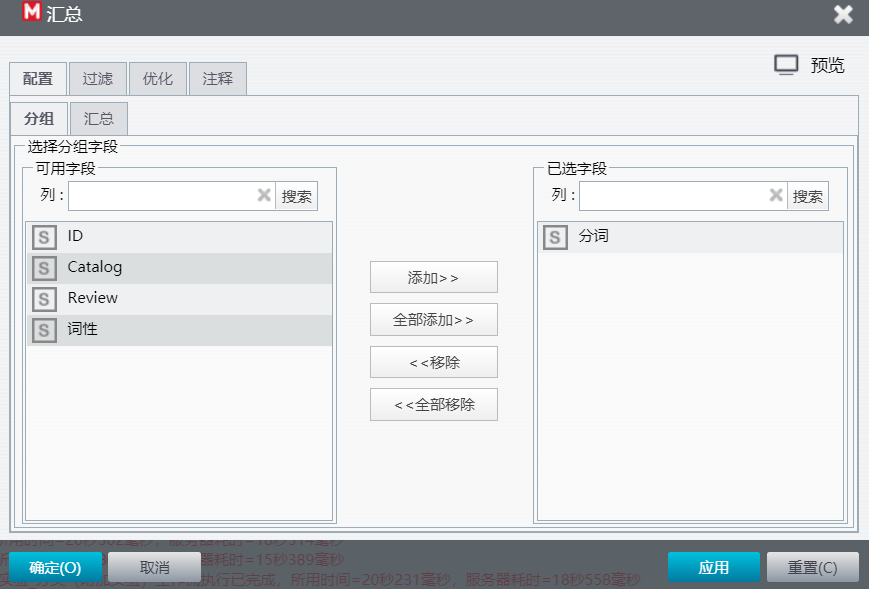

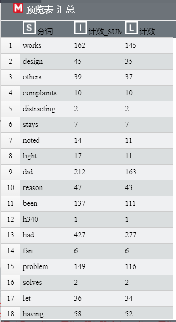

结果如上图所示。

- 选择：汇总后的“计数_SUM”

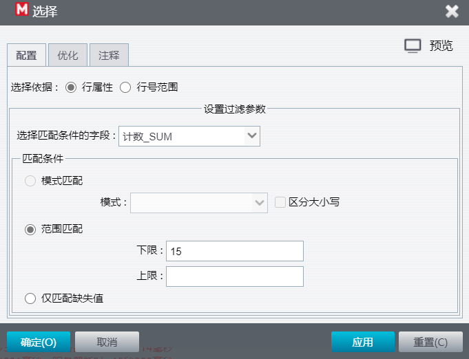

- 参考行过滤：选择分词

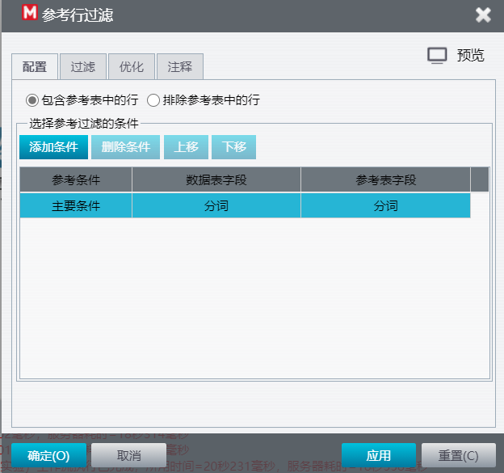

- 此时输出表：结果如下图

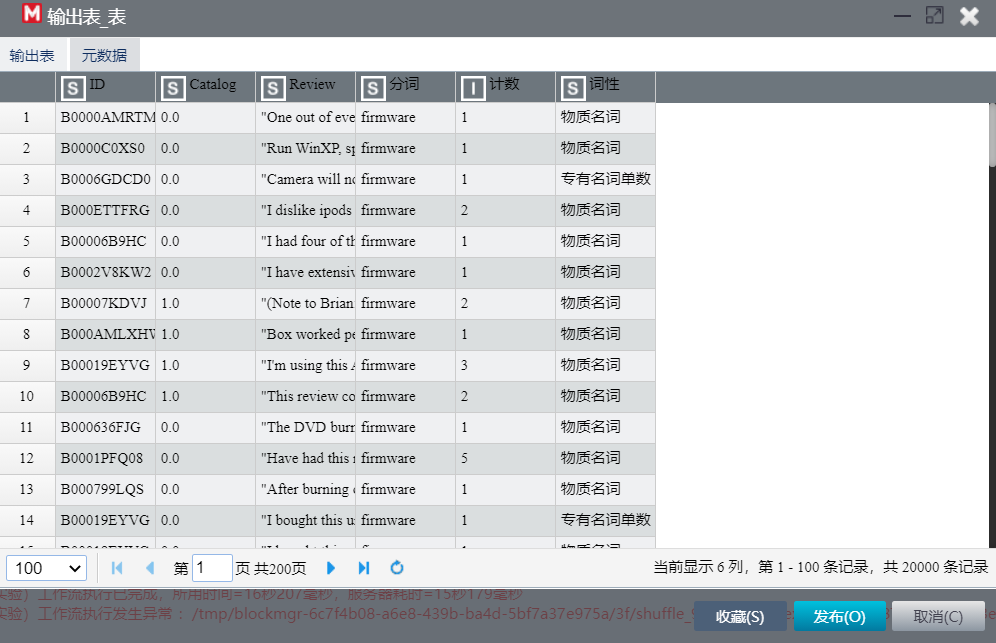

- 出超节点
- 缺失填充：使用众数

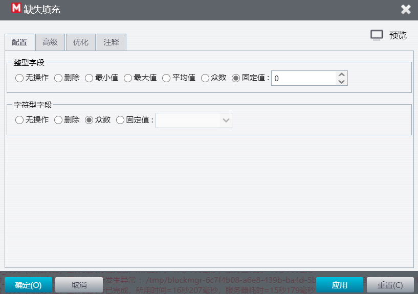

- 目标

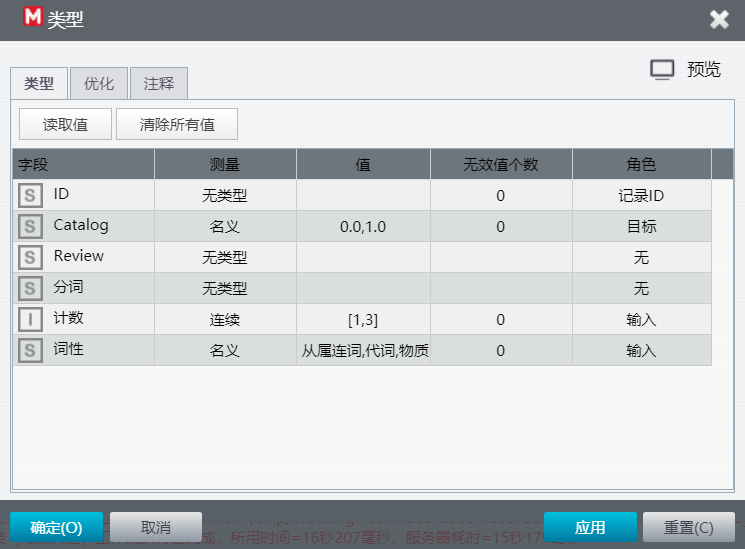

将先前得到的计数字段以及词性字段设定为输入

- 分区：区分训练集和测试集

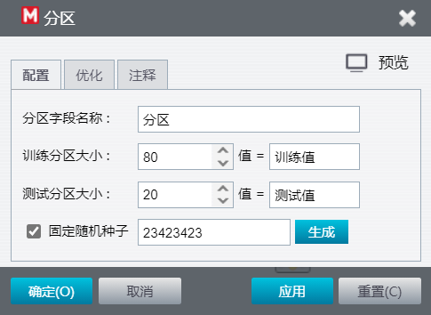

### 结果与分析

- 情感分析：设定分析目标为Review

几乎都是好。

- 文本分类：使用朴素贝叶斯法

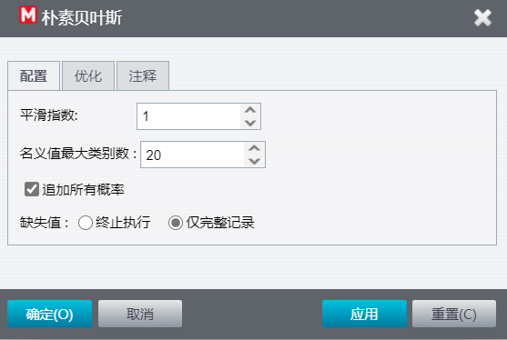

- 文本分类评估结果

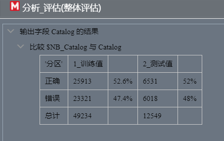

无论是在测试集还是在训练集中，正确率都和瞎懵的50%差不多，并不理想。我认为这可能的原因来自于数据集：数据集中经过了分词以及汇总后的结果仍然非常分散，基本上汇总结果是1，且情感分析的结果也几乎都是“好”，即没有很有效、特征显著的数据。同时，实验中缺乏了更多样的度量方法，只是分词结果以及其对应的数量统计不能很好地进行分类（维度太少）。这二者因素的综合共同使得训练效果不佳。

## 实验中遇到的问题及解决方法

本次实验因为有助教的样例的提示，都比较顺利。其中出现的一个问题是一开始文本分析无法训练，原因出在我没有将Catalog设定为训练目标，设定完成后便跑通了。

但是实验训练出来的结果并不是很理想，我认为的解决方法是需要找更合适、有效的数据集以及使用更多样的度量方法，而不仅仅只是分词结果以及其对应的数量统计。

## 实验感想和收获

本次实验是根据eleNegData数据集，分析其中的Review字段，对文本进行分析。包含了情感分析以及文本的分类。实验的进行相对顺利，要感谢助教的提示和帮助！这是我第一次对文本进行数据挖掘，体验不错。我感受到了分词的作用——可以标注英文单词的词性、属性等。

同时，由于这次实验训练结果不甚理想，我反思得比较多——反思哪里出了问题？数据的原因——数据有效性不够，没有特色的数据；训练参数的原因——参与训练，作为输入的字段太少。这一反思的过程，也是我的一大收获。
