# 数据挖掘实验报告——分类

[TOC]

## 实验目的

本次实验主要利用给出的consumption_data/car_sale数据集，对K-Means聚类算法进行理解和学习，最终应该达到如下目标：

1. 能了解相关的算法（体现在参数设置）
2. 能对数据挖掘过程的思路更深入的理解并进行总结
3. 能对最终的模型结果进行分析

## 实验内容

- 发现问题本质、探索数据以及数据预处理
- 训练模型并对模型结果进行分析评估
- 写出实验中遇到的问题和收获感想

## 实验步骤

### 完整工作流

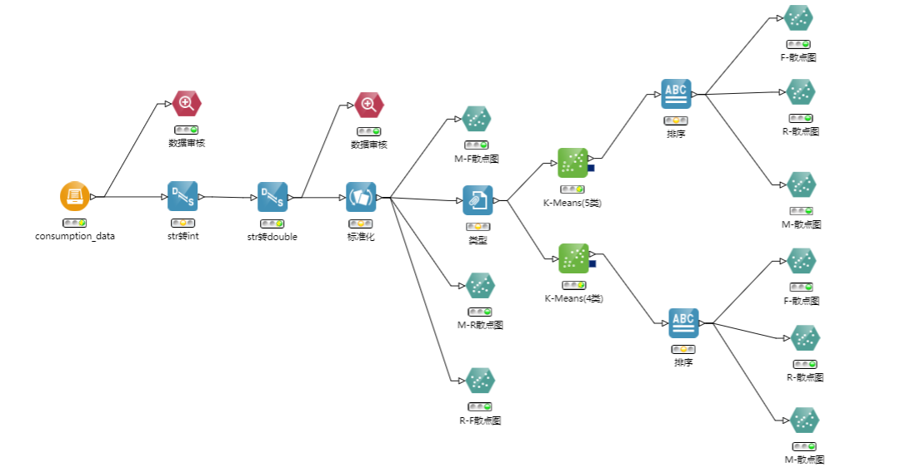

### 建立思路与设计过程

- 首先观察数据源：我在此选用的是consumption_data（某餐饮公司客户消费行为特征数据）数据库

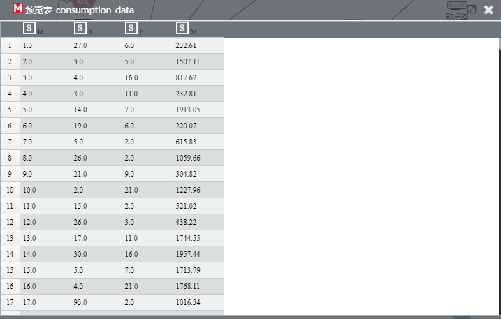

观察可见，Id应是序号，从1开始递增，对实际训练没有意义，在后续需要进行处理（如在类型中指明其是记录ID）

查看PPT，详细得知各字段的含义：

| 字段名 | 字段含义             |
| ------ | -------------------- |
| ID     | 客户编号             |
| R      | 最近一次消费时间间隔 |
| F      | 消费频率             |
| M      | 消费总金额           |

Id、R、F都为整数，而M为浮点数，需要通过类型转换处理。

- 设计K-Means算法的流程：

导入数据，类型转换，数据标准化，指定类型。（其间需要通过数据审核观察是否有缺失值等）其后，便可开始K-Means聚类分析。

- 通过散点图来观察聚类情况
  - 在K-Means算法前，预估要分多少类
  - 执行K-Means后，查看各个参数的聚类效果

### 各节点信息

- 导入数据后，进行初次数据审核

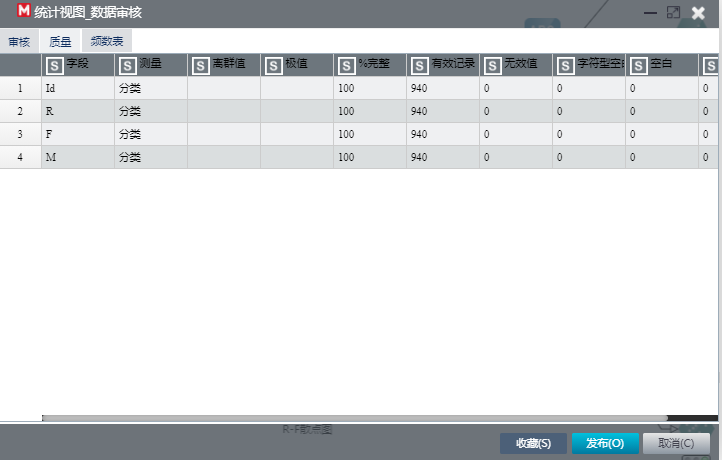

观察发现完整度为100%，没有无效值（缺失值）

- str转int

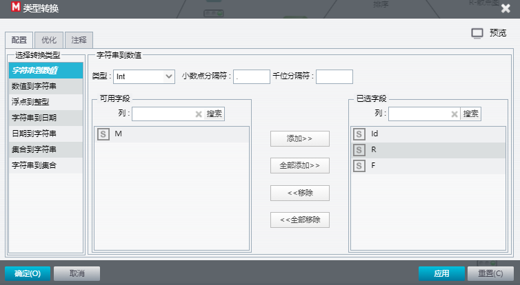

将Id、R、F转为整数类型

- str转double

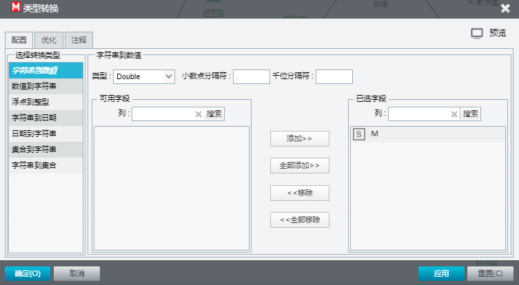

将消费总金额M转为浮点类型

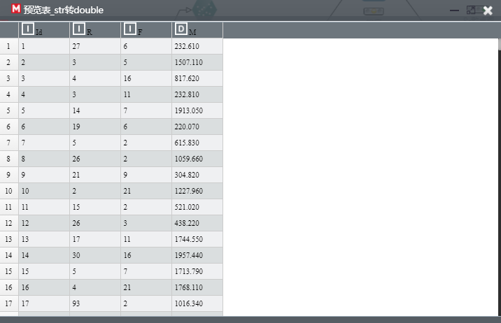

两次类型转换完后的表如上

- 第二次数据审核

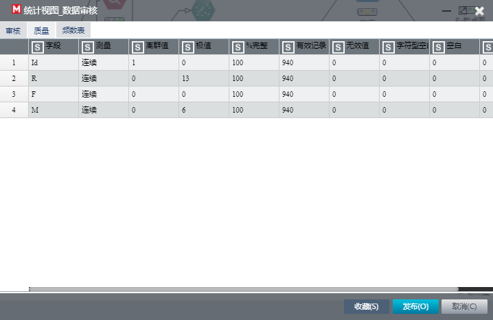

可见存在离群值和若干的极值。但由于数据本身价值量大且数据量小，此处离群值保留，后续将不做处理。

- 标准化

将R、M、F字段通过Min-Max方法标准化

**Note:**

- 目的: 把数变为（0，1）之间的小数; 转化为无量纲数据
- （标准化使参与聚类的标量能方差统一，以便减小方差大的变量在聚类中起到的作用大于方差小的标量。如果没有充分理由说明在分类中某些因素较其他因素更重要，就应该标准化。）

- 类型

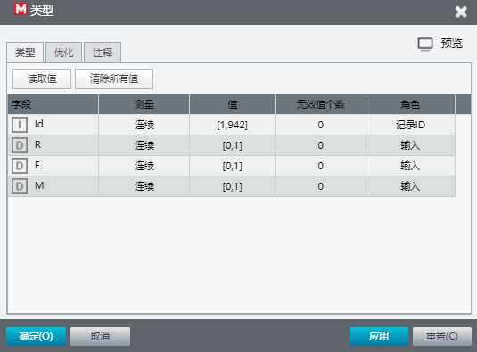

声明Id为记录ID，其余R、F、M均为输入的角色

- M-F、M-R、R-F散点图

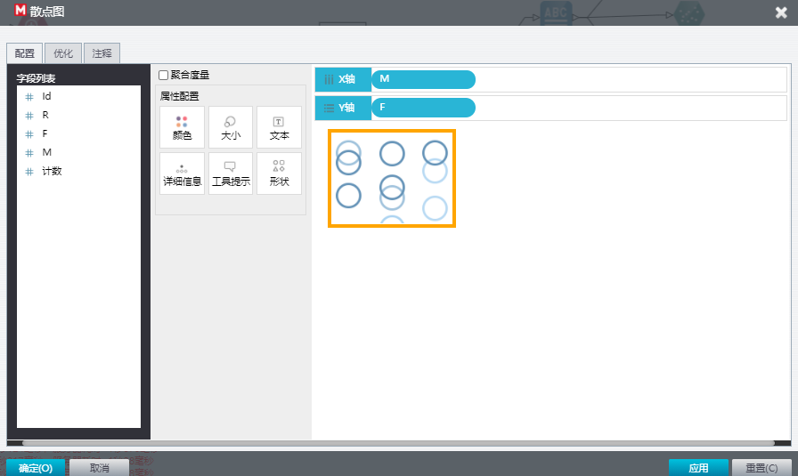

如上图配置M-F散点图（其余2者类似）以事先观察要大概分成几类

M-F散点图

M-R散点图

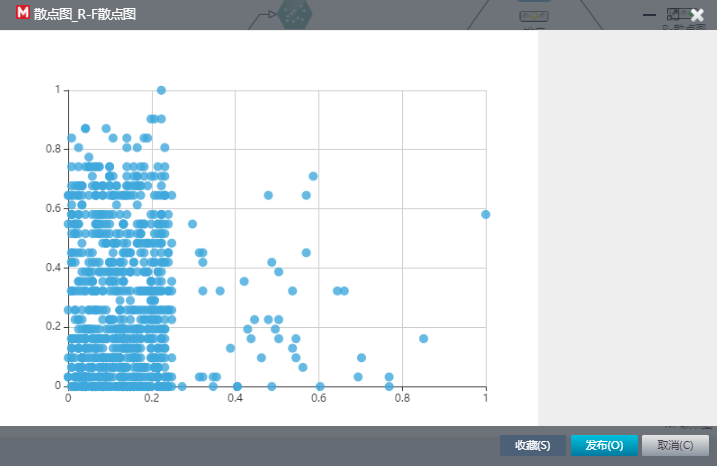

R-F散点图

和先前数据审核中所述的相一致：此处虽含部分离群点，由于数据本身价值量大且数据量小，此处离群值保留，不做处理。

#### K-Means与结果分析

- K-Means

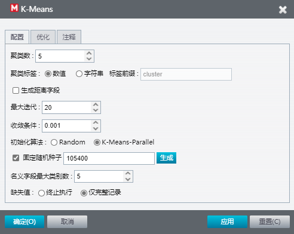

我在数据流中分别聚类为4/5类，初始化算法选用的为K-Means-Parallel。实际上我试了比较多的组合，各种组合的聚类效果如下几张图：

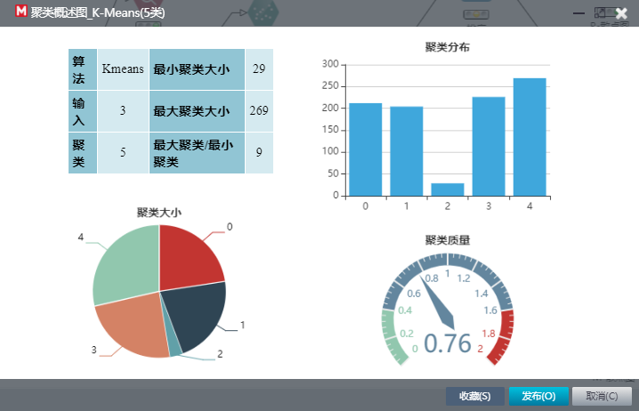

5类，K-Means-Parallel（可见其中2类的值非常少，聚为4类或有更好的效果）

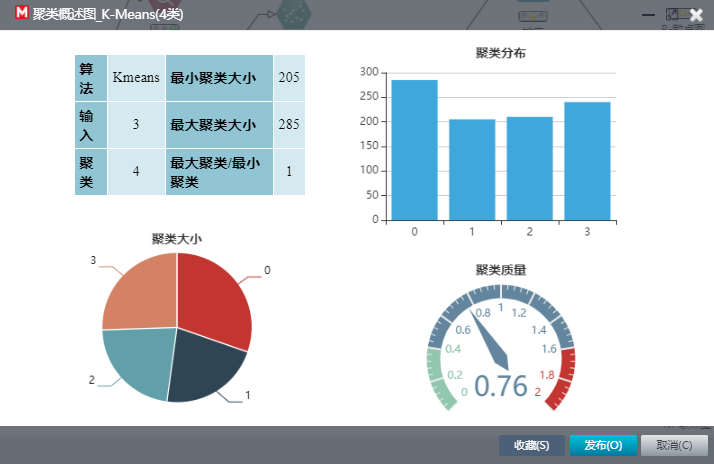

4类，K-Means-Parallel（确实效果好了不少）

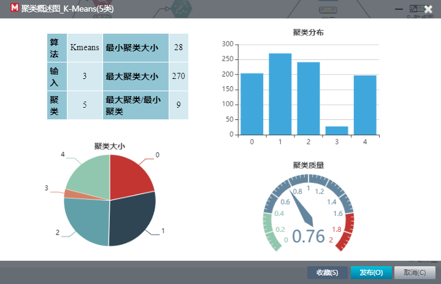

5类，Random

4类，Random

通过观察以上这几种聚类方式的聚类分布，我认为4类，K-Means-Parallel的效果是最好的。（虽然聚类质量的得分都是0.76）

4类，K-Means-Parallel另外的聚类单元视图统计图表如下：

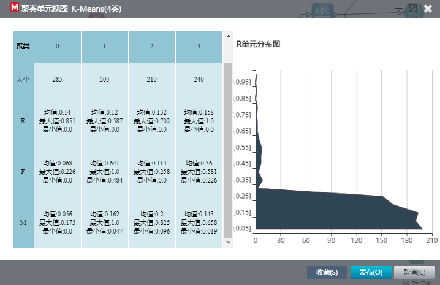

- 排序（为了在最后的可视化散点图中，让数据集中展示）

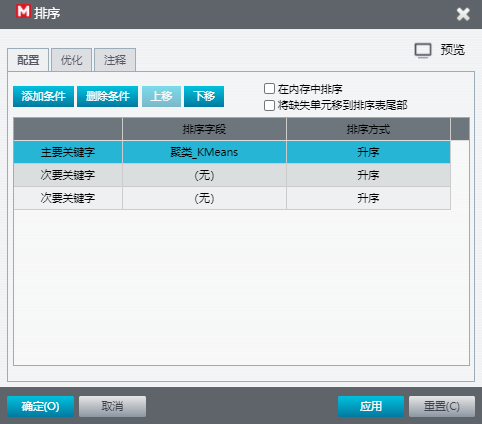

- F/R/M-散点图

在此以4类，K-Means-Parallel的散点图为例：

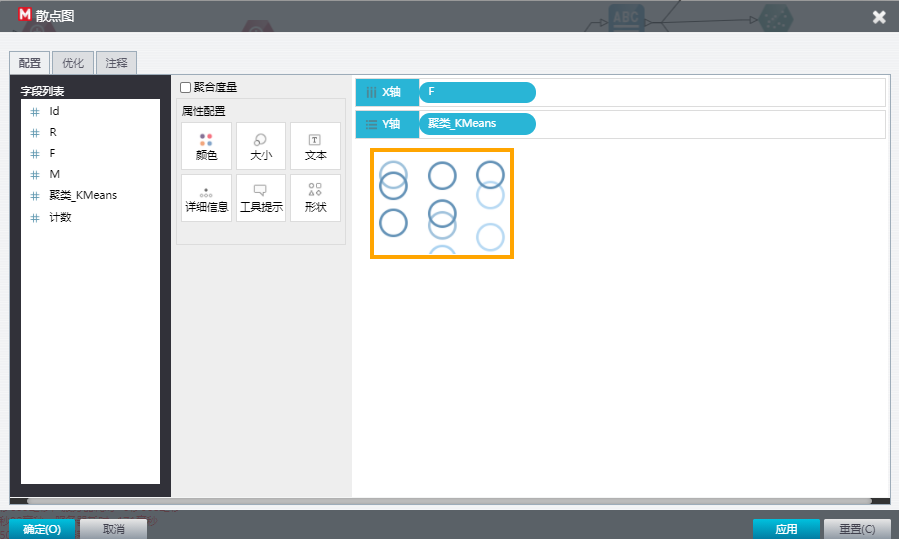

F-聚类_KMeans散点图的设置（其余类似）

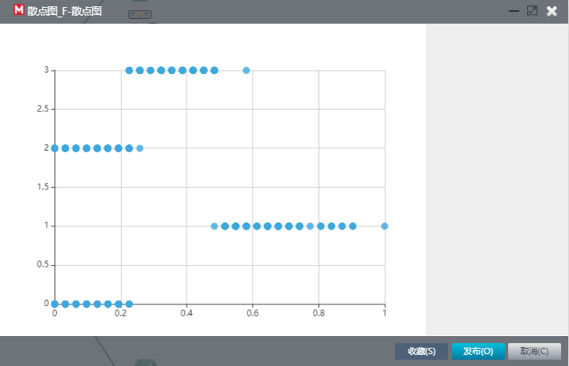

F-聚类_KMeans散点图

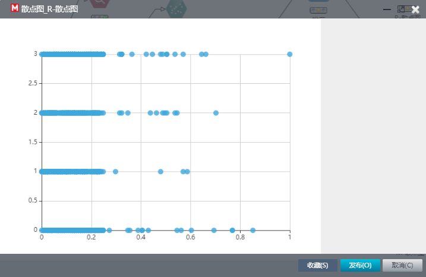

R-聚类_KMeans散点图

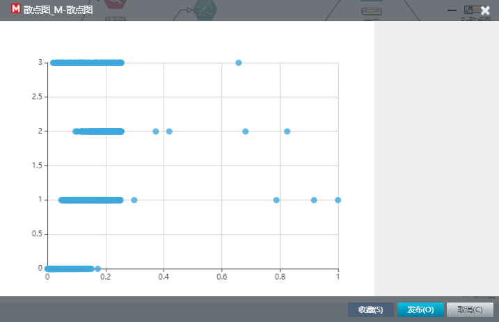

M-聚类_KMeans散点图

## 实验中遇到的问题及解决方法

对于实验流程，助教在PPT中已介绍地非常详细，对于实验要怎么做，实验目的基本上都没什么问题，因此是比较顺利的。

实验中遇到的问题是SmartMining平台的系统故障，由于在观察可视化图时操作较为频繁，最终出现了“系统开小差，请联系管理员”的BUG。等了半个小时自动好了。

## 实验感想和收获

本次实验主要是通过K-Means进行聚类与分析。从中，我初步了解了K-Means聚类的实验相关操作和部分理论。

对于实验流程，通过助教的讲解，我第一次认识到离群点并不是一定要处理：由于数据本身价值量大且数据量小，在本实验中的离群值或可以保留。

理论方面，我了解了变量差异指标VDI、异常指标AI、变量贡献指标VCM等概念。

综合实验与理论，我受益匪浅！
