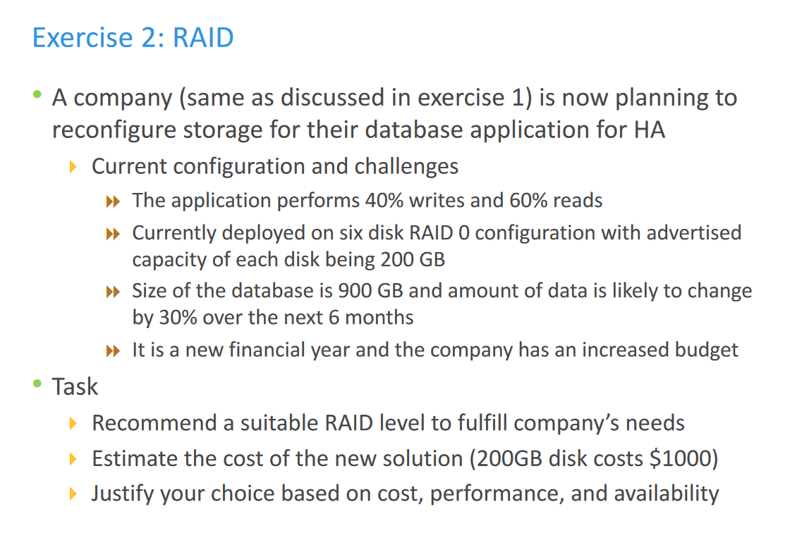

# Network Storage Assignment #2

> 完成pdf后的作业1和2
- Exercise 2: RAID 
- 作业：Scenario:
  - 一个业务场景，实际IOPS是4800，读cache命中率是30%，读写比3:2；磁盘个数为60，计算采用RAID5与RAID10磁盘的IOPS，分析那种方案更合适该场景。

## Q1

- 使用RAID5方案

15%的随机写<30%的随机写，适合使用RAID5/6(Good for random and sequential reads, Fair for random and sequential writes)；考虑到成本，选择RAID5更好。

现有的5块磁盘为RAID0方案，切换至RAID5，其中一块用于Parity；(5-1)/5\*200\*5>730，满足存储要求。

## Q2

- 使用RAID5方案

由于数据有大量变更需求，且需要进行广泛的随机读写。对于database而言，数据的一致性、出现错误时的修复都非常关键，RAID5方案可以自动地校验、备份，具有很强的fault tolerance。RAID5较之于RAID6成本更低，也Good for random and sequential reads, Fair for random and sequential writes。

当前有6块RAID0磁盘，将其切换至RAID5方案中使用；另外所需的900GB的database经过30%的数据变更，会扩大270GB至1170GB。

(x-1)/x\*200\*x>=1170，得x>=7，即需要再买7-6=1块200G磁盘，花$1000。

- 使用RAID10方案

RAID10方案非常适合>30%写操作的应用场景。其安全性很好，可以最多坏一半的盘，而RAID5方案最多只能坏1块盘。且RAID10方案的访问效率更高，写的代价较低。

当前的6块RAID0磁盘可在RAID10方案中继续使用，节约成本。

由于RAID10中数据通过镜像进行备份，$2 \times \lceil 1170/200 \rceil = 12$

所以需要再买12-6=6块磁盘，花$6000

**综合考虑，虽然RAID5方案便宜，但RAID10性能更佳，在有足够预算的情况下，选择RAID10方案更好。**

## Q3

- 使用RAID5时单块磁盘的IOPS：

$$4800/60\times((1-30\%)\times\frac{3}{3+2}+4\times\frac{2}{3+2})=161.6IOPS$$

- 使用RAID10时单块磁盘的IOPS：

$$4800/60\times((1-30\%)\times\frac{3}{3+2}+2\times\frac{2}{3+2})=97.6IOPS$$

**磁盘承受的IOPS越低越好**

$161.6IOPS$基本达到磁盘的极限(约$150IOPS$)，响应速度会过慢，而$97.6IOPS$对于磁盘而言负载较均衡。

故RAID10方案更适合该场景。