# 《网络存储》主机虚拟化实验(2)

> 课程代码：B3J213220
> 实验学时：4/16
> 实验报告题目：主机虚拟化实验(2)
> 学号：18373722
> 姓名：朱英豪
> 所在学院：软件学院

[TOC]

## 1. 实验目标

> 理解集中管理对于虚化的作用，通过部署集中vCenter体验集群的设置，分布式交换机的设置，了解主机从不同网络进行迁移的实际需求。

- [x] 1. 部署集中管理(建议两位同学一起做，将各自的主机加入到vCenter中。实验内容可以重复完成)
- [x] 2. 创建集群，配置集群
- [x] 3. 创建分布式虚拟交换机
- [x] 4. 网络迁移

## 2. 实验实施

根据助教的实验环境配置指南，环境配置完成后开始实验。

- 2台装有ESXi的虚拟机、1台装有vCenter的Windows Server虚拟机

- vCenter在Windows Server 2016虚拟里安装配置后，可在自己电脑里访问到vCenter的管理页面

### 2.1. 部署集中管理

- 创建数据中心

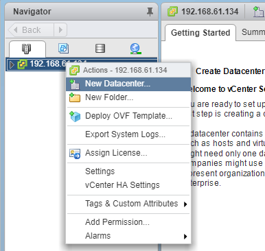

- 设置数据中心名称

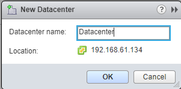

- 其余按照默认配置，数据中心创建成功

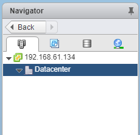

- 在该数据中心下，添加2台ESXi主机

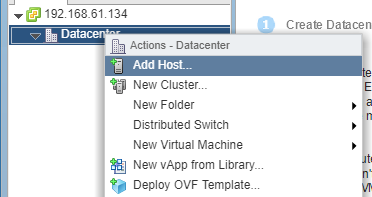

- 全程默认配置，如图，已将2台ESXi添加进数据中心，配置成功

### 2.2. 创建集群，配置集群

- Click "New Cluster" 创建集群

- 以默认配置，Click "OK"

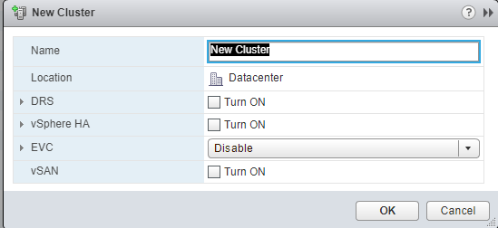

- 集群创建成功

- 将2台ESXi主机添加进集群中

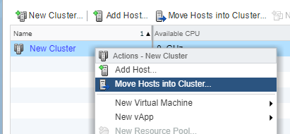

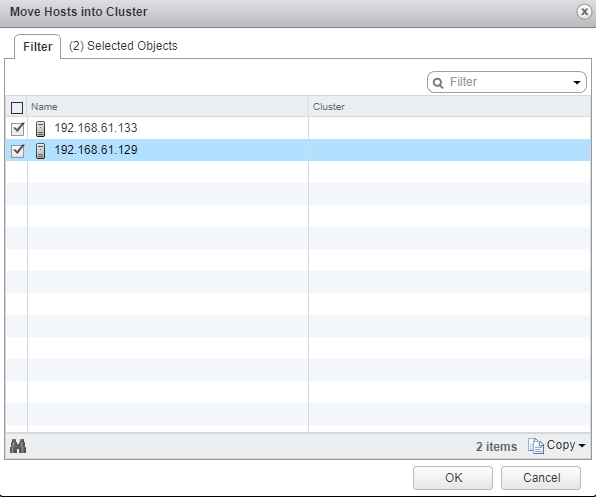

- 如图，添加成功。可在以下管理页面中，进行监控。

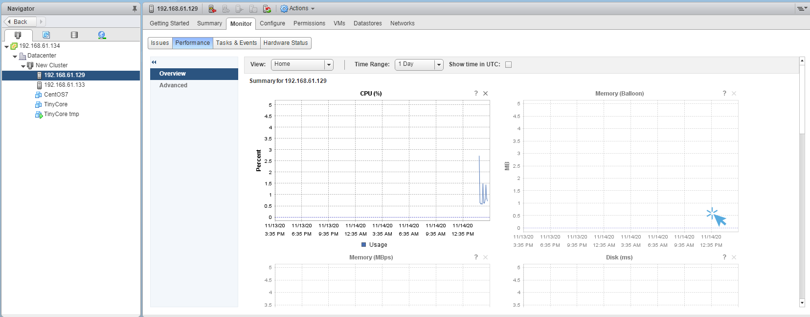

- 在Configure中，可对集群进行配置

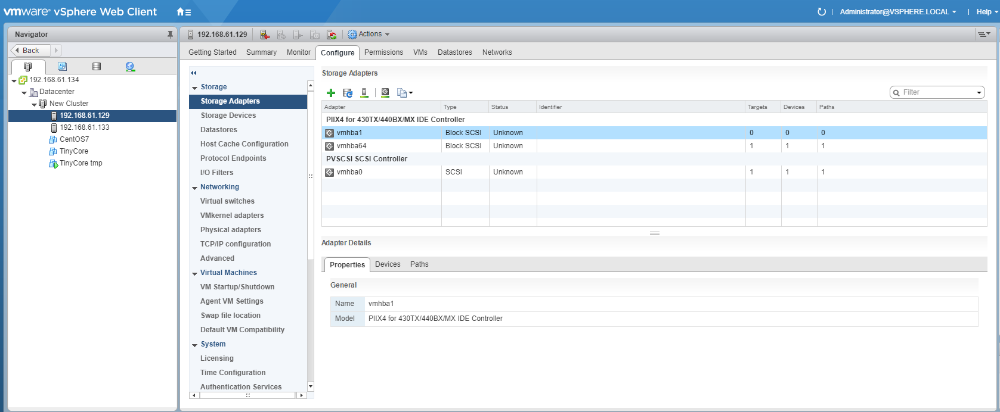

### 2.3. 创建分布式虚拟交换机

- 新建分布式虚拟交换机

- 按照默认设置进行配置，命名为DSwitch

- 分布式虚拟交换机创建成功

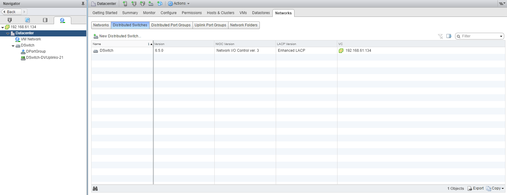

- 将主机添加进来

- 在任务选项中，Select "Add hosts"

- Select hosts，选择一台主机

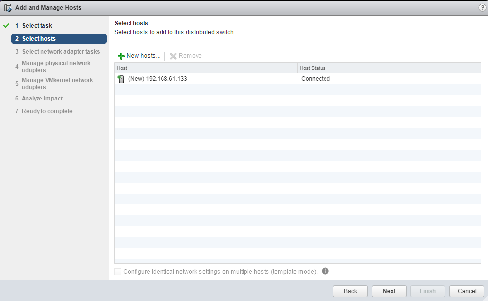

- 其余按默认配置，Click "Finish"

### 2.4. 网络迁移

- 选择刚刚创建好的分布式虚拟交换机DSwitch，开始网络迁移

- 配置网络配置的Source和Destination。（从VM Network->DPortGroup）

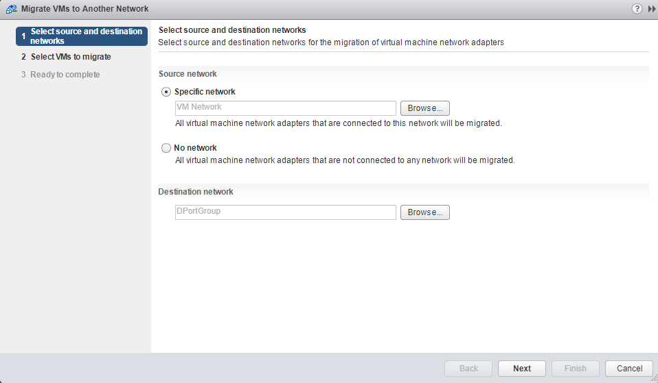

- 选择要迁移网络配置的虚拟机：TinyCore tmp

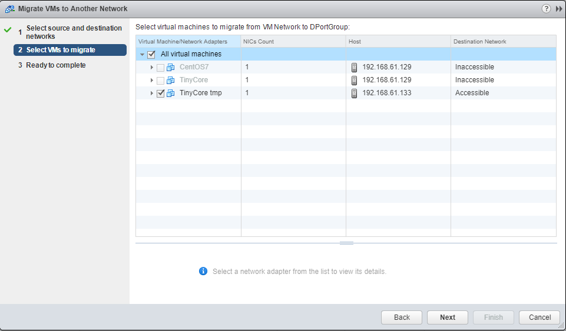

- 其余按默认设置，Click "Finish"，网络迁移成功

- 在ESXi的vSphere Client内，创建VM Network 2（方法同虚拟化实验(1)）

- 再次测试网络迁移。（从VM Network 1->VM Network 2）

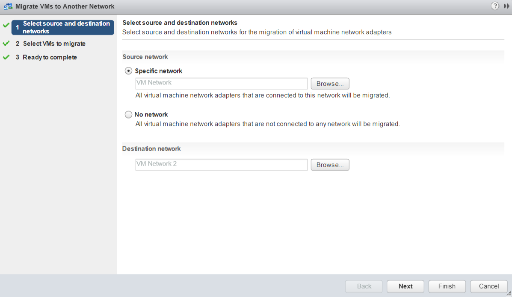

- 勾选主机（CentOS7和TinyCore）

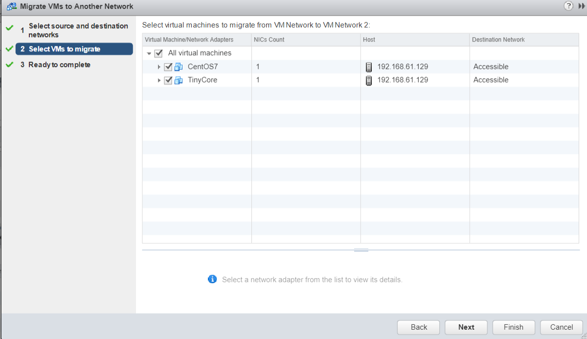

- 迁移成功

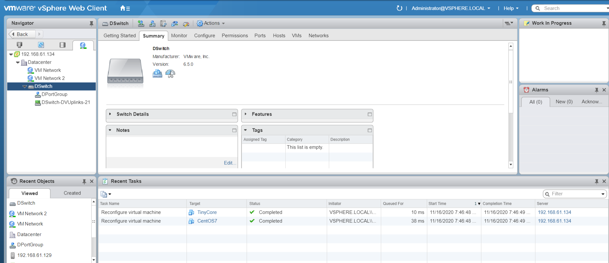

## 3. 总结与实验体会

本次实验中，通过vCenter的使用，我学习到了如何建立集群来管理大量的主机/虚拟机（通过将若干ESXi主机添加进数据中心-集群中，完成对虚拟架构的集中控制）。在管理页面，vCenter客户端内亦可实时观察到各台主机的运行状况。若作为维护人员，这些功能都非常实用。

尽管在一开始配置环境（多台ESXi主机、多台虚拟机的建立、Windows Server下安装vCenter）遇到了诸多困难，但在助教的帮助下，我理解了应该这些环境的相互依赖关系，应当以何种方式来相互串联，最终由vCenter集中管理。在此，再次非常感谢邢智涣助教！同时，作为前一次实验的延伸，我也在上次实验的基础上，再次体验到了虚拟化管理各台主机/虚拟机的乐趣。另外，无论是分布式虚拟交换机，还是网络迁移，都是行业前沿技术，也非常感谢这门课带领我体会虚拟化的魅力！
